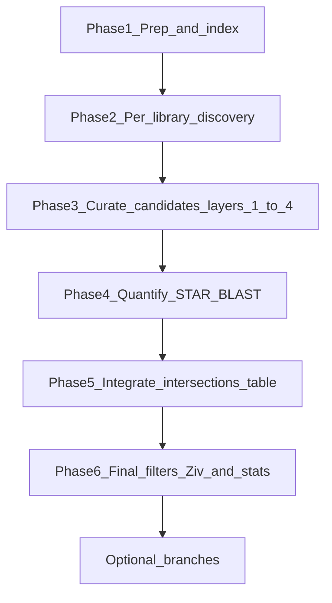

# Novel miRNA discovery pipeline — workflow (proposed)

> **Companion doc:** [Pipeline.md](Pipeline.md) — current command reference (unchanged).  
> **Scripts:** `/mnt/new_groups/vaksler_group/Isana_Tzah/novel-miRNAs/` (invoke by absolute path).  
> **Data:** `Charles_seq/` and `RNAcentral/` under `/mnt/new_groups/vaksler_group/Isana_Tzah/`.

Species behavior is driven by [`pipeline_config.py`](../pipeline_config.py) (`SPECIES_CONFIG`). Use `-s <Species>` on Python scripts; add `--variant new_genome` (or `-s <Species>_newGenome`) for alternate assemblies.

---

## 1. Purpose and rationale

This pipeline discovers miRNA candidates from small-RNA sequencing, filters them through a series of quality gates, quantifies expression, compares results across tools and (for *C. elegans*) known databases, and applies a final structural filter before statistical analysis.

The workflow separates three concerns:

1. **Discovery** — what do miRDeep2 and sRNAbench call from each library?
2. **Filtering** — which calls survive progressive quality gates?
3. **Integration** — among survivors, which loci agree across tools / known databases, and what are their expression and homology profiles?



### Filtering layers

Each layer removes or labels candidates for a specific reason. Layers 1–4 run during curation; layer 5 runs inside the intersections table; layer 6 (Ziv) runs on that consolidated workbook.

| Layer | Name | What it does | When it runs (current scripts) |
|-------|------|--------------|--------------------------------|
| 1 | Per-library quality | Low read counts, ncRNA hits, novel451, miRDeep score rules | `*PerLibraryFilter.py` in each library folder |
| 2 | Coordinate dedup | Merge same-locus duplicates across libraries (≥60% overlap) | `*UniteGFF.py` unite stage |
| 3 | good_candidates | Require multi-library or multi-replicate support in 20 bp window | `processGoodCandidates.py` |
| 4 | Strand labels | Mark sense / antisense / overlap on precursors | `overlapSenseAnti.py` |
| 5 | Expression | Drop candidates with sum mature featureCounts &lt; 100 | `intersectionsTable.py --sum-fc-thres 100` |
| 6 | Structural (Ziv) | Drop implausible hairpin geometry | `Ziv_feature_SOS.py` |
| 7 | Oscar *(TBD)* | Collaborator filtering criteria | *Not yet implemented — see §3.1* |

**Why Ziv runs after integration (locked recommendation):** Ziv is a structural **filter**, not a downstream analysis step. It runs after the intersections table because that workbook is the canonical consolidated input — each row already has sequences, BLAST, featureCounts, and cross-tool types. Moving Ziv earlier would require rewiring `allCandidatesFasta.py`, `Ziv_feature_SOS.py`, and related scripts for limited gain. The intersections table applies the expression filter (layer 5) before Ziv sees any rows.

---

## 2. Species at a glance

| Species | Role | Libraries | Discovery | Known-miRNA intersects | BLAST | Seed file |
|---------|------|-----------|-----------|------------------------|-------|-----------|
| **Elegans** | Validation control | 12 (CE57–CE81) | Per-library | **miRBase + miRGeneDB** | Yes | `mirbase_data/Seeds.txt` |
| **Macrosperma** | Novel nematode | 5 (MR4–MR8) | Per-library | Tool–tool only | Yes | `mirbase_data/Seeds.txt` |
| **Sulstoni** | Novel nematode | 8 (SR0–SR7) | Per-library | Tool–tool only | Yes | `mirbase_data/Seeds.txt` |
| **Hofstenia** | Acoel flatworm | 33 (EC1…SMA3) | Per-library | None | **No** | `mirbase_data/ALL_seed_family_from_mirgendb.csv` |

**Nematode sequencing** (Elegans, Macrosperma, Sulstoni): PRJNA678899 (Nelson & Ambros 2021). Adapter `AACTGTAGGCACCATCAAT`; trim with cutadapt: `-a AACTGTAGGCACCATCAAT --core 2 -e 0.25 --discard-untrimmed -m 17 -M 26`.

**Hofstenia:** [OneDrive dataset](https://onedrive.live.com/?authkey=%21AKCytbQPG3KfYmM&id=746671E5D2B00BDD%2114017&cid=746671E5D2B00BDD&sw=bypassConfig). Adapter trimmed upstream.

### good_candidates support rule

| Mode | Species | Rule |
|------|---------|------|
| `distinct_libraries` | Elegans, Macrosperma, Sulstoni | ≥2 **distinct libraries** in a 20 bp cluster |
| `dev_condition_replicates` | Hofstenia | ≥2 **condition replicates** (library name minus trailing digit, e.g. EC1/EC2/EC3 → EC) in a 20 bp cluster |

### Ziv / statistics profiles

| Profile | Species | Ziv output sheet | Extra filters |
|---------|---------|------------------|---------------|
| `structural_sheets` | Nematodes | `(D) Structural Features` | `5p_overhang_ziv`, `3p_overhang_ziv` ∈ [0, 4] |
| `unfiltered_only` | Hofstenia | `(A) Unfiltered` | Thresholds from pan–miRGeneDB distributions |

---

## 3. Phase 3 detail — candidate curation (filtering layers 1–4)

### 3.1 Per-library filtering (layer 1)

Run in each library folder with **conda off**.

**sRNAbench** (`srnabenchPerLibraryFilter.py --filter-mc 10`):

1. Drop novel if `max(5pRC,3pRC) < 10` or `matureBindings < 14`.
2. **Discard all novel451** entries (all species).
3. Drop if mature/star/hairpin matches ncRNA (`RNAcentral/ncRNAs_Caenorhabditis/`).
4. Trim hairpin to mature/star bounds; drop rows that fail alignment (`sRNAbench_removed_no_find.csv`).

**miRDeep** (`mirdeepPerLibraryFilter.py --filter-s 10 --exclude-c 100 --filter-mc 10`):

1. Drop rfam-alert or ncRNA matches.
2. Remove lower-scoring duplicate mature/star when score ≥ 10.
3. Keep if score ≥ 10, **or** score &lt; 10 with total ≥ 100 and star &gt; 0.
4. Drop if `max(mature read count, star read count) < 10`.

#### Oscar's filtering methods (TODO)

<!-- Placeholder: document Oscar's additional filtering criteria when provided.
     Expected topics may include:
     - High-score overlapping miRNA pairs (mark both as "overlap")
     - Species-specific structural cutoffs beyond Ziv
     - Integration with external collaborator candidate lists (e.g. miRge GFF sets)
     Hook points: after layer 1 (per-library) or after layer 2 (coordinate dedup).
-->

### 3.2 Unite libraries and coordinate dedup (layer 2)

Working directory: `{base}/<Species>/scripts/`

Concatenate per-library `remaining` CSVs from all libraries, then deduplicate loci with ≥60% coordinate overlap (`overlaps` attribute). Removed rows go to `removed_*_no_overlaps.csv`.

### 3.3 good_candidates — three explicit steps (layer 3)

The unite scripts currently use `--goodcandidates False/True` for two distinct operations. The target workflow names them separately:

| Step | Name | Purpose | Script (current) | Key output |
|------|------|---------|------------------|------------|
| **A** | Export united table | Merge libraries + dedup; snapshot full table for cluster analysis | `*UniteGFF.py --goodcandidates False` | `debugging_<Species>_*.csv` |
| **B** | Apply support filter | Keep loci with ≥2 libraries/condition-replicates in 20 bp window | `processGoodCandidates.py` | `good_candidates/<tool>_goodCandidates.csv` |
| **C** | Build annotation files | Write GFF/FASTA from supported subset only | `*UniteGFF.py --goodcandidates True` | `*_all_remaining_filtered.csv`, GFF/FASTAs |

**Why three steps?** `processGoodCandidates.py` must see **every** locus in each 20 bp cluster (it reads `debugging_*.csv`). Step C does not re-derive clusters — it only emits genome annotations for the supported subset.

**sRNAbench example:**

```bash
REPO=/mnt/new_groups/vaksler_group/Isana_Tzah/novel-miRNAs
SEED=/mnt/new_groups/vaksler_group/Isana_Tzah/Charles_seq/mirbase_data/Seeds.txt

# Step A — export
python $REPO/srnabenchUniteGFF.py -o Elegans_sRNAbench.gff3 \
  -seed $SEED --create-fasta Elegans_sRNAbench.fasta \
  -s Elegans --goodcandidates False

# Step B — support filter
python $REPO/processGoodCandidates.py --tool sRNAbench -s Elegans

# Step C — final GFF
python $REPO/srnabenchUniteGFF.py -o Elegans_sRNAbench.gff3 \
  -seed $SEED --create-fasta Elegans_sRNAbench.fasta \
  -s Elegans --goodcandidates True
```

**miRDeep:** same pattern with `mirdeepUniteGFF.py` and `--tool miRDeep`.

**Outputs** (in `scripts/`):

- `<Species>_sRNAbench.gff3`, `<Species>_mirdeep.gff3` (+ `_pre_only`, `_star`, FASTAs)
- `sRNAbench_all_remaining_filtered.csv`, `mirdeep_all_remaining_filtered.csv`
- `debugging_<Species>_*.csv`, `good_candidates/` artifacts

### 3.4 Coordinate QC

Nematodes (per `pipeline_config.py`): verify GFF coordinates match FASTA sequences.

```bash
python $REPO/compare_genome_to_fasta.py --mode discovery --species <Species> \
  --dir Charles_seq/<Species>/scripts \
  --genome_fasta <genome.fa> \
  --gff <Species>_sRNAbench.gff3 --mature <Species>_sRNAbench.fasta \
  --star <Species>_sRNAbench_star.fasta \
  --hairpin-table sRNAbench_all_remaining_filtered.csv \
  --output sRNAbench_coord_check.csv
```

Repeat for miRDeep. Hofstenia: optional / collaborator-specific (`compare_genome_qc: False` in config).

### 3.5 Strand overlap labels (layer 4)

| Label | Definition |
|-------|------------|
| **Overlap** | Same-strand overlap ≥ 40% |
| **Sense / antisense** | Opposite-strand overlap; higher-count locus → sense |

```bash
sed -i 's/\t*$//' <Species>_mirdeep_pre_only.gff3
sed -i 's/\t*$//' <Species>_sRNAbench_pre_only.gff3

bedtools intersect -wao -loj -f 0.4 -a <pre_only.gff3> -b <pre_only.gff3> > <tool>_intersect.bed

python $REPO/overlapSenseAnti.py \
  --intersections-table RNAcentral/miRNAs/<Species>/<tool>_intersect.bed \
  --gff Charles_seq/<Species>/scripts/<Species>_<tool>_pre_only.gff3
```

---

## 4. Phase 1 — input preparation

**Nematodes:** trim adapters → bowtie index → `config.txt`.

**Hofstenia:** pre-trimmed libraries; mapper may be split across sbatch jobs.

**Genome whitespace fix:** `perl -lane 's/\s+.+$//' < raw.fa > new.fa`

**sRNAbench:** `makeSeqObj.jar` → zip to `sRNAtoolboxDB/seqOBJ/`; copy bowtie index to `sRNAtoolboxDB/index/`.

---

## 5. Phase 2 — per-library discovery

**Do not combine FASTQs** for nematodes. Each library: `mirdeep_out/<library>/`.

**miRDeep2:** `mapper.pl` → `miRDeep2.pl` → per-library filter (§3.1).

**sRNAbench:** `sRNAbench.jar` per library → per-library filter (§3.1).

Then Phase 3 for each tool.

---

## 6. Phase 4 — quantification

*Rationale:* measure expression and homology on curated GFF/FASTA from Phase 3.

**STAR:** index → per-library align → `featureCounts` on mature GFF.

**Flanked pre:** `add_flank_to_GFF.py` → featureCounts on `*_flanked_pre.gff3` (m/pre ratio).

**Elegans only:** featureCounts on `cel_mirbase_seq.gff3`.

**BLAST (nematodes):** `filterSpacesBlastDB.py` → `makeblastdb` → `blastn` on mature FASTAs. Hofstenia skips BLAST.

---

## 7. Phase 5 — integration and comparison

*Rationale:* annotate agreement among curated candidates. Requires quantification outputs.

**bedtools cross-intersect** (`-s`, tuned `-f`): sRNAbench ↔ miRDeep (all nematodes + Hofstenia). Elegans also vs miRBase and miRGeneDB (`mirbaseToGFF3.py` for miRBase GFF).

**intersectionsTable.py** — merges BED + FC + BLAST + remaining CSVs; applies `--sum-fc-thres 100` (layer 5). Elegans adds miRBase sheet and extra BED args. Types 1–8; manual corrections documented for untrimmed miRBase-only-mature loci.

**Elegans validation:** miRBase 253 → miRDeep 61%, sRNAbench 52%; miRGeneDB 138 → miRDeep 88%, sRNAbench 79%.

---

## 8. Phase 6 — final filters and statistics

**Ziv (layer 6):** `allCandidatesFasta.py` → `Ziv_feature_SOS.py` on intersections workbook. See [Appendix A](#appendix-a-ziv-structural-thresholds).

**statistics.py:** clustering (Hofstenia 10 kb), description formatting.

---

## 9. Optional branches (all retained)

mirTrace QC (nematodes); expression dynamics (Elegans, Hofstenia, all-species); miRge after Ziv; Elegans sensitivity check; `seed_frequency.py`; `--variant new_genome` track (Appendix B).

---

## 10. Proposed script changes (for a future coding agent)

**Not yet implemented.** Operators use `--goodcandidates False/True` (§3.3) until marked done.

1. **`--stage {unite,final}`** on `srnabenchUniteGFF.py` / `mirdeepUniteGFF.py`; deprecate `--goodcandidates`.
2. **`run_candidate_curation.py`** orchestrator: steps A → B → C → `compare_genome_to_fasta`.
3. **Oscar hook** at §3.1 placeholder when criteria provided.
4. **Not proposed:** moving Ziv before intersections table; removing any stage.

---

## 11. Reference

### Quick execution order

```
Phase 1  Prep
Phase 2  miRDeep + sRNAbench per library → per-library filter
Phase 3  Unite A → processGoodCandidates → Unite C → coord QC → strand labels
Phase 4  STAR + featureCounts + BLAST
Phase 5  bedtools cross-intersect → intersectionsTable
Phase 6  allCandidatesFasta → Ziv → statistics
Optional mirTrace / expression / miRge / seeds
```

### Directory layout and script inventory

See [Pipeline.md](Pipeline.md) for full paths and legacy/deprecated scripts.

---

## Appendix A — Ziv structural thresholds

| Feature | Lower | Upper |
|---------|-------|-------|
| Hairpin_seq_trimmed_length | 55.0 | 71.0 |
| Mature_connections | 11.5 | 23.5 |
| Mature_BP_ratio | 0.58 | 0.98 |
| Mature_max_bulge | −0.5 | 3.5 |
| Loop_length | 10.0 | 26.0 |
| Mature_Length | 20.5 | 24.5 |
| Star_length | 20.5 | 24.5 |
| Star_connections | 15.0 | 23.0 |
| Star_BP_ratio | 0.62 | 1.02 |
| Star_max_bulge | −0.5 | 3.5 |
| Max_bulge_symmetry | −1.5 | 2.5 |
| min_one_mer_hairpin | 0.104 | 0.271 |
| max_one_mer_hairpin | 0.216 | 0.422 |

Derived from pan–miRGeneDB via `mirgenedbThresholds.py` / `plot_series.py`.

---

## Appendix B — Alternate genome assemblies

| Species | Genome FASTA |
|---------|--------------|
| Elegans | `Elegans_newGenome/genome/CELEG...WBPS19.scaffolds.fna` |
| Macrosperma | `Macrosperma_newGenome/genome/CMACR..._v2.scaffolds.fna` |
| Sulstoni | `Sulstoni_newGenome/genome/CSULS...WBPS19.scaffolds.fna` |
| Hofstenia | `Hofstenia_newGenome/sRNA_PBonly/hofPB_v6.FINAL.fa` |

Use `--variant new_genome` or `-s <Species>_newGenome`.

---

## Appendix C — Library reference

**Elegans:** CE57–CE81 (12 libraries, PRJNA678899). **Macrosperma:** MR4–MR8. **Sulstoni:** SR0–SR7. **Hofstenia:** 33 libraries (AMP…SMA). Full tables in [Pipeline.md](Pipeline.md).

---

## Appendix D — Citations

cutadapt (DOI 10.14806/ej.17.1.200); miRDeep2 (NAR 2012); sRNAbench (NAR 2019); bedtools (Bioinformatics 2010); Nelson & Ambros G3 2021 (PRJNA678899).
