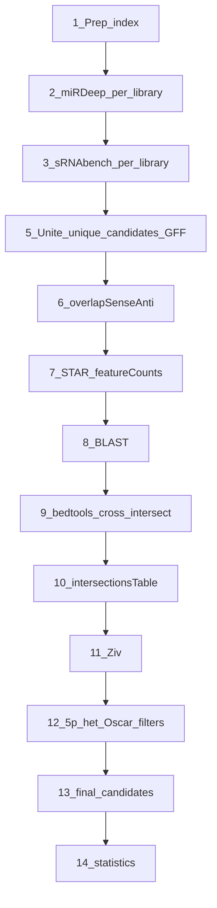

# Novel miRNA discovery pipeline (v3 — template reference)

Generalized pipeline documentation for **manual runs on the cluster**. Every command block below is meant to be copied into a bash session after the [shell setup](#manual-run-shell-setup).

| Document | Use when |
|----------|----------|
| **This file** (`pipeline_v3.md`) | Run order + copy-paste commands |
| `Pipeline <Species>.md` | Paper text, validation notes, species-specific quirks |

**Fixed roots (cluster):**

- Scripts (`$REPO`): `/mnt/new_groups/vaksler_group/Isana_Tzah/novel-miRNAs/`
- Data (`$BASE`): `/mnt/new_groups/vaksler_group/Isana_Tzah/Charles_seq/`
- Intersections / BLAST (`$RNACENTRAL`): `/mnt/new_groups/vaksler_group/Isana_Tzah/RNAcentral/`

Invoke Python scripts by **absolute path** (`$REPO/...`); do not copy scripts into species folders.

---

## Manual run — shell setup

**Preferred:** source the repo env loader (lives in git; updates with `git pull`). All later command blocks assume these variables exist.

```bash
# one-shot (any species / track)
source /mnt/new_groups/vaksler_group/Isana_Tzah/novel-miRNAs/env/load_pipeline_env.sh Macrosperma
# source .../env/load_pipeline_env.sh Macrosperma new_genome
# source .../env/load_pipeline_env.sh Hofstenia_newGenome
```

**MobaXterm / every new SSH session** — add once to cluster `~/.bashrc`:

```bash
source /mnt/new_groups/vaksler_group/Isana_Tzah/novel-miRNAs/env/moba_aliases.sh
```

Then after connect:

```bash
nm Macrosperma          # loads TRACK + verify helpers + nm_snapshot
nm-list                 # show all tracks
```

Exports are **not** persisted across reconnects; `nm …` (or `source load_pipeline_env.sh …`) must run again each session. Details: `env/load_pipeline_env.sh`, `env/moba_aliases.sh`.

Expanded copy-paste blocks below are fallbacks if you cannot source the loader.

Conventions:

- `$TRACK` — on-disk folder (`$SPECIES` or `${SPECIES}_newGenome`); drives `$SPECIES_DIR`, `$RNA_MI_DIR`, `$ZIV_XLSX`, `$BLAST_QUERY_DIR`
- `$VARIANT` — leave empty for the default assembly, or set to `--variant new_genome`
- `$HOF_FLAGS` — Hofstenia only: `--base-path $BASE` on unite / processGoodCandidates; empty for nematodes
- `$STAR_SAMS` — space-separated relative SAM paths (use from `$BASH_DIR`)
- Per-library loops use `$LIBRARIES` (comma-separated, no spaces)
- After each phase: run that phase’s **Verify** block; stop if it prints `VERIFY FAILED`

### Nematodes (Elegans / Macrosperma / Sulstoni)

Edit `SPECIES`, `LIBRARIES`, and path casing for your target. Library lists match `pipeline_config.py`.

```bash
export REPO=/mnt/new_groups/vaksler_group/Isana_Tzah/novel-miRNAs
export BASE=/mnt/new_groups/vaksler_group/Isana_Tzah/Charles_seq
export RNACENTRAL=/mnt/new_groups/vaksler_group/Isana_Tzah/RNAcentral

# --- edit for your run ---
export SPECIES=Elegans
export VARIANT=""
export TRACK=$SPECIES   # new_genome → ${SPECIES}_newGenome (see below)
export LIBRARIES=CE57,CE58,CE59,CE60,CE61,CE62,CE63,CE69,CE78,CE79,CE80,CE81
export INDEX_BASENAME=elegans
export HOF_FLAGS=""

# Elegans uses Bash/ and Genome/; Macrosperma and Sulstoni use bash/ and genome/
export SPECIES_DIR=$BASE/$TRACK
export SCRIPTS_DIR=$SPECIES_DIR/scripts
export BASH_DIR=$SPECIES_DIR/Bash
export GENOME_DIR=$SPECIES_DIR/Genome
export RNA_MI_DIR=$RNACENTRAL/miRNAs/$TRACK
export BLAST_QUERY_DIR=$RNACENTRAL/queries/$TRACK
export SEED=$BASE/mirbase_data/Seeds.txt
export ZIV_XLSX=$BASE/Ziv_Features/all_remaining_after_ziv_${TRACK}.xlsx
export INTERSECTIONS_XLSX=$RNA_MI_DIR/intersections_table_${SPECIES}.xlsx
export ZIV_SHEET="(D) Structural Features"
export MIRGE_FASTA_DIR=$SPECIES_DIR/miRge/
export GENOME_FA=$GENOME_DIR/caenorhabditis_elegans.PRJNA13758.WBPS16.genomic.fa
export GENOME_FA_NO_WS=$GENOME_DIR/new_caenorhabditis_elegans.PRJNA13758.WBPS16.genomic.fa
export SRNABENCH_INDEX=${INDEX_BASENAME}GenomeIndexed

export STAR_SAMS="$(for lib in ${LIBRARIES//,/ }; do echo ../STAR/align_to_genome/$lib/${SPECIES}_Aligned.out.sam; done)"
```

**Macrosperma** — set `SPECIES=Macrosperma`, `TRACK=Macrosperma`, `LIBRARIES=MR4,MR5,MR6,MR7,MR8`, `INDEX_BASENAME=macrosperma`, `BASH_DIR=$SPECIES_DIR/bash`, `GENOME_DIR=$SPECIES_DIR/genome`, and the matching `GENOME_FA` / `GENOME_FA_NO_WS` under `Macrosperma/genome/`.

**Sulstoni** — set `SPECIES=Sulstoni`, `TRACK=Sulstoni`, `LIBRARIES=SR0,SR1,SR2,SR3,SR4,SR5,SR6,SR7`, `INDEX_BASENAME=sulstoni`, `BASH_DIR=$SPECIES_DIR/bash`, `GENOME_DIR=$SPECIES_DIR/genome`.

**Alternate assembly** — set:

```bash
export VARIANT="--variant new_genome"
export TRACK=${SPECIES}_newGenome
# then re-export SPECIES_DIR, SCRIPTS_DIR, BASH_DIR, GENOME_DIR, RNA_MI_DIR,
# BLAST_QUERY_DIR, ZIV_XLSX, INTERSECTIONS_XLSX, MIRGE_FASTA_DIR, STAR_SAMS
# from $TRACK as in the block above
```

`$SPECIES` stays the canonical name (`Elegans`); `$TRACK` selects the on-disk folder. Ziv workbook basename uses `$TRACK`; intersections workbook basename still uses `$SPECIES` but lives under `miRNAs/$TRACK/`.

### Hofstenia

```bash
export REPO=/mnt/new_groups/vaksler_group/Isana_Tzah/novel-miRNAs
export BASE=/mnt/new_groups/vaksler_group/Isana_Tzah/Charles_seq
export RNACENTRAL=/mnt/new_groups/vaksler_group/Isana_Tzah/RNAcentral

export SPECIES=Hofstenia
export VARIANT=""
export TRACK=Hofstenia
export LIBRARIES=EC1,EC2,EC3,GA1,GA2,GA3,DI1,DI2,DI3,PDi1,PDi2,PDi3,PDii1,PDii2,PDii3,PL1,PL2,PL3,PH1,PH2,PH3,HL1,HL2,HL3,IST1,IST2,IST3,AMP1,AMP2,AMP3,SMA1,SMA2,SMA3
export INDEX_BASENAME=hofstenia
export HOF_FLAGS="--base-path $BASE"

export SPECIES_DIR=$BASE/$TRACK
export SCRIPTS_DIR=$SPECIES_DIR/scripts
export BASH_DIR=$SPECIES_DIR/bash
export GENOME_DIR=$SPECIES_DIR/Genome/refs/Hmia_ref
export RNA_MI_DIR=$RNACENTRAL/miRNAs/$TRACK
export BLAST_QUERY_DIR=$RNACENTRAL/queries/$TRACK   # unused (no BLAST)
export ZIV_XLSX=$BASE/Ziv_Features/all_remaining_after_ziv_${TRACK}.xlsx
export INTERSECTIONS_XLSX=$RNA_MI_DIR/intersections_table_${SPECIES}.xlsx
export ZIV_SHEET="(A) Unfiltered"
export MIRGE_FASTA_DIR=$SPECIES_DIR/miRge_after_Ziv/
export GENOME_FA=$GENOME_DIR/Hmia.030120.fasta
export READ_FASTQ_DIR=$BASE/Hofstenia/Fastq/Hmia_annotation/filtered   # reads stay on old track
export SRNABENCH_INDEX=hofsteniaGenomeIndexed

export STAR_SAMS="$(for lib in ${LIBRARIES//,/ }; do echo ../STAR/align_to_genome/$lib/${SPECIES}_Aligned.out.sam; done)"
```

Hofstenia has no BLAST phase and no `-seed` on unite scripts. For `new_genome`, set `VARIANT="--variant new_genome"`, `TRACK=Hofstenia_newGenome`, re-export dirs from `$TRACK`, and point `GENOME_FA` at `Hofstenia_newGenome/sRNA_PBonly/hofPB_v6.FINAL.fa`. Keep `READ_FASTQ_DIR` on the original Hofstenia Fastq tree.

### Per-library read path helper (nematodes)

```bash
# Example: trimmed FASTQ for library CE57 (adjust SRR ↔ library mapping in species docs)
export READ_FASTQ=$SPECIES_DIR/TrimmedFastq/SRR13072557.1_trimmed.fastq
```

### Per-library read path helper (Hofstenia)

```bash
export LIBRARY=EC1
export READ_FASTQ=$READ_FASTQ_DIR/${LIBRARY}.filtered.fastq
```

### Verify helpers (paste once after shell setup)

Each phase ends with a **Verify** block. Paste this once so those checks can use `need_file` / `need_dir` / `count_lines`:

```bash
FAIL=0
ok()   { echo "OK: $*"; }
fail() { echo "FAIL: $*"; FAIL=1; }
need_file() {
  local f="$1"
  if [[ -s "$f" ]]; then ok "file $f ($(wc -c <"$f") bytes)"
  else fail "missing/empty: $f"; fi
}
need_dir() {
  local d="$1"
  if [[ -d "$d" ]]; then ok "dir $d"
  else fail "missing dir: $d"; fi
}
count_lines() { wc -l <"$1" | tr -d ' '; }
echo "Verify helpers loaded for TRACK=$TRACK SPECIES=$SPECIES VARIANT=${VARIANT:-<empty>}"
```

After each Verify block: if `FAIL` is non-zero, **stop** — do not start the next phase.

---

## Overwrite safety (read before re-running)

### What is already isolated by `$TRACK`

| Artifact | Old track | New-genome track |
|----------|-----------|------------------|
| Working root | `$BASE/{Species}/` | `$BASE/{Species}_newGenome/` |
| Unite / GFF / FASTA | `.../scripts/` | same under `_newGenome` |
| miRDeep / STAR / counts | under species root | under `_newGenome` |
| Intersections / BEDs | `RNAcentral/miRNAs/{Species}/` | `RNAcentral/miRNAs/{Species}_newGenome/` |
| Ziv workbook | `Ziv_Features/all_remaining_after_ziv_{Species}.xlsx` | `..._ziv_{Species}_newGenome.xlsx` |

Nematode **new_genome** tracks are mostly greenfield → lower overwrite risk if you never point `$TRACK` at the old folder.

### What can still overwrite old results

1. **Re-running an old track** (`TRACK=$SPECIES`) — Phases 5–11 write **in place** into existing `scripts/`, `unique_candidates/`, `counts_sep/`, `miRNAs/$SPECIES/`, and Ziv.
2. **`Hofstenia_newGenome`** — already run historically; any re-run of Phases 2–11 can replace prior outputs under that track.
3. **BLAST outs** — if you write to `queries/$SPECIES/` for both assemblies, new_genome overwrites old. Always use `$BLAST_QUERY_DIR` (`queries/$TRACK/`).
4. **sRNAtoolboxDB index / seqOBJ** — shared under `$BASE/sRNAtoolboxDB/` if `$SRNABENCH_INDEX` / basename collide across assemblies.
5. **Phase 6** — `overlapSenseAnti.py` edits the GFF **in place**.
6. **Phase 11 (old genome)** — `Ziv_feature_SOS.py` writes to **cwd** (`./`) for the default variant. Always `cd "$BASE/Ziv_Features"` before Step 11b on old tracks (new_genome already targets that directory via config).

### Snapshot recipe (do this before touching an existing track)

```bash
export SNAP=$BASE/snapshots/${TRACK}_$(date +%Y%m%d_%H%M%S)
mkdir -p "$SNAP"
[[ -d "$SCRIPTS_DIR" ]] && cp -a "$SCRIPTS_DIR" "$SNAP/scripts"
[[ -d "$SPECIES_DIR/unique_candidates" ]] && cp -a "$SPECIES_DIR/unique_candidates" "$SNAP/unique_candidates"
[[ -d "$SPECIES_DIR/counts_sep" ]] && cp -a "$SPECIES_DIR/counts_sep" "$SNAP/counts_sep"
[[ -d "$RNA_MI_DIR" ]] && cp -a "$RNA_MI_DIR" "$SNAP/miRNAs_${TRACK}"
[[ -f "$ZIV_XLSX" ]] && cp -a "$ZIV_XLSX" "$SNAP/"
[[ -d "$BLAST_QUERY_DIR" ]] && cp -a "$BLAST_QUERY_DIR" "$SNAP/blast_queries"
echo "Snapshot at $SNAP"
```

Optional: `chmod -R a-w` on the snapshot after copying so it cannot be edited by accident.

### Recommended execution order (post-refactor)

Status assumption: **Hofstenia_newGenome already has prior outputs**; nematode `_newGenome` tracks have **not** been run.

```
0. Snapshot any track you will re-touch (especially old genomes + Hofstenia_newGenome)
1. Smoke: Macrosperma OLD — Phase 5 (±6) with Verify; fix bugs before scaling
2. OLD genomes → through Phase 11 (Ziv) only; Verify each phase; STOP (wait for Phase 12)
     order: Elegans → Macrosperma → Sulstoni → Hofstenia
3. Nematode NEW genomes (fresh) → through Phase 11; Verify; STOP
     order: Elegans_newGenome → Macrosperma_newGenome → Sulstoni_newGenome
4. Hofstenia_newGenome: Verify existing outputs first; only re-run phases that fail Verify
     or that you intentionally want to regenerate (after snapshot)
5. Wait for Phase 12 (Oscar + 5p heterogeneity) → then 13 → 14 on all tracks
```

Do **not** run Phases 13–14 until Phase 12 is implemented (you would redo them).

---

## What changed in the reordering (v2 → v3)

Stage **names** are unchanged for Phases 1–10 relative to the pre-v3 template ordering. v3 **splits old Phase 11 downstream** into four phases (11 Ziv, 12 Oscar/5p-het filters, 13 final candidates, 14 statistics). Only the **run order** of Phases 7–9 changed relative to that earlier ordering.

In v2, **cross-tool bedtools intersections** (old Phase 7) appeared *before* **STAR / featureCounts** (Phase 8) and **BLAST** (Phase 9). That order is fine for drawing overlap BEDs between GFF files, but **`intersectionsTable.py` (Phase 10) needs featureCounts and BLAST files**, so quantification must finish before the integration block. v3 therefore runs:

**Phases 1–6 unchanged** → **7 STAR/featureCounts** → **8 BLAST** → **9 cross-tool bedtools** → **10 intersectionsTable** → **11 Ziv** → **12 Oscar/5p-het (placeholder)** → **13 final candidates** → **14 statistics**.

One prep addition: **`mirbaseToGFF3.py`** (Elegans) moved into Phase 1 so `cel_mirbase_seq.gff3` exists before Phase 7 miRBase featureCounts.

Phase 5 now uses **`--debug-only`** on unite scripts (Step A) so you do not build GFF/FASTA twice; Step C with **`--uniquecandidates True`** loads the unique_candidates CSV directly without re-reading per-library files.

| v2 section order | v3 run order | What runs |
|------------------|--------------|-----------|
| 7 — Cross-tool intersections | **9** | bedtools cross-intersect |
| 8 — STAR / featureCounts | **7** | STAR, featureCounts, `add_flank_to_GFF.py` |
| 9 — BLAST | **8** | blastn |
| 10 — Intersections table | **10** | `intersectionsTable.py` |
| 11 — Downstream (all in one) | **11–14** | Ziv → Oscar/5p-het → final FASTAs → `statistics.py` |

Phases 1–6 keep the same names and relative order as v2.

---

## Workflow overview

Each phase lists its main scripts. Run in this order:

| Step | Phase name (same as v2) | Main scripts / tools |
|------|-------------------------|----------------------|
| 1 | Read preprocessing and genome indexing | cutadapt, bowtie-build, makeSeqObj.jar, `mirbaseToGFF3.py` (Elegans) |
| 2 | miRDeep2 discovery (per library) | mapper.pl, miRDeep2.pl, `mirdeepPerLibraryFilter.py` |
| 3 | sRNAbench discovery (per library) | sRNAbench.jar, `srnabenchPerLibraryFilter.py` |
| 4 | Per-library filtering criteria | *(reference only — filters run in Phases 2–3)* |
| 5 | Unite libraries, unique_candidates, GFF3/FASTA | `srnabenchUniteGFF.py`, `mirdeepUniteGFF.py`, `processGoodCandidates.py`, `compare_genome_to_fasta.py` |
| 6 | Sense / antisense / overlap labeling | bedtools (self-intersect), `overlapSenseAnti.py` |
| 7 | STAR alignment and featureCounts | STAR, featureCounts, `add_flank_to_GFF.py` |
| 8 | BLAST homolog search | `filterSpacesBlastDB.py`, makeblastdb, blastn |
| 9 | Cross-tool (and known-miRNA) intersections | bedtools (cross-intersect), `intersections.sbatch` |
| 10 | Intersections table | `intersectionsTable.py` |
| 11 | Structural filtering (Ziv) | `allCandidatesFasta.py` → `Ziv_feature_SOS.py` |
| 12 | 5p heterogeneity / Oscar filters | *(placeholder — not yet wired)* |
| 13 | Final candidates | `allCandidatesFasta.py` (from post-filter workbook) |
| 14 | Statistics | `statistics.py` |



### Quick execution order

After [shell setup](#manual-run-shell-setup) and [verify helpers](#verify-helpers-paste-once-after-shell-setup), run phases in this order. Snapshot first if re-touching an existing track ([overwrite safety](#overwrite-safety-read-before-re-running)). Each phase section has ready-to-paste `bash` blocks **and a Verify block** — do not advance while `FAIL≠0`.

```
1  cutadapt, bowtie-build, makeSeqObj  (+ mirbaseToGFF3 for Elegans)  → Verify
2  mapper.pl → miRDeep2.pl → mirdeepPerLibraryFilter.py   (each library) → Verify
3  sRNAbench.jar → srnabenchPerLibraryFilter.py             (each library) → Verify
5  unite --debug-only → processGoodCandidates → unite --uniquecandidates True  → Verify
6  bedtools self-intersect → overlapSenseAnti.py → Verify
7  STAR → featureCounts → add_flank_to_GFF → featureCounts (flanked) → Verify
8  filterSpacesBlastDB → blastn → $BLAST_QUERY_DIR          (nematodes only) → Verify
9  bedtools cross-intersect → Verify
10 intersectionsTable.py → Verify
11 allCandidatesFasta → Ziv_feature_SOS.py (cd Ziv_Features) → Verify → STOP (wait for Phase 12)
12 5p heterogeneity + Oscar filters                         (placeholder)
13 allCandidatesFasta (from post-filter workbook) → final FASTAs
14 statistics.py
Optional: mirTrace, expression_dynamics, miRge, seed_frequency, new_genome
```

*(Phase 4 is a reference table of filter rules, not a separate run step.)*

### Filtering layers (which script, which phase)

Only stages that **remove** miRNA candidates and keep a subset. Merge/unite, labeling, and export steps are omitted.

| Layer | What it does | Script | Phase |
|-------|--------------|--------|-------|
| 1 | Per-library quality filter | `mirdeepPerLibraryFilter.py`, `srnabenchPerLibraryFilter.py` | 2, 3 |
| 2 | unique_candidates (±20 bp collapse; Hofstenia multi-replicate support) | `processGoodCandidates.py` | 5 step B |
| 3 | Drop low expression (sum FC &lt; 100) | `intersectionsTable.py --sum-fc-thres 100` | 10 |
| 4 | Structural filter | `Ziv_feature_SOS.py` | 11 |
| 5 | 5p heterogeneity / Oscar filters | *(TBD — placeholder)* | 12 |

`Ziv_feature_SOS.py` runs after `intersectionsTable.py` so each row already has featureCounts, BLAST, and cross-tool types. `statistics.py` runs on the filtered workbook (Phase 14), not the raw intersections table. Until Phase 12 is implemented, Phases 13–14 read `$ZIV_XLSX` directly from Phase 11.

---

## Template variables

The [shell setup](#manual-run-shell-setup) exports most of these. Use the table when you need to override a single value or look up species-specific paths. Library lists and flags live in `pipeline_config.py` (`SPECIES_CONFIG`).

| Variable | Meaning | Example (Hofstenia) |
|----------|---------|---------------------|
| `$SPECIES` | Canonical `-s` argument (**must match** `SPECIES_CONFIG`) | `Hofstenia` |
| `$VARIANT` | Empty, or `--variant new_genome` | *(empty)* |
| `$TRACK` | On-disk folder name | `Hofstenia` or `Hofstenia_newGenome` |
| `$LIBRARIES` | Comma-separated library IDs | `EC1,EC2,EC3,...` |
| `$LIBRARY` | Single library ID (set in loop) | `EC1` |
| `$BASE` | Charles_seq root | `/mnt/new_groups/vaksler_group/Isana_Tzah/Charles_seq` |
| `$SPECIES_DIR` | Species working root | `$BASE/$TRACK` |
| `$SCRIPTS_DIR` | United GFF/FASTA dir | `$SPECIES_DIR/scripts` |
| `$BASH_DIR` | sbatch wrappers | `$SPECIES_DIR/bash` (Elegans: `Bash`) |
| `$GENOME_DIR` | Genome folder | species-specific; see [Library reference](#library-reference) |
| `$GENOME_FA` | Reference FASTA | species-specific |
| `$GENOME_FA_NO_WS` | Whitespace-stripped genome | Elegans: `new_caenorhabditis_elegans...` |
| `$INDEX_BASENAME` | bowtie / sRNAbench index basename | `hofstenia`, `elegans`, etc. |
| `$SRNABENCH_INDEX` | sRNAbench `species=` key | `${INDEX_BASENAME}GenomeIndexed` |
| `$READ_FASTQ` | Per-library reads | Nematodes: `TrimmedFastq/<SRR>_trimmed.fastq`; Hofstenia: `Fastq/.../filtered/{LIBRARY}.filtered.fastq` |
| `$STAR_SAMS` | All library SAMs (space-separated) | Built in shell setup |
| `$RNACENTRAL` | RNAcentral root | `/mnt/new_groups/vaksler_group/Isana_Tzah/RNAcentral` |
| `$SEED` | Seed file (nematodes only) | `$BASE/mirbase_data/Seeds.txt` |
| `$HOF_FLAGS` | Hofstenia unite flags | `--base-path $BASE` or empty |
| `$RNA_MI_DIR` | Intersections / BED / tables | `$RNACENTRAL/miRNAs/$TRACK` |
| `$BLAST_QUERY_DIR` | BLAST out directory (nematodes) | `$RNACENTRAL/queries/$TRACK` |
| `$REPO` | Script root | `/mnt/new_groups/vaksler_group/Isana_Tzah/novel-miRNAs` |
| `$INTERSECTIONS_XLSX` | Phase 10 workbook | `$RNA_MI_DIR/intersections_table_${SPECIES}.xlsx` |
| `$ZIV_XLSX` | Ziv-filtered workbook | `$BASE/Ziv_Features/all_remaining_after_ziv_${TRACK}.xlsx` |
| `$ZIV_SHEET` | Sheet for final candidates / statistics | Nematodes: `(D) Structural Features`; Hofstenia: `(A) Unfiltered` |
| `$MIRGE_FASTA_DIR` | Final candidate FASTAs (Phase 13) | Hofstenia: `miRge_after_Ziv/`; nematodes: `miRge/` |

**Manual run rules:**

1. **Per-library loops** — `for lib in ${LIBRARIES//,/ }; do ... done`
2. **`-s` on Python scripts** — always canonical `$SPECIES` (`Elegans`, not `elegans`)
3. **`-l` argument** — comma-separated `$LIBRARIES`, no spaces
4. **`$VARIANT`** — include verbatim in Python commands (empty string is fine)
5. **`$STAR_SAMS`** — run `featureCounts` from `$BASH_DIR` so relative SAM paths resolve
6. **Phase 5 unique_candidates (per tool, in order)** — never skip a step; never run Step C before Step B:
   - **Step A:** `*UniteGFF.py ... --debug-only` → `debugging_${SPECIES}_*.csv`
   - **Step B:** `processGoodCandidates.py --tool {TOOL}` → `unique_candidates/{tool}_uniqueCandidates.csv`
   - **Step C:** same unite command as Step A but **`--uniquecandidates True`** (no `--debug-only`)
7. **Phase 11 vs 13 `allCandidatesFasta.py`** — Phase 11 reads intersections table; Phase 13 reads `$ZIV_XLSX` with `--sheetname "$ZIV_SHEET"`
8. **Species forks** — see [Species-specific forks](#species-specific-forks)

---

## Species at a glance

| Species | Role | Libraries | Known-miRNA intersects | BLAST | Seed file |
|---------|------|-----------|------------------------|-------|-----------|
| **Elegans** | Validation control | 12 (CE57–CE81) | **miRBase + miRGeneDB** | Yes | `mirbase_data/Seeds.txt` |
| **Macrosperma** | Novel nematode | 5 (MR4–MR8) | Tool–tool only | Yes | `mirbase_data/Seeds.txt` |
| **Sulstoni** | Novel nematode | 8 (SR0–SR7) | Tool–tool only | Yes | `mirbase_data/Seeds.txt` |
| **Hofstenia** | Acoel flatworm | 33 (EC1…SMA3) | None | **No** | `mirbase_data/ALL_seed_family_from_mirgendb.csv` |

**Nematodes:** PRJNA678899; adapter `AACTGTAGGCACCATCAAT`; cutadapt  
`-a AACTGTAGGCACCATCAAT --core 2 -e 0.25 --discard-untrimmed -m 17 -M 26`.

**unique_candidates:** nematodes = one representative per ±20 bp cluster (single-library loci kept); Hofstenia = same ±20 bp collapse, plus ≥2 condition replicates (strip trailing digit).

**Ziv sheets:** nematodes → `(D) Structural Features`; Hofstenia → `(A) Unfiltered`.

---

## Directory layout

```
$BASE/
  {Species}/
    TrimmedFastq/          # nematodes
    genome/ or Genome/     # FASTA + bowtie index
    mapper_out/
    mirdeep_out/{library}/
    scripts/               # unite, GFF/FASTA/CSVs
    unique_candidates/
    STAR/genome_index/
    STAR/align_to_genome/{library}/
    counts_sep/
    bash/ or Bash/
  {Species}_newGenome/
  sRNAtoolboxDB/out/{Species}/{Species}_{library}/
  mirbase_data/
  Ziv_Features/
$RNACENTRAL/
  miRNAs/{Species}/
  queries/{Species}/
  bash/
  BLAST_DB/
```

---

## Script inventory

| Phase | Script | Key flags |
|-------|--------|-----------|
| 2, 3 | `srnabenchPerLibraryFilter.py` | `--filter-mc 10` |
| 2, 3 | `mirdeepPerLibraryFilter.py` | `--filter-s 10 --exclude-c 100 --filter-mc 10` |
| 5 | `srnabenchUniteGFF.py`, `mirdeepUniteGFF.py` | `--debug-only` (step A); `--uniquecandidates True` (step C) |
| 5 | `processGoodCandidates.py` | `--tool sRNAbench` or `miRDeep` |
| 5 | `compare_genome_to_fasta.py` | `--mode discovery` (nematodes) |
| 6 | `overlapSenseAnti.py` | after self-intersect BED |
| 1 | `mirbaseToGFF3.py` | **Elegans only** |
| 7 | `add_flank_to_GFF.py` | `-s $SPECIES` |
| 8 | `filterSpacesBlastDB.py` | once for nematodes |
| 10 | `intersectionsTable.py` | `--sum-fc-thres 100` |
| 11 | `allCandidatesFasta.py` | from intersections table (Ziv input FASTAs) |
| 11 | `Ziv_feature_SOS.py` | → `$ZIV_XLSX` |
| 12 | *(placeholder)* | 5p heterogeneity / Oscar filters — not yet wired |
| 13 | `allCandidatesFasta.py` | `--sheetname "$ZIV_SHEET"` from `$ZIV_XLSX` |
| 14 | `statistics.py` | `--all "$ZIV_XLSX"`; Hofstenia: 10 kb clusters |

---

## Phase 1 — Read preprocessing and genome indexing

**Scripts/tools:** cutadapt, bowtie-build, makeSeqObj.jar, `mirbaseToGFF3.py` (Elegans only)

**Inputs:** raw FASTQ (nematodes) or pre-trimmed reads (Hofstenia), reference genome FASTA.  
**Outputs:** trimmed reads, bowtie index, sRNAbench seq object, optional Elegans miRBase GFF.

**Nematodes — trim adapter** (per library; or submit `cutadapt.sbatch` from `$BASH_DIR`):

```bash
cd "$BASH_DIR"
cutadapt -a AACTGTAGGCACCATCAAT --core 2 -e 0.25 --discard-untrimmed -m 17 -M 26 \
  "../Fastq/${SRR}.fastq" > "../TrimmedFastq/${SRR}_trimmed.fastq"
```

Loop over all libraries (set `SRR` per library using the mapping in `Pipeline Elegans.md`):

```bash
cd "$BASH_DIR"
# example pair — repeat for each library
SRR=SRR13072557 LIB=CE57
cutadapt -a AACTGTAGGCACCATCAAT --core 2 -e 0.25 --discard-untrimmed -m 17 -M 26 \
  "../Fastq/${SRR}.fastq" > "../TrimmedFastq/${SRR}_trimmed.fastq"
```

**Bowtie index:**

```bash
cd "$GENOME_DIR"
bowtie-build -f "$GENOME_FA" "index/${INDEX_BASENAME}GenomeIndexed"
```

**Genome whitespace fix** (before miRDeep2 if needed):

```bash
perl -lane 's/\s+.+$//' < "$GENOME_FA" > "$GENOME_FA_NO_WS"
```

**sRNAbench genome object** (`makeSeqObj.jar` writes a **seq-object zip** next to the input FASTA; input stays plain `.fa`/`.fna`/`.fasta`. The jar names the zip from the basename prefix before the first dot — e.g. `CMACR....fna` → `CMACR.zip`, `caenorhabditis_elegans....fa` → `caenorhabditis_elegans.zip`, `Hmia.030120.fasta` → `Hmia.zip`):

```bash
java -jar "$BASE/sRNAtoolboxDB/exec/makeSeqObj.jar" "$GENOME_FA"
SEQOBJ_ZIP="$(dirname "$GENOME_FA")/$(basename "$GENOME_FA" | cut -d. -f1).zip"
mv "$SEQOBJ_ZIP" "$BASE/sRNAtoolboxDB/seqOBJ/${SRNABENCH_INDEX}.zip"
cp -r "$GENOME_DIR/index/." "$BASE/sRNAtoolboxDB/index/"
```

**Elegans only — miRBase GFF** (run once; required before Phase 7 miRBase featureCounts and Phase 9 miRBase intersections):

```bash
cd "$BASE/mirbase_data"
python "$REPO/mirbaseToGFF3.py"
```

> **sbatch:** new-genome indexing (`bowtie_index.sbatch`, `makeseqobj.sbatch`, `star_genome_indexing.sbatch`). Mapper jobs are Phase 2.

### Verify — Phase 1

```bash
FAIL=0
need_file "$GENOME_FA"
# bowtie index: at least one .ebwt / .bt2 under genome index dir (path varies by species)
ls "$GENOME_DIR"/index/*GenomeIndexed*.ebwt "$GENOME_DIR"/index/*GenomeIndexed*.bt2 2>/dev/null | head
need_file "$BASE/sRNAtoolboxDB/seqOBJ/${SRNABENCH_INDEX}.zip"
if [[ "$SPECIES" == "Elegans" && -z "$VARIANT" ]]; then
  need_file "$BASE/mirbase_data/cel_mirbase_seq.gff3"
fi
# nematodes only — trimmed reads present (skip if Hofstenia)
if [[ "$SPECIES" != "Hofstenia" ]]; then
  need_dir "$SPECIES_DIR/TrimmedFastq"
fi
[[ $FAIL -eq 0 ]] && echo "Phase 1 VERIFY PASSED" || echo "Phase 1 VERIFY FAILED"
```

---

## Phase 2 — miRDeep2 discovery (per library)

**Scripts:** mapper.pl, miRDeep2.pl, `mirdeepPerLibraryFilter.py`

**Inputs:** trimmed/pre-trimmed reads, indexed genome.  
**Outputs:** per-library folders under `$SPECIES_DIR/mirdeep_out/`; `remaining_file_*.csv` per library.

**mapper.pl** — submit via sbatch from `$BASH_DIR`. Same model for all species: **one `mapper.pl` call per FASTQ** (no `config.txt`, no `-d`). One sbatch file may contain many sequential calls.

| Species | sbatch | Scope |
|---------|--------|--------|
| Nematodes (Elegans, Macrosperma, Sulstoni) | **one** `mapper.sbatch` per species | Sequential `mapper.pl` per library FASTQ → per-library `.arf` / collapsed `.fasta` |
| Hofstenia | `mapper_test2.sbatch` + `mapper_test3.sbatch` | Libraries split across **two** jobs (size); same per-FASTQ pattern |

**Nematodes** (from `$BASH_DIR`):

Run:
```bash
cd "$BASH_DIR"
sbatch mapper.sbatch
```

Example of what's inside, single-library `mapper.pl` (paths relative to `$BASH_DIR`; repeat per library):

```bash
cd "$BASH_DIR"
LIBRARY=CE57
READ_FASTQ="../TrimmedFastq/SRR13072557.1_trimmed.fastq"
mapper.pl "$READ_FASTQ" -e -i -j -m -h \
  -p "../Genome/Index/${INDEX_BASENAME}GenomeIndexed" \
  -t "../mapper_out/elegans_Seq_vs_genome_${LIBRARY}.arf" \
  -s "../mapper_out/elegans_Seq_collapsed_${LIBRARY}.fasta"
```

**Hofstenia** (two batch files covering all libraries):

```bash
cd "$BASH_DIR"
sbatch mapper_test2.sbatch
sbatch mapper_test3.sbatch
```

Example single-library `mapper.pl` (Hofstenia):

```bash
cd "$BASH_DIR"
LIBRARY=EC1
mapper.pl "$READ_FASTQ_DIR/${LIBRARY}.filtered.fastq" -e -i -j -m -h \
  -p "../Genome/refs/Hmia_ref/index/${INDEX_BASENAME}GenomeIndexed" \
  -t "../mapper_out/hofstenia_Seq_vs_genome_${LIBRARY}.arf" \
  -s "../mapper_out/hofstenia_Seq_collapsed_${LIBRARY}.fasta"
```

**miRDeep2.pl** — one run per library in `$SPECIES_DIR/mirdeep_out/`, using that library’s mapper outputs. Do **not** use unsuffixed combined `*_Seq_collapsed.fasta`.

```bash
cd "$SPECIES_DIR/mirdeep_out"
for dir in ${LIBRARIES//,/ }; do
  (cd "$dir" && sbatch mirdeep_test.sbatch)
done
```

Or sequential from `$BASH_DIR`:

```bash
cd "$BASH_DIR"
sbatch mirdeep.sbatch
```

**Filter** (conda off; or via sbatch):

```bash
# per library folder:
cd "$SPECIES_DIR/mirdeep_out/$LIBRARY"
python "$REPO/mirdeepPerLibraryFilter.py" -i result_*.csv \
  --filter-s 10 --exclude-c 100 --filter-mc 10

# all libraries (nematodes):
sbatch "$SPECIES_DIR/scripts/filter_mirdeep.sbatch"

# Hofstenia:
sbatch "$SPECIES_DIR/scripts/filter_hof_mirdeep.sbatch"
```

Outputs: `remaining_file_1.csv`, `remaining_file_2.csv`, `removed.csv`.

> **sbatch:** `mapper.sbatch` (or Hofstenia `mapper_test2/3.sbatch`); `mirdeep_test.sbatch` / `mirdeep.sbatch`; `filter_mirdeep.sbatch` (nematodes) or `filter_hof_mirdeep.sbatch`.

### Verify — Phase 2

```bash
FAIL=0
missing=0
for lib in ${LIBRARIES//,/ }; do
  d="$SPECIES_DIR/mirdeep_out/$lib"
  need_dir "$d"
  if ! ls "$d"/remaining_file_*.csv >/dev/null 2>&1; then
    fail "no remaining_file_*.csv in $d"; missing=$((missing+1))
  else
    ok "remaining files for $lib"
  fi
done
echo "Libraries missing remaining CSV: $missing / $(echo ${LIBRARIES//,/ } | wc -w)"
[[ $FAIL -eq 0 ]] && echo "Phase 2 VERIFY PASSED" || echo "Phase 2 VERIFY FAILED"
```

---

## Phase 3 — sRNAbench discovery (per library)

**Scripts:** sRNAbench.jar, `srnabenchPerLibraryFilter.py`

**Inputs:** trimmed/pre-trimmed reads, sRNAbench genome index.  
**Outputs:** per-library folders under `$BASE/sRNAtoolboxDB/out/`; filtered `remaining*.csv`.

**Do not combine FASTQs** (no `*_final.fastq`). Each library gets its own output folder under `$BASE/sRNAtoolboxDB/out/`.

```bash
cd "$BASH_DIR"
sbatch srnabench.sbatch
```

Example single-library run (nematode):

```bash
cd "$BASH_DIR"
LIBRARY=CE57
java -jar "$BASE/sRNAtoolboxDB/exec/sRNAbench.jar" \
  input="$SPECIES_DIR/TrimmedFastq/SRR13072557.1_trimmed.fastq" \
  output="$BASE/sRNAtoolboxDB/out/${SPECIES}/${SPECIES}_${LIBRARY}" \
  predict=true species="$SRNABENCH_INDEX" \
  dbPath="$BASE/sRNAtoolboxDB" \
  hairpin=animalsHairpin.fa mature=animalsMature.fa
```

Example single-library run (Hofstenia):

```bash
cd "$BASH_DIR"
LIBRARY=EC1
java -jar "$BASE/sRNAtoolboxDB/exec/sRNAbench.jar" \
  input="$READ_FASTQ_DIR/${LIBRARY}.filtered.fastq" \
  output="$BASE/sRNAtoolboxDB/out/Hofstenia_${LIBRARY}" \
  predict=true species="$SRNABENCH_INDEX" \
  dbPath="$BASE/sRNAtoolboxDB" \
  hairpin=animalsHairpin.fa mature=animalsMature.fa
```

**Filter** (conda off; or via sbatch):

```bash
cd "$BASE/sRNAtoolboxDB/out/${SPECIES}/${SPECIES}_${LIBRARY}"
python "$REPO/srnabenchPerLibraryFilter.py" -i novel.txt -a novel451.txt --filter-mc 10
```

All libraries:

```bash
sbatch "$SPECIES_DIR/scripts/filter_sRNAbench.sbatch"
# Hofstenia: filter_hof_sRNAbench.sbatch
```

> **sbatch:** `srnabench.sbatch` (nematodes: sequential per-library; Hofstenia: `sRNAbench_{LIBRARY}.sbatch`); `filter_sRNAbench.sbatch` / `filter_hof_sRNAbench.sbatch`.

### Verify — Phase 3

```bash
FAIL=0
missing=0
for lib in ${LIBRARIES//,/ }; do
  if [[ "$SPECIES" == "Hofstenia" && -z "$VARIANT" ]]; then
    d="$BASE/sRNAtoolboxDB/out/Hofstenia_${lib}"
  elif [[ -n "$VARIANT" ]]; then
    d="$BASE/sRNAtoolboxDB/out/${TRACK}/${SPECIES}_${lib}"
  else
    d="$BASE/sRNAtoolboxDB/out/${SPECIES}/${SPECIES}_${lib}"
  fi
  need_dir "$d"
  if ! ls "$d"/remaining*.csv >/dev/null 2>&1; then
    fail "no remaining*.csv in $d"; missing=$((missing+1))
  else
    ok "sRNAbench remaining for $lib"
  fi
done
echo "Libraries missing remaining CSV: $missing"
[[ $FAIL -eq 0 ]] && echo "Phase 3 VERIFY PASSED" || echo "Phase 3 VERIFY FAILED"
```

---

## Phase 4 — Per-library filtering criteria (reference)

**Scripts:** `mirdeepPerLibraryFilter.py` (Phase 2), `srnabenchPerLibraryFilter.py` (Phase 3)

These filters run immediately after each discovery tool, inside each library folder. This section documents the rules only.

**sRNAbench:** drop if `max(5pRC,3pRC) < 10` or `matureBindings < 14`; discard all novel451; drop ncRNA matches; trim hairpin to mature/star bounds.

**miRDeep:** drop rfam-alert / ncRNA; deduplicate lower-scoring mature/star when score ≥ 10; keep if score ≥ 10 or (score < 10 and total ≥ 100 and star > 0); drop if `max(mature RC, star RC) < 10`.

---

## Phase 5 — Unite libraries, unique_candidates, GFF3/FASTA

**Scripts:** `srnabenchUniteGFF.py`, `mirdeepUniteGFF.py`, `processGoodCandidates.py`, `compare_genome_to_fasta.py`

**Inputs:** per-library `remaining*.csv` from Phases 2–3.  
**Outputs:** united GFF/FASTA, `*_all_remaining_filtered.csv`, `*_pre_only.gff3`.

Working directory: `$SCRIPTS_DIR/`. Run **per tool** (sRNAbench, then miRDeep). Each tool uses the **three-step sequence below** — do not swap order.

### Checklist (Phase 5, one tool at a time)

```
FOR tool IN (sRNAbench, miRDeep):
  1. unite  --debug-only              → debugging_${SPECIES}_*.csv
  2. processGoodCandidates --tool     → unique_candidates/{tool}_uniqueCandidates.csv
  3. unite  --uniquecandidates True   → final GFF3, FASTA, *_all_remaining_filtered.csv
```

**Flags:** Step A uses `--debug-only` (not `--uniquecandidates False`). Step C uses `--uniquecandidates True` only.

### Step A — unite libraries, write debugging CSV only

Produces `debugging_${SPECIES}_sRNAbench.csv` or `debugging_${SPECIES}_miRDeep_{1,2}.csv`. No GFF/FASTA yet.

**sRNAbench — nematodes:**

```bash
cd "$SCRIPTS_DIR"
python "$REPO/srnabenchUniteGFF.py" -o "${SPECIES}_sRNAbench.gff3" \
  -seed "$SEED" --create-fasta "${SPECIES}_sRNAbench.fasta" \
  -s "$SPECIES" $VARIANT --debug-only
```

**sRNAbench — Hofstenia:**

```bash
cd "$SCRIPTS_DIR"
python "$REPO/srnabenchUniteGFF.py" -o Hofstenia_sRNAbench.gff3 -s Hofstenia \
  $HOF_FLAGS --create-fasta Hofstenia_sRNAbench.fasta --debug-only
```

**miRDeep — nematodes:**

```bash
cd "$SCRIPTS_DIR"
python "$REPO/mirdeepUniteGFF.py" -o "${SPECIES}_mirdeep.gff3" \
  --create-fasta "${SPECIES}_mirdeep.fasta" \
  -seed "$SEED" -s "$SPECIES" $VARIANT --debug-only
```

**miRDeep — Hofstenia:**

```bash
cd "$SCRIPTS_DIR"
python "$REPO/mirdeepUniteGFF.py" -o Hofstenia_mirdeep.gff3 \
  --create-fasta Hofstenia_mirdeep.fasta -s Hofstenia \
  $HOF_FLAGS --debug-only
```

### Step B — unique_candidates (±20 bp collapse)

Requires Step A debugging CSV. Writes `$SPECIES_DIR/unique_candidates/{tool}_uniqueCandidates.csv`.

```bash
cd "$SCRIPTS_DIR"
python "$REPO/processGoodCandidates.py" --tool sRNAbench -s "$SPECIES" $VARIANT $HOF_FLAGS
python "$REPO/processGoodCandidates.py" --tool miRDeep -s "$SPECIES" $VARIANT $HOF_FLAGS
```

### Step C — final GFF and united CSV

Same flags as Step A, but replace `--debug-only` with **`--uniquecandidates True`**:

```bash
cd "$SCRIPTS_DIR"
python "$REPO/srnabenchUniteGFF.py" -o "${SPECIES}_sRNAbench.gff3" \
  -seed "$SEED" --create-fasta "${SPECIES}_sRNAbench.fasta" \
  -s "$SPECIES" $VARIANT --uniquecandidates True

python "$REPO/mirdeepUniteGFF.py" -o "${SPECIES}_mirdeep.gff3" \
  --create-fasta "${SPECIES}_mirdeep.fasta" \
  -seed "$SEED" -s "$SPECIES" $VARIANT --uniquecandidates True
```

Hofstenia Step C (omit `-seed`; keep `$HOF_FLAGS`):

```bash
cd "$SCRIPTS_DIR"
python "$REPO/srnabenchUniteGFF.py" -o Hofstenia_sRNAbench.gff3 -s Hofstenia \
  $HOF_FLAGS --create-fasta Hofstenia_sRNAbench.fasta --uniquecandidates True

python "$REPO/mirdeepUniteGFF.py" -o Hofstenia_mirdeep.gff3 -s Hofstenia \
  $HOF_FLAGS --create-fasta Hofstenia_mirdeep.fasta --uniquecandidates True
```

Outputs in `$SCRIPTS_DIR/`: `${SPECIES}_sRNAbench.gff3`, `${SPECIES}_mirdeep.gff3`, `*_pre_only.gff3`, FASTAs, `*_all_remaining_filtered.csv`.

### Coordinate QC (nematodes; after step C)

Run once per tool (`TOOL_TAG` = `sRNAbench` or `mirdeep`):

```bash
cd "$SCRIPTS_DIR"
TOOL_TAG=mirdeep
python "$REPO/compare_genome_to_fasta.py" --mode discovery --species "$SPECIES" $VARIANT \
  --dir "$SCRIPTS_DIR" --genome_fasta "$GENOME_FA_NO_WS" \
  --gff "${SPECIES}_${TOOL_TAG}.gff3" --mature "${SPECIES}_${TOOL_TAG}.fasta" \
  --star "${SPECIES}_${TOOL_TAG}_star.fasta" \
  --hairpin-table "${TOOL_TAG}_all_remaining_filtered.csv" --output "${TOOL_TAG}_coord_check.csv"
```

### Verify — Phase 5

```bash
FAIL=0
need_file "$SCRIPTS_DIR/debugging_${SPECIES}_sRNAbench.csv"
# miRDeep debug may be split across _1 / _2
ls "$SCRIPTS_DIR"/debugging_${SPECIES}_miRDeep*.csv >/dev/null 2>&1 \
  && ok "miRDeep debugging CSV(s)" || fail "missing debugging_${SPECIES}_miRDeep*.csv"

need_file "$SPECIES_DIR/unique_candidates/sRNAbench_uniqueCandidates.csv"
need_file "$SPECIES_DIR/unique_candidates/miRDeep_uniqueCandidates.csv"

for tag in sRNAbench mirdeep; do
  need_file "$SCRIPTS_DIR/${SPECIES}_${tag}.gff3"
  need_file "$SCRIPTS_DIR/${SPECIES}_${tag}_pre_only.gff3"
  need_file "$SCRIPTS_DIR/${SPECIES}_${tag}.fasta"
  need_file "$SCRIPTS_DIR/${tag}_all_remaining_filtered.csv"
done

# unique ≤ debugging (collapse should not grow the set)
uc_s=$(count_lines "$SPECIES_DIR/unique_candidates/sRNAbench_uniqueCandidates.csv")
dbg_s=$(count_lines "$SCRIPTS_DIR/debugging_${SPECIES}_sRNAbench.csv")
[[ "$uc_s" -le "$dbg_s" ]] && ok "sRNAbench unique ($uc_s) ≤ debug ($dbg_s)" \
  || fail "sRNAbench unique ($uc_s) > debug ($dbg_s)"

if [[ "$SPECIES" != "Hofstenia" ]]; then
  for tag in sRNAbench mirdeep; do
    [[ -f "$SCRIPTS_DIR/${tag}_coord_check.csv" ]] && need_file "$SCRIPTS_DIR/${tag}_coord_check.csv"
  done
fi
[[ $FAIL -eq 0 ]] && echo "Phase 5 VERIFY PASSED" || echo "Phase 5 VERIFY FAILED"
```

---

## Phase 6 — Sense / antisense / overlap labeling

**Scripts:** bedtools (self-intersect), `overlapSenseAnti.py`

**Inputs:** `${SPECIES}_*_pre_only.gff3` from Phase 5.  
**Outputs:** labeled GFF with sense/antisense/overlap types (used in Phase 9 cross-tool intersects).

Self-intersection on `_pre_only.gff3` (`bedtools intersect -wao -loj -f 0.4`):

```bash
cd "$SCRIPTS_DIR"
sed -i 's/\t*$//' "${SPECIES}_mirdeep_pre_only.gff3"
sed -i 's/\t*$//' "${SPECIES}_sRNAbench_pre_only.gff3"

cd "$RNA_MI_DIR"
bedtools intersect -wao -loj -f 0.4 \
  -a "$SCRIPTS_DIR/${SPECIES}_mirdeep_pre_only.gff3" \
  -b "$SCRIPTS_DIR/${SPECIES}_mirdeep_pre_only.gff3" \
  > miRdeep_intersect.bed

bedtools intersect -wao -loj -f 0.4 \
  -a "$SCRIPTS_DIR/${SPECIES}_sRNAbench_pre_only.gff3" \
  -b "$SCRIPTS_DIR/${SPECIES}_sRNAbench_pre_only.gff3" \
  > sRNAbench_intersect.bed

python "$REPO/overlapSenseAnti.py" \
  --intersections-table "$RNA_MI_DIR/miRdeep_intersect.bed" \
  --gff "$SCRIPTS_DIR/${SPECIES}_mirdeep_pre_only.gff3"

python "$REPO/overlapSenseAnti.py" \
  --intersections-table "$RNA_MI_DIR/sRNAbench_intersect.bed" \
  --gff "$SCRIPTS_DIR/${SPECIES}_sRNAbench_pre_only.gff3"
```

### Verify — Phase 6

```bash
FAIL=0
need_file "$RNA_MI_DIR/miRdeep_intersect.bed"
need_file "$RNA_MI_DIR/sRNAbench_intersect.bed"
for tag in mirdeep sRNAbench; do
  gff="$SCRIPTS_DIR/${SPECIES}_${tag}_pre_only.gff3"
  need_file "$gff"
  # labeled types should appear after overlapSenseAnti
  if grep -qE 'sense|antisense|overlap' "$gff"; then
    ok "overlap labels present in $gff"
  else
    fail "no sense/antisense/overlap labels in $gff (did overlapSenseAnti run?)"
  fi
done
[[ $FAIL -eq 0 ]] && echo "Phase 6 VERIFY PASSED" || echo "Phase 6 VERIFY FAILED"
```

> **Overwrite note:** Phase 6 edits `*_pre_only.gff3` in place. Snapshot `$SCRIPTS_DIR` first if you need the unlabeled GFF.

---

## Phase 7 — STAR alignment and featureCounts

**Scripts:** STAR, featureCounts, `add_flank_to_GFF.py`

**Inputs:** united GFF/FASTA from Phase 5, reads from Phase 1.  
**Outputs:** STAR SAMs, `counts_sep/miRNA_*_counts.txt`, flanked precursor counts.

### STAR

**Index** (from `$BASH_DIR`):

```bash
cd "$BASH_DIR"
STAR --runMode genomeGenerate --runThreadN 16 \
  --genomeDir ../STAR/genome_index/ --genomeSAindexNbases 11 \
  --genomeFastaFiles "$GENOME_FA"
```

**Align** — **one FASTQ / one output dir per library** (never all libraries in one `--readFilesIn`):

```bash
cd "$BASH_DIR"
sbatch star_align.sbatch
```

Example single-library align (nematode):

```bash
cd "$BASH_DIR"
LIBRARY=CE57
STAR --genomeDir ../STAR/genome_index/ \
  --readFilesIn "$SPECIES_DIR/TrimmedFastq/SRR13072557.1_trimmed.fastq" \
  --outFileNamePrefix "../STAR/align_to_genome/${LIBRARY}/${SPECIES}_" \
  --outFilterMultimapNmax 20 --runThreadN 16 --outSAMtype SAM
```

Example single-library align (Hofstenia):

```bash
cd "$BASH_DIR"
LIBRARY=EC1
STAR --genomeDir ../STAR/genome_index/ \
  --readFilesIn "$READ_FASTQ_DIR/${LIBRARY}.filtered.fastq" \
  --outFileNamePrefix "../STAR/align_to_genome/${LIBRARY}/${SPECIES}_" \
  --outFilterMultimapNmax 20 --runThreadN 16 --outSAMtype SAM
```

> **Do not use** `star_align_all_libraries.sbatch` on nematode `*_newGenome` tracks — it is disabled (legacy combined). Use `star_align.sbatch`.

### featureCounts — mature miRNA

**Same for nematodes and Hofstenia:** one `featureCounts` call listing **all** library SAMs (`$STAR_SAMS`) → one count matrix with **per-library columns**. Do **not** run featureCounts once per library, and do **not** merge SAMs/BAMs first. STAR stays per-library; only quantification is multi-SAM. Run from `$BASH_DIR`:

```bash
cd "$BASH_DIR"
TOOL_TAG=mirdeep
featureCounts -t miRNA -g ID -O -s 1 -M \
  -a "$SCRIPTS_DIR/${SPECIES}_${TOOL_TAG}.gff3" \
  -o "../counts_sep/miRNA_${TOOL_TAG}_counts.txt" \
  $STAR_SAMS

TOOL_TAG=sRNAbench
featureCounts -t miRNA -g ID -O -s 1 -M \
  -a "$SCRIPTS_DIR/${SPECIES}_${TOOL_TAG}.gff3" \
  -o "../counts_sep/miRNA_${TOOL_TAG}_counts.txt" \
  $STAR_SAMS
```

**Elegans only — miRBase counts** (requires `cel_mirbase_seq.gff3` from Phase 1):

```bash
cd "$BASH_DIR"
featureCounts -R SAM -t miRNA -g ID -O -s 1 -M \
  -a "$BASE/mirbase_data/cel_mirbase_seq.gff3" \
  -o ../counts_sep/miRNA_mirbase_counts.txt \
  $STAR_SAMS
```

### Flanked precursor counts (m/pre ratio)

```bash
cd "$SCRIPTS_DIR"
python "$REPO/add_flank_to_GFF.py" -s "$SPECIES" $VARIANT

cd "$BASH_DIR"
TOOL_TAG=mirdeep
featureCounts -F GFF -t pre_miRNA -g ID -O -s 1 -M \
  -a "$SCRIPTS_DIR/${SPECIES}_${TOOL_TAG}_flanked_pre.gff3" \
  -o "../counts_sep/miRNA_${TOOL_TAG}_counts_flanked.txt" \
  $STAR_SAMS

TOOL_TAG=sRNAbench
featureCounts -F GFF -t pre_miRNA -g ID -O -s 1 -M \
  -a "$SCRIPTS_DIR/${SPECIES}_${TOOL_TAG}_flanked_pre.gff3" \
  -o "../counts_sep/miRNA_${TOOL_TAG}_counts_flanked.txt" \
  $STAR_SAMS
```

### Verify — Phase 7

```bash
FAIL=0
need_dir "$SPECIES_DIR/STAR/genome_index"
missing_sam=0
nlib=0
for lib in ${LIBRARIES//,/ }; do
  nlib=$((nlib+1))
  sam="$SPECIES_DIR/STAR/align_to_genome/$lib/${SPECIES}_Aligned.out.sam"
  if [[ -s "$sam" ]]; then ok "SAM $lib"; else fail "missing SAM $sam"; missing_sam=$((missing_sam+1)); fi
done
echo "Missing SAMs: $missing_sam / $nlib"

for tag in mirdeep sRNAbench; do
  need_file "$SPECIES_DIR/counts_sep/miRNA_${tag}_counts.txt"
  need_file "$SPECIES_DIR/counts_sep/miRNA_${tag}_counts_flanked.txt"
  # header line should mention multiple libraries (one multi-SAM featureCounts call)
  hdr=$(head -n 2 "$SPECIES_DIR/counts_sep/miRNA_${tag}_counts.txt" | tail -n 1)
  cols=$(echo "$hdr" | awk '{print NF}')
  [[ "$cols" -ge $((nlib + 6)) ]] && ok "$tag counts columns≈$cols (libs=$nlib)" \
    || fail "$tag counts look under-columned (NF=$cols, libs=$nlib) — was featureCounts multi-SAM?"
done
if [[ "$SPECIES" == "Elegans" ]]; then
  need_file "$SPECIES_DIR/counts_sep/miRNA_mirbase_counts.txt"
fi
[[ $FAIL -eq 0 ]] && echo "Phase 7 VERIFY PASSED" || echo "Phase 7 VERIFY FAILED"
```

---

## Phase 8 — BLAST homolog search

**Scripts:** `filterSpacesBlastDB.py`, makeblastdb, blastn

**Inputs:** precursor FASTAs from Phase 5 (`${SPECIES}_mirdeep.fasta`, `${SPECIES}_sRNAbench.fasta`).  
**Outputs:** `miRdeep_blastn_compact`, `sRNAbench_blastn_compact` in `$RNACENTRAL/queries/$SPECIES/`.

**Nematodes only** — Hofstenia skips this phase.

**Once — build DB** in `$RNACENTRAL/BLAST_DB/`:

```bash
cd "$RNACENTRAL/BLAST_DB"
python "$REPO/filterSpacesBlastDB.py" > Caenorhabditis_pre_miRNA.fasta
makeblastdb -in Caenorhabditis_pre_miRNA.fasta -title miRNADB -dbtype nucl \
  -out Caenorhabditis_pre_miRNAsDB
```

**Per species** (from `$RNACENTRAL/bash/`):

```bash
mkdir -p "$BLAST_QUERY_DIR"
cd "$RNACENTRAL/bash"
blastn -query "$SCRIPTS_DIR/${SPECIES}_mirdeep.fasta" \
  -db ../BLAST_DB/Caenorhabditis_pre_miRNAsDB \
  -out "$BLAST_QUERY_DIR/miRdeep_blastn_compact" \
  -outfmt 6 -evalue 10 -task blastn-short

blastn -query "$SCRIPTS_DIR/${SPECIES}_sRNAbench.fasta" \
  -db ../BLAST_DB/Caenorhabditis_pre_miRNAsDB \
  -out "$BLAST_QUERY_DIR/sRNAbench_blastn_compact" \
  -outfmt 6 -evalue 10 -task blastn-short
```

> **Overwrite:** always write under `$BLAST_QUERY_DIR` (`queries/$TRACK/`), never a shared `queries/$SPECIES/` for both assemblies.

> **Fully expanded STAR SAM lists** (33 Hofstenia libraries, etc.): see [`Pipeline Hofstenia.md`](Pipeline%20Hofstenia.md). `$STAR_SAMS` from the shell setup covers all species when `$LIBRARIES` is set correctly.

### Verify — Phase 8 (nematodes only; skip Hofstenia)

```bash
FAIL=0
if [[ "$SPECIES" == "Hofstenia" ]]; then
  echo "Phase 8 skipped for Hofstenia — VERIFY N/A"
else
  need_file "$BLAST_QUERY_DIR/miRdeep_blastn_compact"
  need_file "$BLAST_QUERY_DIR/sRNAbench_blastn_compact"
  [[ $FAIL -eq 0 ]] && echo "Phase 8 VERIFY PASSED" || echo "Phase 8 VERIFY FAILED"
fi
```

---

## Phase 9 — Cross-tool (and known-miRNA) intersections

**Scripts:** bedtools (cross-intersect), `intersections.sbatch`

**Inputs:** labeled GFF from Phase 6.  
**Outputs:** cross-intersect BED files in `$RNA_MI_DIR/` (e.g. `miRdeep_sRNAbench_intersect.bed`).

> **Note:** In v2 this was Phase 7 and ran *before* STAR. v3 runs it here (after Phases 7–8) because Phase 10 `intersectionsTable.py` needs featureCounts and BLAST first; cross-tool BEDs only need GFF and can still be built at this point.

### Cross-tool bedtools intersections

Strand-aware (`-s`); overlap fraction `-f`:

| Comparison | `-f` |
|------------|------|
| sRNAbench ↔ miRDeep | 0.6 |
| Any ↔ miRBase | 0.5–0.6 |
| miRDeep ↔ miRGeneDB | 0.6 |

**Nematodes:** sRNAbench ↔ miRDeep only.  
**Elegans:** also vs miRBase and miRGeneDB (miRBase GFF built in Phase 1).

Run from `$RNA_MI_DIR` (or submit `intersections.sbatch`). Strand-aware (`-s`); overlap fraction `-f` as in the table above.

**Cross-tool (all species with both tools):**

```bash
cd "$RNA_MI_DIR"
bedtools intersect -s -f 0.6 \
  -a "$SCRIPTS_DIR/${SPECIES}_mirdeep_pre_only.gff3" \
  -b "$SCRIPTS_DIR/${SPECIES}_sRNAbench_pre_only.gff3" \
  > miRdeep_sRNAbench_intersect.bed

bedtools intersect -s -f 0.6 \
  -a "$SCRIPTS_DIR/${SPECIES}_sRNAbench_pre_only.gff3" \
  -b "$SCRIPTS_DIR/${SPECIES}_mirdeep_pre_only.gff3" \
  > sRNAbench_miRdeep_intersect.bed
```

**Elegans only — vs miRBase and miRGeneDB**

The full Elegans intersection matrix (miRBase, miRGeneDB, mixed `-f` values) is long and lives on the cluster at `$RNA_MI_DIR/Command.txt`. Prefer submitting the pre-built batch file:

```bash
cd "$RNA_MI_DIR"
sbatch intersections.sbatch
```

If running bedtools manually, set GFF paths first (miRBase from Phase 1; miRGeneDB preprocessed GFF — see `Pipeline Elegans.md`):

```bash
cd "$RNA_MI_DIR"
MIRBASE_GFF="$BASE/mirbase_data/cel_mirbase_seq.gff3"
MIRGENEDB_GFF="$BASE/mirgenedb_data_v3/cel_mirgenedb.gff3"   # adjust if your local filename differs

bedtools intersect -s -f 0.6 -a "$SCRIPTS_DIR/${SPECIES}_mirdeep_pre_only.gff3" -b "$MIRBASE_GFF" > miRdeep_miRBase_intersect.bed
bedtools intersect -s -f 0.6 -a "$SCRIPTS_DIR/${SPECIES}_sRNAbench_pre_only.gff3" -b "$MIRBASE_GFF" > sRNAbench_miRBase_intersect.bed
bedtools intersect -s -f 0.6 -a "$MIRBASE_GFF" -b "$SCRIPTS_DIR/${SPECIES}_mirdeep_pre_only.gff3" > miRBase_miRdeep_intersect.bed
bedtools intersect -s -f 0.6 -a "$MIRBASE_GFF" -b "$SCRIPTS_DIR/${SPECIES}_sRNAbench_pre_only.gff3" > miRBase_sRNAbench_intersect.bed

bedtools intersect -s -f 0.6 -a "$SCRIPTS_DIR/${SPECIES}_mirdeep_pre_only.gff3" -b "$MIRGENEDB_GFF" > miRdeep_miRGeneDB_intersect.bed
bedtools intersect -s -f 0.6 -a "$SCRIPTS_DIR/${SPECIES}_sRNAbench_pre_only.gff3" -b "$MIRGENEDB_GFF" > sRNAbench_miRGeneDB_intersect.bed
bedtools intersect -s -f 0.6 -a "$MIRBASE_GFF" -b "$MIRGENEDB_GFF" > miRBase_miRGeneDB_intersect.bed
```

### Verify — Phase 9

```bash
FAIL=0
need_file "$RNA_MI_DIR/miRdeep_sRNAbench_intersect.bed"
need_file "$RNA_MI_DIR/sRNAbench_miRdeep_intersect.bed"
if [[ "$SPECIES" == "Elegans" ]]; then
  for f in miRdeep_miRBase_intersect.bed sRNAbench_miRBase_intersect.bed \
           miRdeep_miRGeneDB_intersect.bed sRNAbench_miRGeneDB_intersect.bed \
           miRBase_miRGeneDB_intersect.bed; do
    need_file "$RNA_MI_DIR/$f"
  done
fi
[[ $FAIL -eq 0 ]] && echo "Phase 9 VERIFY PASSED" || echo "Phase 9 VERIFY FAILED"
```

---

## Phase 10 — Intersections table

**Script:** `intersectionsTable.py`

**Inputs:** cross-intersect BEDs from Phase 9, featureCounts from Phase 7, BLAST from Phase 8 (nematodes).  
**Outputs:** `$INTERSECTIONS_XLSX` in `$RNA_MI_DIR/`. Applies expression filter (sum mature FC &lt; 100).

**Hofstenia / nematodes without miRBase** (no BLAST for Hofstenia):

```bash
python "$REPO/intersectionsTable.py" -s "$SPECIES" $VARIANT \
  --mirdeep-inter-table "$RNA_MI_DIR/miRdeep_sRNAbench_intersect.bed" \
  --sRNAbench-inter-table "$RNA_MI_DIR/sRNAbench_miRdeep_intersect.bed" \
  --fc-mirdeep "$SPECIES_DIR/counts_sep/miRNA_mirdeep_counts.txt" \
  --fc-pre-mirdeep "$SPECIES_DIR/counts_sep/miRNA_mirdeep_counts_flanked.txt" \
  --fc-sRNAbench "$SPECIES_DIR/counts_sep/miRNA_sRNAbench_counts.txt" \
  --fc-pre-sRNAbench "$SPECIES_DIR/counts_sep/miRNA_sRNAbench_counts_flanked.txt" \
  -rm "$SCRIPTS_DIR/mirdeep_all_remaining_filtered.csv" \
  -rs "$SCRIPTS_DIR/sRNAbench_all_remaining_filtered.csv" \
  -l "$LIBRARIES" \
  --sum-fc-thres 100
```

**Macrosperma / Sulstoni** — add BLAST to the command above:

```bash
python "$REPO/intersectionsTable.py" -s "$SPECIES" $VARIANT \
  --mirdeep-inter-table "$RNA_MI_DIR/miRdeep_sRNAbench_intersect.bed" \
  --sRNAbench-inter-table "$RNA_MI_DIR/sRNAbench_miRdeep_intersect.bed" \
  --fc-mirdeep "$SPECIES_DIR/counts_sep/miRNA_mirdeep_counts.txt" \
  --fc-pre-mirdeep "$SPECIES_DIR/counts_sep/miRNA_mirdeep_counts_flanked.txt" \
  --fc-sRNAbench "$SPECIES_DIR/counts_sep/miRNA_sRNAbench_counts.txt" \
  --fc-pre-sRNAbench "$SPECIES_DIR/counts_sep/miRNA_sRNAbench_counts_flanked.txt" \
  -rm "$SCRIPTS_DIR/mirdeep_all_remaining_filtered.csv" \
  -rs "$SCRIPTS_DIR/sRNAbench_all_remaining_filtered.csv" \
  -l "$LIBRARIES" \
  --sum-fc-thres 100 \
  --blast-mirdeep "$BLAST_QUERY_DIR/miRdeep_blastn_compact" \
  --blast-sRNAbench "$BLAST_QUERY_DIR/sRNAbench_blastn_compact"
```

**Elegans** — full intersection matrix + miRBase counts:

```bash
python "$REPO/intersectionsTable.py" -s Elegans $VARIANT \
  --mirdeep-inter-table "$RNA_MI_DIR/miRdeep_sRNAbench_intersect.bed" \
  --mirdeep-mibrase-inter "$RNA_MI_DIR/miRdeep_miRBase_intersect.bed" \
  --mirdeep-mirgenedb-inter "$RNA_MI_DIR/miRdeep_miRGeneDB_intersect.bed" \
  --sRNAbench-inter-table "$RNA_MI_DIR/sRNAbench_miRdeep_intersect.bed" \
  --sRNAbench-mibrase-inter "$RNA_MI_DIR/sRNAbench_miRBase_intersect.bed" \
  --sRNAbench-mirgenedb-inter "$RNA_MI_DIR/sRNAbench_miRGeneDB_intersect.bed" \
  --mirbase-mirgenedb-inter "$RNA_MI_DIR/miRBase_miRGeneDB_intersect.bed" \
  --mirbase-mirdeep-inter "$RNA_MI_DIR/miRBase_miRdeep_intersect.bed" \
  --mirbase-sRNAbench-inter "$RNA_MI_DIR/miRBase_sRNAbench_intersect.bed" \
  --fc-mirdeep "$SPECIES_DIR/counts_sep/miRNA_mirdeep_counts.txt" \
  --fc-pre-mirdeep "$SPECIES_DIR/counts_sep/miRNA_mirdeep_counts_flanked.txt" \
  --fc-sRNAbench "$SPECIES_DIR/counts_sep/miRNA_sRNAbench_counts.txt" \
  --fc-pre-sRNAbench "$SPECIES_DIR/counts_sep/miRNA_sRNAbench_counts_flanked.txt" \
  -rm "$SCRIPTS_DIR/mirdeep_all_remaining_filtered.csv" \
  -rs "$SCRIPTS_DIR/sRNAbench_all_remaining_filtered.csv" \
  -l "$LIBRARIES" \
  --sum-fc-thres 100 \
  --blast-mirdeep "$BLAST_QUERY_DIR/miRdeep_blastn_compact" \
  --blast-sRNAbench "$BLAST_QUERY_DIR/sRNAbench_blastn_compact" \
  --fc_mirbase "$SPECIES_DIR/counts_sep/miRNA_mirbase_counts.txt" \
  -mgff "$BASE/mirbase_data/cel_mirbase_seq.gff3"
```

Output: `$INTERSECTIONS_XLSX` (`intersections_table_${SPECIES}.xlsx` under `miRNAs/$TRACK/`).

### Verify — Phase 10

```bash
FAIL=0
need_file "$INTERSECTIONS_XLSX"
python - <<'PY'
import os, sys
import openpyxl
path = os.environ["INTERSECTIONS_XLSX"]
wb = openpyxl.load_workbook(path, read_only=True)
need = {"miRdeep", "sRNAbench", "all_candidates"}
missing = need - set(wb.sheetnames)
print("sheets:", wb.sheetnames)
if missing:
    print("FAIL missing sheets:", missing); sys.exit(1)
ws = wb["all_candidates"]
rows = sum(1 for _ in ws.iter_rows(values_only=True)) - 1
print(f"OK all_candidates data rows≈{rows}")
if rows < 1:
    sys.exit(1)
PY
[[ $? -eq 0 ]] && ok "intersections workbook readable" || fail "intersections workbook bad/unreadable"
[[ $FAIL -eq 0 ]] && echo "Phase 10 VERIFY PASSED" || echo "Phase 10 VERIFY FAILED"
```

---

## Phase 11 — Structural filtering (Ziv)

**Scripts:** `allCandidatesFasta.py` (prep), `Ziv_feature_SOS.py`

**Inputs:** `$INTERSECTIONS_XLSX` from Phase 10.  
**Outputs:** precursor/mature/star FASTAs in `$RNA_MI_DIR/`; `$ZIV_XLSX`.

Run from any cwd; paths below use exported variables.

### Step 11a — extract FASTAs for Ziv (from intersections table)

```bash
python "$REPO/allCandidatesFasta.py" \
  --all "$INTERSECTIONS_XLSX" \
  -s "$SPECIES" $VARIANT
```

Writes `$RNA_MI_DIR/all_candidates_hairpin.fasta`, `all_candidates_mature.fasta`, `all_candidates_star.fasta` (when `--variant` / config sets `output_dir`; otherwise pass `--output "$RNA_MI_DIR/"`).

### Step 11b — structural features and filter

**Overwrite critical:** for the **default (old) assembly**, Ziv writes `all_remaining_after_ziv_*.xlsx` into **the current working directory**. Always:

```bash
cd "$BASE/Ziv_Features"
# optional: snapshot existing workbook first
[[ -f "$ZIV_XLSX" ]] && cp -a "$ZIV_XLSX" "${ZIV_XLSX}.bak_$(date +%Y%m%d_%H%M%S)"

python "$REPO/Ziv_feature_SOS.py" \
  --precursors "$RNA_MI_DIR/all_candidates_hairpin.fasta" \
  --mature "$RNA_MI_DIR/all_candidates_mature.fasta" \
  --star "$RNA_MI_DIR/all_candidates_star.fasta" \
  --species "$SPECIES" $VARIANT \
  --all-remaining "$INTERSECTIONS_XLSX"
```

For `--variant new_genome`, config already directs output into `$BASE/Ziv_Features/` as `all_remaining_after_ziv_${TRACK}.xlsx`.

Output: `$ZIV_XLSX`. Structural sheet name → `$ZIV_SHEET`.

### Verify — Phase 11

```bash
FAIL=0
need_file "$RNA_MI_DIR/all_candidates_hairpin.fasta"
need_file "$RNA_MI_DIR/all_candidates_mature.fasta"
need_file "$RNA_MI_DIR/all_candidates_star.fasta"
need_file "$ZIV_XLSX"
python - <<'PY'
import os, sys
import openpyxl
path = os.environ["ZIV_XLSX"]
sheet = os.environ.get("ZIV_SHEET", "(A) Unfiltered")
wb = openpyxl.load_workbook(path, read_only=True)
print("sheets:", wb.sheetnames)
if sheet not in wb.sheetnames:
    print("FAIL missing sheet", sheet); sys.exit(1)
rows = sum(1 for _ in wb[sheet].iter_rows(values_only=True)) - 1
print(f"OK sheet {sheet!r} data rows≈{rows}")
if rows < 1:
    sys.exit(1)
PY
[[ $? -eq 0 ]] && ok "Ziv workbook + sheet OK" || fail "Ziv workbook missing expected sheet/rows"
echo "STOP after Phase 11 until Phase 12 (Oscar / 5p-het) is implemented — do not run 13–14 yet."
[[ $FAIL -eq 0 ]] && echo "Phase 11 VERIFY PASSED" || echo "Phase 11 VERIFY FAILED"
```

---

## Phase 12 — 5p heterogeneity / Oscar filters *(placeholder)*

**Status:** not yet implemented in this template. Slot reserved after Ziv and before final-candidate FASTA export.

**Intended role:** apply 5p heterogeneity scoring and any additional filters Oscar used (isomiR / miRge-derived thresholds and related QC), further reducing the Ziv-passing set before Phase 13.

**Inputs (planned):** `$ZIV_XLSX` from Phase 11; likely miRge / isomiR reports (see species docs under “Calculating 5p heterogeneity”).  
**Outputs (planned):** filtered workbook or candidate list consumed by Phase 13.

Until this phase is wired, skip it and pass `$ZIV_XLSX` straight into Phases 13–14.

### Verify — Phase 12

Not applicable until the filter is implemented. Do not treat “skipped” as a pass for production finals.

---

## Phase 13 — Final candidates

**Script:** `allCandidatesFasta.py` (second pass — from Ziv workbook, or post-Phase-12 workbook once available)

**Inputs:** `$ZIV_XLSX` from Phase 11 (or Phase 12 output when implemented).  
**Outputs:** final candidate FASTAs in `$MIRGE_FASTA_DIR/`.

Extract sequences from the **Ziv-filtered sheet**, not the raw intersections table:

```bash
python "$REPO/allCandidatesFasta.py" \
  --all "$ZIV_XLSX" \
  -s "$SPECIES" $VARIANT \
  --sheetname "$ZIV_SHEET" \
  --output "$MIRGE_FASTA_DIR/"
```

**Output directory by species:**

| Species | `$MIRGE_FASTA_DIR` |
|---------|---------------------|
| Elegans, Macrosperma, Sulstoni | `$SPECIES_DIR/miRge/` |
| Hofstenia | `$SPECIES_DIR/miRge_after_Ziv/` |

Phase 13 is required before the optional miRge branch; Phase 14 does not depend on it.

### Verify — Phase 13 *(only after Phase 12 exists)*

```bash
FAIL=0
need_dir "$MIRGE_FASTA_DIR"
need_file "$MIRGE_FASTA_DIR/all_candidates_hairpin.fasta"
need_file "$MIRGE_FASTA_DIR/all_candidates_mature.fasta"
need_file "$MIRGE_FASTA_DIR/all_candidates_star.fasta"
[[ $FAIL -eq 0 ]] && echo "Phase 13 VERIFY PASSED" || echo "Phase 13 VERIFY FAILED"
```

---

## Phase 14 — Statistics

**Script:** `statistics.py`

**Inputs:** `$ZIV_XLSX` from Phase 11 (post-Ziv filtered candidates; or Phase 12 output when implemented).  
**Outputs:** plots in `./figures/`, cluster files, updated `$ZIV_XLSX` with cluster columns.

Run from `$RNA_MI_DIR` (statistics writes `./figures/` relative to cwd):

```bash
cd "$RNA_MI_DIR"
python "$REPO/statistics.py" \
  --all "$ZIV_XLSX" \
  -s "$SPECIES" $VARIANT
```

`statistics.py` reads sheet `$ZIV_SHEET` automatically via `cfg["mirge_input_sheet"]`. Do **not** pass the intersections table here.

### Verify — Phase 14 *(only after Phase 12 exists)*

```bash
FAIL=0
need_file "$ZIV_XLSX"
need_dir "$RNA_MI_DIR/figures"
[[ $FAIL -eq 0 ]] && echo "Phase 14 VERIFY PASSED" || echo "Phase 14 VERIFY FAILED"
```

---

## Species-specific forks

| Fork | Species | Action |
|------|---------|--------|
| No BLAST | Hofstenia | Skip Phase 8 BLAST; omit `--blast-*` in Phase 10 |
| miRBase + miRGeneDB | Elegans | Phase 1 `mirbaseToGFF3.py`; full intersection matrix in Phase 9 |
| Coordinate QC | Nematodes | Phase 5 after unite step C; Elegans uses `$GENOME_FA_NO_WS` |
| Hofstenia unite | Hofstenia | `$HOF_FLAGS` (`--base-path $BASE`) on unite + processGoodCandidates; no `-seed` |
| Hofstenia reads | Hofstenia | `$READ_FASTQ_DIR/`, not `TrimmedFastq/` |
| Elegans paths | Elegans | `Bash/`, `Genome/` (capital letters) |
| `-s` casing | All | Always canonical `$SPECIES` |
| Ziv sheet | Nematodes vs Hofstenia | `(D) Structural Features` vs `(A) Unfiltered` |

---

## Ziv structural thresholds

Build reference distributions once (before first Ziv run on any species):

```bash
python "$REPO/mirgenedbThresholds.py"

python "$REPO/Ziv_feature_SOS.py" \
  --precursors "$BASE/mirgenedb_data_v3/ALL_mirgenedb_hairpin.fasta" \
  --mature "$BASE/mirgenedb_data_v3/ALL_mirgenedb_mature.fasta" \
  --star "$BASE/mirgenedb_data_v3/ALL_mirgenedb_star.fasta" \
  --species miRGeneDB

python "$REPO/plot_series.py"
```

| Feature | Lower | Upper |
|---------|-------|-------|
| Hairpin_seq_trimmed_length | 55.0 | 71.0 |
| Mature_connections | 11.5 | 23.5 |
| Mature_BP_ratio | 0.58 | 0.98 |
| Mature_max_bulge | −0.5 | 3.5 |
| Loop_length | 10.0 | 26.0 |
| Mature_Length | 20.5 | 24.5 |
| Star_length | 20.5 | 24.5 |
| Star_connections | 15.0 | 23.0 |
| Star_BP_ratio | 0.62 | 1.02 |
| Star_max_bulge | −0.5 | 3.5 |
| Max_bulge_symmetry | −1.5 | 2.5 |
| min_one_mer_hairpin | 0.104 | 0.271 |
| max_one_mer_hairpin | 0.216 | 0.422 |

Nematodes additionally filter `5p_overhang_ziv` and `3p_overhang_ziv` to [0, 4] on sheet (D).

---

## Optional steps

Run after Phase 14 unless noted.

**mirTrace QC** (nematodes; can run after Phase 1):

```bash
java -jar -Xms4G -Xmx4G "$CONDA/mirtrace.jar" qc \
  --species cel --adapter AACTGTAGGCACCATCAAT --config config.txt
```

**Expression dynamics:**

```bash
python "$REPO/expression_dynamics.py" \
  --all "$BASE/Ziv_Features/all_remaining_after_ziv_${SPECIES}.xlsx" \
  --libraries "$LIBRARIES" --time "$TIMEPOINTS" -s "$SPECIES"

python "$REPO/expression_dynamics_all.py" \
  --all "$BASE/All_species/all_species_candidates.xlsx"
```

**Cross-species seeds** (after all species complete):

```bash
cd "$BASE/All_species"
python "$REPO/seed_frequency.py"
```

**miRge** (after Ziv): regenerate FASTAs from appropriate Ziv sheet → `create_combined_mature_star.py` → `generate_miRNA_GFF.py` → `miRge-build` → `mirge.sbatch` → `mirge_processing.py`. See species docs and `run_miRge.sh`.

---

## Alternate genome assemblies (`--variant new_genome`)

Reuse reads from original track; rebuild indices on new scaffolds. Outputs under `{Species}_newGenome/` (`$TRACK`).

| Species | Genome FASTA | Prior status (as of this doc) |
|---------|--------------|-------------------------------|
| Elegans | `Elegans_newGenome/genome/CELEG...WBPS19.scaffolds.fna` | **Not yet run** |
| Macrosperma | `Macrosperma_newGenome/genome/CMACR..._v2.scaffolds.fna` | **Not yet run** |
| Sulstoni | `Sulstoni_newGenome/genome/CSULS...WBPS19.scaffolds.fna` | **Not yet run** |
| Hofstenia | `Hofstenia_newGenome/sRNA_PBonly/hofPB_v6.FINAL.fa` | **Already run** — snapshot + Verify before re-touching |

Add `$VARIANT="--variant new_genome"`, set `$TRACK=${SPECIES}_newGenome`, and re-export paths (see [shell setup](#manual-run-shell-setup)). Use `$BLAST_QUERY_DIR` so BLAST does not collide with the old assembly.

---

## Library reference

### *C. elegans* (CE57–CE81)

Genome: `$GENOME_DIR/caenorhabditis_elegans.PRJNA13758.WBPS16.genomic.fa`  
Whitespace-stripped: `$GENOME_DIR/new_caenorhabditis_elegans.PRJNA13758.WBPS16.genomic.fa`  
`$BASH_DIR` = `Elegans/Bash/`, `$GENOME_DIR` = `Elegans/Genome/`, `$INDEX_BASENAME` = `elegans`

### *C. macrosperma* (MR4–MR8)

Genome: `CMACR.caenorhabditis_macrosperma_JU2083_v1.scaffolds.fna`, `$INDEX_BASENAME` = `macrosperma`

### *C. sulstoni* (SR0–SR7)

Genome: `CSULS.caenorhabditis_sulstoni_JU2788_v1.scaffolds.fna`, `$INDEX_BASENAME` = `sulstoni`

### *Hofstenia miamia* (33 libraries)

Genome: `Hofstenia/Genome/refs/Hmia_ref/Hmia.030120.fasta`  
Reads: `$READ_FASTQ_DIR/${LIBRARY}.filtered.fastq`  
`$INDEX_BASENAME` = `hofstenia`

Full SRR ↔ library tables: `Pipeline Elegans.md`, `pipeline_config.py`.

---

## Adding a new species

1. Add entry to `SPECIES_CONFIG` in `pipeline_config.py`.
2. Place data under `$BASE/{Species}/` following the directory layout.
3. Copy a shell-setup block, adjust `$LIBRARIES` and paths, then run phases 1–14 in order.
4. Use Elegans as validation template if curated miRNAs exist.

---

## Legacy doc drift

Some commands in `Pipeline <Species>.md` use lowercase `-s` (e.g. `-s elegans`). Current scripts require canonical `-s` (`Elegans`, etc.). Follow this file and `pipeline_config.py`, not legacy casing in species docs.

---

## Citations

- cutadapt: DOI 10.14806/ej.17.1.200
- miRDeep2: Friedländer et al., NAR 2012 — https://doi.org/10.1093/nar/gkr688
- sRNAbench: Aparicio-Puerta et al., NAR 2019 — https://doi.org/10.1093/nar/gkz415
- bedtools: Quinlan & Hall, Bioinformatics 2010 — https://doi.org/10.1093/bioinformatics/btq033
- Nematode sRNA-seq: Nelson & Ambros, G3 2021 — PRJNA678899
