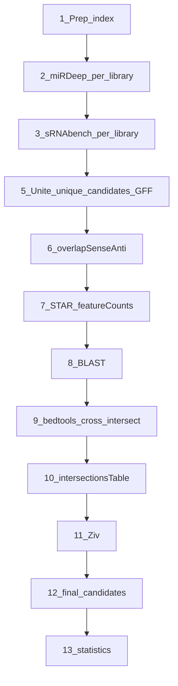

# Novel miRNA discovery pipeline (v3 — template reference)

Generalized, agent-friendly pipeline documentation. Commands are **templates** with named placeholders. Substitute values from the [template variables](#template-variables) table and `pipeline_config.py` (`SPECIES_CONFIG`).

| Document | Use when |
|----------|----------|
| **This file** (`pipeline_v3.md`) | Understanding workflow order; assembling or automating commands |
| `Pipeline <Species>.md` | Species-specific notes, paper text, validation results, expanded command examples |

**Paths (fixed):**

- Scripts: `/mnt/new_groups/vaksler_group/Isana_Tzah/novel-miRNAs/`
- Data: `/mnt/new_groups/vaksler_group/Isana_Tzah/Charles_seq/`
- Intersections / BLAST: `/mnt/new_groups/vaksler_group/Isana_Tzah/RNAcentral/`

Invoke Python scripts by **absolute path**; do not copy scripts into species folders.

---

## What changed in the reordering (v2 → v3)

Stage **names** are unchanged for Phases 1–10 relative to the pre-v3 template ordering. v3 **splits old Phase 11 downstream** into three phases (11 Ziv, 12 final candidates, 13 statistics). Only the **run order** of Phases 7–9 changed relative to that earlier ordering.

In v2, **cross-tool bedtools intersections** (old Phase 7) appeared *before* **STAR / featureCounts** (Phase 8) and **BLAST** (Phase 9). That order is fine for drawing overlap BEDs between GFF files, but **`intersectionsTable.py` (Phase 10) needs featureCounts and BLAST files**, so quantification must finish before the integration block. v3 therefore runs:

**Phases 1–6 unchanged** → **7 STAR/featureCounts** → **8 BLAST** → **9 cross-tool bedtools** → **10 intersectionsTable** → **11 Ziv** → **12 final candidates** → **13 statistics**.

One prep addition: **`mirbaseToGFF3.py`** (Elegans) moved into Phase 1 so `cel_mirbase_seq.gff3` exists before Phase 7 miRBase featureCounts.

Phase 5 now uses **`--debug-only`** on unite scripts (Step A) so you do not build GFF/FASTA twice; Step C with **`--uniquecandidates True`** loads the unique_candidates CSV directly without re-reading per-library files.

| v2 section order | v3 run order | What runs |
|------------------|--------------|-----------|
| 7 — Cross-tool intersections | **9** | bedtools cross-intersect |
| 8 — STAR / featureCounts | **7** | STAR, featureCounts, `add_flank_to_GFF.py` |
| 9 — BLAST | **8** | blastn |
| 10 — Intersections table | **10** | `intersectionsTable.py` |
| 11 — Downstream (all in one) | **11–13** | Ziv → final FASTAs → `statistics.py` |

Phases 1–6 keep the same names and relative order as v2.

---

## Workflow overview

Each phase lists its main scripts. Run in this order:

| Step | Phase name (same as v2) | Main scripts / tools |
|------|-------------------------|----------------------|
| 1 | Read preprocessing and genome indexing | cutadapt, bowtie-build, makeSeqObj.jar, `mirbaseToGFF3.py` (Elegans) |
| 2 | miRDeep2 discovery (per library) | mapper.pl, miRDeep2.pl, `mirdeepPerLibraryFilter.py` |
| 3 | sRNAbench discovery (per library) | sRNAbench.jar, `srnabenchPerLibraryFilter.py` |
| 4 | Per-library filtering criteria | *(reference only — filters run in Phases 2–3)* |
| 5 | Unite libraries, unique_candidates, GFF3/FASTA | `srnabenchUniteGFF.py`, `mirdeepUniteGFF.py`, `processGoodCandidates.py`, `compare_genome_to_fasta.py` |
| 6 | Sense / antisense / overlap labeling | bedtools (self-intersect), `overlapSenseAnti.py` |
| 7 | STAR alignment and featureCounts | STAR, featureCounts, `add_flank_to_GFF.py` |
| 8 | BLAST homolog search | `filterSpacesBlastDB.py`, makeblastdb, blastn |
| 9 | Cross-tool (and known-miRNA) intersections | bedtools (cross-intersect), `intersections.sbatch` |
| 10 | Intersections table | `intersectionsTable.py` |
| 11 | Structural filtering (Ziv) | `allCandidatesFasta.py` → `Ziv_feature_SOS.py` |
| 12 | Final candidates | `allCandidatesFasta.py` (from Ziv workbook) |
| 13 | Statistics | `statistics.py` |



### Quick execution order

```
1  cutadapt, bowtie-build, makeSeqObj  (+ mirbaseToGFF3 for Elegans)
2  mapper.pl → miRDeep2.pl → mirdeepPerLibraryFilter.py   (each library)
3  sRNAbench.jar → srnabenchPerLibraryFilter.py             (each library)
5  unite --debug-only → processGoodCandidates → unite --uniquecandidates True  (per tool)
6  bedtools self-intersect → overlapSenseAnti.py
7  STAR → featureCounts → add_flank_to_GFF → featureCounts (flanked)
8  filterSpacesBlastDB → blastn                              (nematodes only)
9  bedtools cross-intersect (sRNAbench ↔ miRDeep; Elegans ↔ miRBase/miRGeneDB)
10 intersectionsTable.py
11 allCandidatesFasta (from intersections) → Ziv_feature_SOS.py
12 allCandidatesFasta (from Ziv workbook, {ZIV_SHEET}) → final FASTAs
13 statistics.py  (input: all_remaining_after_ziv_{SPECIES}.xlsx)
Optional: mirTrace, expression_dynamics, miRge, seed_frequency, new_genome
```

*(Phase 4 is a reference table of filter rules, not a separate run step.)*

### Filtering layers (which script, which phase)

Only stages that **remove** miRNA candidates and keep a subset. Merge/unite, labeling, and export steps are omitted.

| Layer | What it does | Script | Phase |
|-------|--------------|--------|-------|
| 1 | Per-library quality filter | `mirdeepPerLibraryFilter.py`, `srnabenchPerLibraryFilter.py` | 2, 3 |
| 2 | unique_candidates (±20 bp collapse; Hofstenia multi-replicate support) | `processGoodCandidates.py` | 5 step B |
| 3 | Drop low expression (sum FC &lt; 100) | `intersectionsTable.py --sum-fc-thres 100` | 10 |
| 4 | Structural filter | `Ziv_feature_SOS.py` | 11 |

`Ziv_feature_SOS.py` runs after `intersectionsTable.py` so each row already has featureCounts, BLAST, and cross-tool types. `statistics.py` runs on the Ziv-filtered workbook (Phase 13), not the raw intersections table.

---

## Template variables

Resolve these before running a step. An agent can load library lists and flags from `pipeline_config.get_species_config("<Species>")`.

| Variable | Meaning | Example (Hofstenia) |
|----------|---------|---------------------|
| `{SPECIES}` | Canonical `-s` argument (**must match** `SPECIES_CONFIG`: `Elegans`, `Macrosperma`, `Sulstoni`, `Hofstenia`) | `Hofstenia` |
| `{VARIANT}` | Optional: `--variant new_genome` or omit | *(omit)* |
| `{LIBRARIES}` | Comma-separated library IDs | `EC1,EC2,EC3,...` |
| `{LIBRARY}` | Single library ID | `EC1` |
| `{BASE}` | Charles_seq root | `/mnt/new_groups/vaksler_group/Isana_Tzah/Charles_seq` |
| `{SPECIES_DIR}` | Species working root | `{BASE}/Hofstenia` |
| `{SCRIPTS_DIR}` | United GFF/FASTA dir | `{SPECIES_DIR}/scripts` |
| `{BASH_DIR}` | sbatch wrappers | `{SPECIES_DIR}/bash` (Elegans: `Bash`) |
| `{GENOME_DIR}` | Genome folder | `{SPECIES_DIR}/genome` (Elegans: `Genome`) |
| `{GENOME_FA}` | Reference FASTA | species-specific; see [Library reference](#library-reference) |
| `{GENOME_FA_NO_WS}` | Whitespace-stripped genome (miRDeep / coord QC) | Elegans: `new_caenorhabditis_elegans...` |
| `{INDEX_BASENAME}` | bowtie / sRNAbench index basename | `hofstenia`, `elegans`, etc. |
| `{SRNABENCH_INDEX}` | sRNAbench `species=` key | `{INDEX_BASENAME}GenomeIndexed` |
| `{READ_FASTQ}` | Per-library reads for STAR/sRNAbench | Nematodes: `TrimmedFastq/<SRR>_trimmed.fastq`; Hofstenia: `Fastq/.../filtered/{LIBRARY}.filtered.fastq` |
| `{MIRDEEP_OUT}` | Per-library miRDeep folder | `{SPECIES_DIR}/mirdeep_out/{LIBRARY}` |
| `{SRNABENCH_OUT}` | Per-library sRNAbench folder | `{BASE}/sRNAtoolboxDB/out/{SPECIES}/{SPECIES}_{LIBRARY}` |
| `{STAR_SAM}` | One library SAM | `{SPECIES_DIR}/STAR/align_to_genome/{LIBRARY}/{SPECIES}_Aligned.out.sam` |
| `{STAR_SAMS}` | All library SAMs (space-separated) | Expand over `{LIBRARIES}` |
| `{TOOL}` | Filter/unite flag | `sRNAbench` or `miRDeep` |
| `{TOOL_TAG}` | Filename / featureCounts token | `sRNAbench` or `mirdeep` (lowercase **m**) |
| `{RNACENTRAL}` | RNAcentral root | `/mnt/new_groups/vaksler_group/Isana_Tzah/RNAcentral` |
| `{SEED}` | Seed file (nematodes; Hofstenia uses config default) | `{BASE}/mirbase_data/Seeds.txt` |
| `{RNA_MI_DIR}` | Intersections / BED / tables | `{RNACENTRAL}/miRNAs/{SPECIES}` |
| `{REPO}` | Script root | `/mnt/new_groups/vaksler_group/Isana_Tzah/novel-miRNAs` |
| `{ZIV_XLSX}` | Ziv-filtered workbook | `{BASE}/Ziv_Features/all_remaining_after_ziv_{SPECIES}.xlsx` |
| `{ZIV_SHEET}` | Sheet for final candidates / statistics | Nematodes: `(D) Structural Features`; Hofstenia: `(A) Unfiltered` — from `cfg["mirge_input_sheet"]` |
| `{MIRGE_FASTA_DIR}` | Final candidate FASTAs (Phase 12) | `{SPECIES_DIR}/miRge/` (Hofstenia: `miRge_after_Ziv/`) |

**Agent assembly rules:**

1. **Per-library loops** — repeat discovery, filter, and STAR-align for each ID in `cfg["libraries"]`.
2. **`-s` on Python scripts** — always canonical `{SPECIES}`; lowercase fails `get_species_config()`.
3. **`-l` argument** — comma-separated `{LIBRARIES}`, no spaces.
4. **`{VARIANT}`** — append `--variant new_genome` on `{Species}_newGenome` tracks; reuse reads from original species folder.
5. **`{STAR_SAMS}`** — from `{BASH_DIR}` use relative paths: `../STAR/align_to_genome/{LIBRARY}/{SPECIES}_Aligned.out.sam`.
6. **Phase 5 unique_candidates (per tool, in order)** — never skip a step; never run Step C before Step B:
   - **Step A:** `*UniteGFF.py ... --debug-only` → writes `debugging_{SPECIES}_*.csv` only
   - **Step B:** `processGoodCandidates.py --tool {TOOL}` → writes `unique_candidates/{tool}_uniqueCandidates.csv`
   - **Step C:** same unite command as Step A but **`--uniquecandidates True`** (no `--debug-only`) → final GFF/FASTA; skips re-uniting libraries if the unique_candidates file exists
7. **Phase 11 vs 12 `allCandidatesFasta.py`** — Phase 11 reads `intersections_table_*.xlsx`; Phase 12 reads `{ZIV_XLSX}` with `--sheetname {ZIV_SHEET}`.
8. **Species forks** — see [Species-specific forks](#species-specific-forks).

---

## Species at a glance

| Species | Role | Libraries | Known-miRNA intersects | BLAST | Seed file |
|---------|------|-----------|------------------------|-------|-----------|
| **Elegans** | Validation control | 12 (CE57–CE81) | **miRBase + miRGeneDB** | Yes | `mirbase_data/Seeds.txt` |
| **Macrosperma** | Novel nematode | 5 (MR4–MR8) | Tool–tool only | Yes | `mirbase_data/Seeds.txt` |
| **Sulstoni** | Novel nematode | 8 (SR0–SR7) | Tool–tool only | Yes | `mirbase_data/Seeds.txt` |
| **Hofstenia** | Acoel flatworm | 33 (EC1…SMA3) | None | **No** | `mirbase_data/ALL_seed_family_from_mirgendb.csv` |

**Nematodes:** PRJNA678899; adapter `AACTGTAGGCACCATCAAT`; cutadapt  
`-a AACTGTAGGCACCATCAAT --core 2 -e 0.25 --discard-untrimmed -m 17 -M 26`.

**unique_candidates:** nematodes = one representative per ±20 bp cluster (single-library loci kept); Hofstenia = same ±20 bp collapse, plus ≥2 condition replicates (strip trailing digit).

**Ziv sheets:** nematodes → `(D) Structural Features`; Hofstenia → `(A) Unfiltered`.

---

## Directory layout

```
{BASE}/
  {Species}/
    TrimmedFastq/          # nematodes
    genome/ or Genome/     # FASTA + bowtie index
    mapper_out/
    mirdeep_out/{library}/
    scripts/               # unite, GFF/FASTA/CSVs
    unique_candidates/
    STAR/genome_index/
    STAR/align_to_genome/{library}/
    counts_sep/
    bash/ or Bash/
  {Species}_newGenome/
  sRNAtoolboxDB/out/{Species}/{Species}_{library}/
  mirbase_data/
  Ziv_Features/
{RNACENTRAL}/
  miRNAs/{Species}/
  queries/{Species}/
  bash/
  BLAST_DB/
```

---

## Script inventory

| Phase | Script | Key flags |
|-------|--------|-----------|
| 2, 3 | `srnabenchPerLibraryFilter.py` | `--filter-mc 10` |
| 2, 3 | `mirdeepPerLibraryFilter.py` | `--filter-s 10 --exclude-c 100 --filter-mc 10` |
| 5 | `srnabenchUniteGFF.py`, `mirdeepUniteGFF.py` | `--debug-only` (step A); `--uniquecandidates True` (step C) |
| 5 | `processGoodCandidates.py` | `--tool sRNAbench` or `miRDeep` |
| 5 | `compare_genome_to_fasta.py` | `--mode discovery` (nematodes) |
| 6 | `overlapSenseAnti.py` | after self-intersect BED |
| 1 | `mirbaseToGFF3.py` | **Elegans only** |
| 7 | `add_flank_to_GFF.py` | `-s {SPECIES}` |
| 8 | `filterSpacesBlastDB.py` | once for nematodes |
| 10 | `intersectionsTable.py` | `--sum-fc-thres 100` |
| 11 | `allCandidatesFasta.py` | from intersections table (Ziv input FASTAs) |
| 11 | `Ziv_feature_SOS.py` | → `{ZIV_XLSX}` |
| 12 | `allCandidatesFasta.py` | `--sheetname {ZIV_SHEET}` from `{ZIV_XLSX}` |
| 13 | `statistics.py` | `--all {ZIV_XLSX}`; Hofstenia: 10 kb clusters |

---

## Phase 1 — Read preprocessing and genome indexing

**Scripts/tools:** cutadapt, bowtie-build, makeSeqObj.jar, `mirbaseToGFF3.py` (Elegans only)

**Inputs:** raw FASTQ (nematodes) or pre-trimmed reads (Hofstenia), reference genome FASTA.  
**Outputs:** trimmed reads, bowtie index, sRNAbench seq object, optional Elegans miRBase GFF.

**Nematodes — trim adapter** (per library; or `cutadapt.sbatch`):

```bash
cd {BASH_DIR}
cutadapt -a AACTGTAGGCACCATCAAT --core 2 -e 0.25 --discard-untrimmed -m 17 -M 26 \
  ../Fastq/{SRR}.fastq > ../TrimmedFastq/{SRR}_trimmed.fastq
```

**Bowtie index:**

```bash
cd {GENOME_DIR}
bowtie-build -f {GENOME_FA} index/{INDEX_BASENAME}GenomeIndexed
```

**Genome whitespace fix** (before miRDeep2 if needed):

```bash
perl -lane 's/\s+.+$//' < {GENOME_FA} > {GENOME_FA_NO_WS}
```

**sRNAbench genome object:**

```bash
java -jar {BASE}/sRNAtoolboxDB/exec/makeSeqObj.jar {GENOME_FA}
# Move zip → {BASE}/sRNAtoolboxDB/seqOBJ/{SRNABENCH_INDEX}.zip
# Copy bowtie index → {BASE}/sRNAtoolboxDB/index/
```

**Elegans only — miRBase GFF** (run once; required before Phase 7 miRBase featureCounts and Phase 9 miRBase intersections):

```bash
cd {BASE}/mirbase_data
python {REPO}/mirbaseToGFF3.py   # → cel_mirbase_seq.gff3
```

> **sbatch:** new-genome indexing (`bowtie_index.sbatch`, `makeseqobj.sbatch`, `star_genome_indexing.sbatch`). Mapper jobs are Phase 2.

---

## Phase 2 — miRDeep2 discovery (per library)

**Scripts:** mapper.pl, miRDeep2.pl, `mirdeepPerLibraryFilter.py`

**Inputs:** trimmed/pre-trimmed reads, indexed genome.  
**Outputs:** per-library `{MIRDEEP_OUT}/` folders; `remaining_file_*.csv` per library.

**mapper.pl** — submit via sbatch from `{BASH_DIR}`. Same model for all species: **one `mapper.pl` call per FASTQ** (no `config.txt`, no `-d`). One sbatch file may contain many sequential calls.

| Species | sbatch | Scope |
|---------|--------|--------|
| Nematodes (Elegans, Macrosperma, Sulstoni) | **one** `mapper.sbatch` per species | Sequential `mapper.pl` per library FASTQ → per-library `.arf` / collapsed `.fasta` |
| Hofstenia | `mapper_test2.sbatch` + `mapper_test3.sbatch` | Libraries split across **two** jobs (size); same per-FASTQ pattern |

**Nematodes** (from `{BASH_DIR}`):

```bash
sbatch mapper.sbatch
# each library inside mapper.sbatch (Hofstenia-style; repeat per {LIBRARY}):
mapper.pl {READ_FASTQ} -e -i -j -m -h \
  -p ../genome/index/{INDEX_BASENAME}GenomeIndexed \
  -t ../mapper_out/{species_tag}_Seq_vs_genome_{LIBRARY}.arf \
  -s ../mapper_out/{species_tag}_Seq_collapsed_{LIBRARY}.fasta
```

**Hofstenia** (two batch files covering all libraries):

```bash
sbatch mapper_test2.sbatch
sbatch mapper_test3.sbatch
```

**miRDeep2.pl** — one run per library in `{MIRDEEP_OUT}/`, using that library’s mapper outputs. Do **not** use unsuffixed combined `*_Seq_collapsed.fasta`.

```bash
# Option A — parallel (Hofstenia-style; preferred):
cd {SPECIES_DIR}/mirdeep_out
for dir in {LIBRARY_1} {LIBRARY_2} ...; do
  (cd "$dir" && sbatch mirdeep_test.sbatch)
done

# Option B — sequential all libraries from {BASH_DIR}:
sbatch mirdeep.sbatch
```

**Filter** (conda off; or via sbatch):

```bash
# per folder:
python {REPO}/mirdeepPerLibraryFilter.py -i result_*.csv \
  --filter-s 10 --exclude-c 100 --filter-mc 10

# or all libraries:
sbatch {SPECIES_DIR}/scripts/filter_mirdeep.sbatch   # nematodes
# Hofstenia: filter_hof_mirdeep.sbatch
```

Outputs: `remaining_file_1.csv`, `remaining_file_2.csv`, `removed.csv`.

> **sbatch:** `mapper.sbatch` (or Hofstenia `mapper_test2/3.sbatch`); `mirdeep_test.sbatch` / `mirdeep.sbatch`; `filter_mirdeep.sbatch` (nematodes) or `filter_hof_mirdeep.sbatch`.

---

## Phase 3 — sRNAbench discovery (per library)

**Scripts:** sRNAbench.jar, `srnabenchPerLibraryFilter.py`

**Inputs:** trimmed/pre-trimmed reads, sRNAbench genome index.  
**Outputs:** per-library `{SRNABENCH_OUT}/` folders; filtered `remaining*.csv`.

**Do not combine FASTQs** (no `*_final.fastq`). Each library gets its own `{SRNABENCH_OUT}/`.

```bash
cd {BASH_DIR}
sbatch srnabench.sbatch
# each library inside (Hofstenia may use one sbatch file per library instead):
java -jar ../../sRNAtoolboxDB/exec/sRNAbench.jar \
  input={READ_FASTQ} \
  output=../../sRNAtoolboxDB/out/{SPECIES}/{SPECIES}_{LIBRARY} \
  predict=true species={SRNABENCH_INDEX} \
  dbPath={BASE}/sRNAtoolboxDB \
  hairpin=animalsHairpin.fa mature=animalsMature.fa
```

**Filter** (conda off; or via sbatch):

```bash
python {REPO}/srnabenchPerLibraryFilter.py -i novel.txt -a novel451.txt --filter-mc 10
# or: sbatch {SPECIES_DIR}/scripts/filter_sRNAbench.sbatch
# Hofstenia: filter_hof_sRNAbench.sbatch
```

> **sbatch:** `srnabench.sbatch` (nematodes: sequential per-library; Hofstenia: `sRNAbench_{LIBRARY}.sbatch`); `filter_sRNAbench.sbatch` / `filter_hof_sRNAbench.sbatch`.

---

## Phase 4 — Per-library filtering criteria (reference)

**Scripts:** `mirdeepPerLibraryFilter.py` (Phase 2), `srnabenchPerLibraryFilter.py` (Phase 3)

These filters run immediately after each discovery tool, inside each library folder. This section documents the rules only.

**sRNAbench:** drop if `max(5pRC,3pRC) < 10` or `matureBindings < 14`; discard all novel451; drop ncRNA matches; trim hairpin to mature/star bounds.

**miRDeep:** drop rfam-alert / ncRNA; deduplicate lower-scoring mature/star when score ≥ 10; keep if score ≥ 10 or (score < 10 and total ≥ 100 and star > 0); drop if `max(mature RC, star RC) < 10`.

---

## Phase 5 — Unite libraries, unique_candidates, GFF3/FASTA

**Scripts:** `srnabenchUniteGFF.py`, `mirdeepUniteGFF.py`, `processGoodCandidates.py`, `compare_genome_to_fasta.py`

**Inputs:** per-library `remaining*.csv` from Phases 2–3.  
**Outputs:** united GFF/FASTA, `*_all_remaining_filtered.csv`, `*_pre_only.gff3`.

Working directory: `{SCRIPTS_DIR}/`. Run **per tool** (sRNAbench, then miRDeep). Each tool uses the **three-step sequence below** — do not swap order, do not combine steps.

### Agent checklist (Phase 5, one tool at a time)

```
FOR tool IN (sRNAbench, miRDeep):
  1. unite  --debug-only              → debugging_{SPECIES}_*.csv
  2. processGoodCandidates --tool     → unique_candidates/{tool}_uniqueCandidates.csv
  3. unite  --uniquecandidates True     → final GFF3, FASTA, *_all_remaining_filtered.csv
```

**Flags:** Step A uses `--debug-only` (not `--uniquecandidates False`). Step C uses `--uniquecandidates True` only. Step C reads the unique_candidates CSV directly and **does not** re-read per-library folders when that file exists.

### Step A — unite libraries, write debugging CSV only

Produces `debugging_{SPECIES}_sRNAbench.csv` or `debugging_{SPECIES}_miRDeep_{1,2}.csv`. No GFF/FASTA yet.

**sRNAbench** (nematodes — pass `-seed`; Hofstenia — `--base-path {BASE}`, no `-seed`):

```bash
cd {SCRIPTS_DIR}
python {REPO}/srnabenchUniteGFF.py -o {SPECIES}_sRNAbench.gff3 \
  -seed {SEED} --create-fasta {SPECIES}_sRNAbench.fasta \
  -s {SPECIES} {VARIANT} --debug-only
```

**Hofstenia sRNAbench:**

```bash
python {REPO}/srnabenchUniteGFF.py -o Hofstenia_sRNAbench.gff3 -s Hofstenia \
  --base-path {BASE} --create-fasta Hofstenia_sRNAbench.fasta --debug-only
```

**miRDeep** (nematodes):

```bash
python {REPO}/mirdeepUniteGFF.py -o {SPECIES}_mirdeep.gff3 \
  --create-fasta {SPECIES}_mirdeep.fasta \
  -seed {SEED} -s {SPECIES} {VARIANT} --debug-only
```

**Hofstenia miRDeep:**

```bash
python {REPO}/mirdeepUniteGFF.py -o Hofstenia_mirdeep.gff3 \
  --create-fasta Hofstenia_mirdeep.fasta -s Hofstenia \
  --base-path {BASE} --debug-only
```

### Step B — unique_candidates (±20 bp collapse)

Requires Step A debugging CSV. Writes `{SPECIES_DIR}/unique_candidates/{tool}_uniqueCandidates.csv`.

- **Nematodes:** collapses candidates within ±20 bp to the highest-read-count representative; **does not** require presence in multiple libraries/stages.
- **Hofstenia:** same ±20 bp collapse, plus ≥2 condition replicates (strip trailing digit from library name).

```bash
python {REPO}/processGoodCandidates.py --tool sRNAbench -s {SPECIES} {VARIANT}
python {REPO}/processGoodCandidates.py --tool miRDeep -s {SPECIES} {VARIANT}
```

Hofstenia: add `--base-path {BASE}` on both commands.

### Step C — final GFF and united CSV

Same flags as Step A, but replace `--debug-only` with **`--uniquecandidates True`**:

```bash
python {REPO}/srnabenchUniteGFF.py -o {SPECIES}_sRNAbench.gff3 \
  -seed {SEED} --create-fasta {SPECIES}_sRNAbench.fasta \
  -s {SPECIES} {VARIANT} --uniquecandidates True

python {REPO}/mirdeepUniteGFF.py -o {SPECIES}_mirdeep.gff3 \
  --create-fasta {SPECIES}_mirdeep.fasta \
  -seed {SEED} -s {SPECIES} {VARIANT} --uniquecandidates True
```

Hofstenia: add `--base-path {BASE}`; omit `-seed`.

Outputs in `{SCRIPTS_DIR}/`: `{SPECIES}_sRNAbench.gff3`, `{SPECIES}_mirdeep.gff3`, `*_pre_only.gff3`, FASTAs, `*_all_remaining_filtered.csv`.

### Coordinate QC (nematodes; after step C)

```bash
python {REPO}/compare_genome_to_fasta.py --mode discovery --species {SPECIES} {VARIANT} \
  --dir {SCRIPTS_DIR} --genome_fasta {GENOME_FA_NO_WS} \
  --gff {SPECIES}_{TOOL_TAG}.gff3 --mature {SPECIES}_{TOOL_TAG}.fasta \
  --star {SPECIES}_{TOOL_TAG}_star.fasta \
  --hairpin-table {TOOL_TAG}_all_remaining_filtered.csv --output {TOOL_TAG}_coord_check.csv
```

---

## Phase 6 — Sense / antisense / overlap labeling

**Scripts:** bedtools (self-intersect), `overlapSenseAnti.py`

**Inputs:** `{SPECIES}_*_pre_only.gff3` from Phase 5.  
**Outputs:** labeled GFF with sense/antisense/overlap types (used in Phase 9 cross-tool intersects).

Self-intersection on `_pre_only.gff3` (`bedtools intersect -wao -loj -f 0.4`):

```bash
cd {SCRIPTS_DIR}
sed -i 's/\t*$//' {SPECIES}_mirdeep_pre_only.gff3
sed -i 's/\t*$//' {SPECIES}_sRNAbench_pre_only.gff3

cd {RNA_MI_DIR}
bedtools intersect -wao -loj -f 0.4 \
  -a {SCRIPTS_DIR}/{SPECIES}_mirdeep_pre_only.gff3 \
  -b {SCRIPTS_DIR}/{SPECIES}_mirdeep_pre_only.gff3 \
  > miRdeep_intersect.bed
bedtools intersect -wao -loj -f 0.4 \
  -a {SCRIPTS_DIR}/{SPECIES}_sRNAbench_pre_only.gff3 \
  -b {SCRIPTS_DIR}/{SPECIES}_sRNAbench_pre_only.gff3 \
  > sRNAbench_intersect.bed

python {REPO}/overlapSenseAnti.py \
  --intersections-table {RNA_MI_DIR}/miRdeep_intersect.bed \
  --gff {SCRIPTS_DIR}/{SPECIES}_mirdeep_pre_only.gff3
python {REPO}/overlapSenseAnti.py \
  --intersections-table {RNA_MI_DIR}/sRNAbench_intersect.bed \
  --gff {SCRIPTS_DIR}/{SPECIES}_sRNAbench_pre_only.gff3
```

---

## Phase 7 — STAR alignment and featureCounts

**Scripts:** STAR, featureCounts, `add_flank_to_GFF.py`

**Inputs:** united GFF/FASTA from Phase 5, reads from Phase 1.  
**Outputs:** STAR SAMs, `counts_sep/miRNA_*_counts.txt`, flanked precursor counts.

### STAR

**Index** (from `{BASH_DIR}`):

```bash
STAR --runMode genomeGenerate --runThreadN 16 \
  --genomeDir ../STAR/genome_index/ --genomeSAindexNbases 11 \
  --genomeFastaFiles {GENOME_FA}
```

**Align** — **one FASTQ / one output dir per `{LIBRARY}`** (never all libraries in one `--readFilesIn`):

```bash
cd {BASH_DIR}
sbatch star_align.sbatch
# each library inside:
STAR --genomeDir ../STAR/genome_index/ \
  --readFilesIn {READ_FASTQ} \
  --outFileNamePrefix ../STAR/align_to_genome/{LIBRARY}/{SPECIES}_ \
  --outFilterMultimapNmax 20 --runThreadN 16 --outSAMtype SAM
```

> **Do not use** `star_align_all_libraries.sbatch` on nematode `*_newGenome` tracks — it is disabled (legacy combined). Use `star_align.sbatch`.

### featureCounts — mature miRNA

```bash
cd {BASH_DIR}
featureCounts -t miRNA -g ID -O -s 1 -M \
  -a {SCRIPTS_DIR}/{SPECIES}_{TOOL_TAG}.gff3 \
  -o ../counts_sep/miRNA_{TOOL_TAG}_counts.txt \
  {STAR_SAMS}
```

**Elegans only — miRBase counts** (requires `cel_mirbase_seq.gff3` from Phase 1):

```bash
featureCounts -R SAM -t miRNA -g ID -O -s 1 -M \
  -a {BASE}/mirbase_data/cel_mirbase_seq.gff3 \
  -o ../counts_sep/miRNA_mirbase_counts.txt \
  {STAR_SAMS}
```

### Flanked precursor counts (m/pre ratio)

```bash
python {REPO}/add_flank_to_GFF.py -s {SPECIES} {VARIANT}

featureCounts -F GFF -t pre_miRNA -g ID -O -s 1 -M \
  -a {SCRIPTS_DIR}/{SPECIES}_{TOOL_TAG}_flanked_pre.gff3 \
  -o ../counts_sep/miRNA_{TOOL_TAG}_counts_flanked.txt \
  {STAR_SAMS}
```

---

## Phase 8 — BLAST homolog search

**Scripts:** `filterSpacesBlastDB.py`, makeblastdb, blastn

**Inputs:** precursor FASTAs from Phase 5 (`{SPECIES}_mirdeep.fasta`, `{SPECIES}_sRNAbench.fasta`).  
**Outputs:** `miRdeep_blastn_compact`, `sRNAbench_blastn_compact` in `{RNACENTRAL}/queries/{SPECIES}/`.

**Nematodes only** — Hofstenia skips this phase.

**Once — build DB** in `{RNACENTRAL}/BLAST_DB/`:

```bash
cd {RNACENTRAL}/BLAST_DB
python {REPO}/filterSpacesBlastDB.py > Caenorhabditis_pre_miRNA.fasta
makeblastdb -in Caenorhabditis_pre_miRNA.fasta -title miRNADB -dbtype nucl \
  -out Caenorhabditis_pre_miRNAsDB
```

**Per species** (from `{RNACENTRAL}/bash/`):

```bash
blastn -query {SCRIPTS_DIR}/{SPECIES}_mirdeep.fasta \
  -db ../BLAST_DB/Caenorhabditis_pre_miRNAsDB \
  -out ../queries/{SPECIES}/miRdeep_blastn_compact \
  -outfmt 6 -evalue 10 -task blastn-short
blastn -query {SCRIPTS_DIR}/{SPECIES}_sRNAbench.fasta \
  -db ../BLAST_DB/Caenorhabditis_pre_miRNAsDB \
  -out ../queries/{SPECIES}/sRNAbench_blastn_compact \
  -outfmt 6 -evalue 10 -task blastn-short
```

> **Worked example:** see [`Pipeline Hofstenia.md`](Pipeline%20Hofstenia.md) for fully expanded STAR SAM lists (33 libraries). For other species, expand `{STAR_SAMS}` over `cfg["libraries"]` in `pipeline_config.py`.

---

## Phase 9 — Cross-tool (and known-miRNA) intersections

**Scripts:** bedtools (cross-intersect), `intersections.sbatch`

**Inputs:** labeled GFF from Phase 6.  
**Outputs:** cross-intersect BED files in `{RNA_MI_DIR}/` (e.g. `miRdeep_sRNAbench_intersect.bed`).

> **Note:** In v2 this was Phase 7 and ran *before* STAR. v3 runs it here (after Phases 7–8) because Phase 10 `intersectionsTable.py` needs featureCounts and BLAST first; cross-tool BEDs only need GFF and can still be built at this point.

### Cross-tool bedtools intersections

Strand-aware (`-s`); overlap fraction `-f`:

| Comparison | `-f` |
|------------|------|
| sRNAbench ↔ miRDeep | 0.6 |
| Any ↔ miRBase | 0.5–0.6 |
| miRDeep ↔ miRGeneDB | 0.6 |

**Nematodes:** sRNAbench ↔ miRDeep only.  
**Elegans:** also vs miRBase and miRGeneDB (miRBase GFF built in Phase 1).

Full bedtools commands: `{RNA_MI_DIR}/Command.txt` and `intersections.sbatch`.

---

## Phase 10 — Intersections table

**Script:** `intersectionsTable.py`

**Inputs:** cross-intersect BEDs from Phase 9, featureCounts from Phase 7, BLAST from Phase 8 (nematodes).  
**Outputs:** `intersections_table_{SPECIES}.xlsx` in `{RNA_MI_DIR}/`. Applies expression filter (sum mature FC &lt; 100).

```bash
python {REPO}/intersectionsTable.py -s {SPECIES} {VARIANT} \
  --mirdeep-inter-table {RNA_MI_DIR}/miRdeep_sRNAbench_intersect.bed \
  --sRNAbench-inter-table {RNA_MI_DIR}/sRNAbench_miRdeep_intersect.bed \
  --fc-mirdeep {SPECIES_DIR}/counts_sep/miRNA_mirdeep_counts.txt \
  --fc-pre-mirdeep {SPECIES_DIR}/counts_sep/miRNA_mirdeep_counts_flanked.txt \
  --fc-sRNAbench {SPECIES_DIR}/counts_sep/miRNA_sRNAbench_counts.txt \
  --fc-pre-sRNAbench {SPECIES_DIR}/counts_sep/miRNA_sRNAbench_counts_flanked.txt \
  -rm {SCRIPTS_DIR}/mirdeep_all_remaining_filtered.csv \
  -rs {SCRIPTS_DIR}/sRNAbench_all_remaining_filtered.csv \
  -l {LIBRARIES} \
  --sum-fc-thres 100
```

**Nematodes (non-Elegans)** — add BLAST:

```bash
  --blast-mirdeep {RNACENTRAL}/queries/{SPECIES}/miRdeep_blastn_compact \
  --blast-sRNAbench {RNACENTRAL}/queries/{SPECIES}/sRNAbench_blastn_compact
```

**Elegans only** — add miRBase/miRGeneDB BEDs, BLAST, `-mgff`, `--fc_mirbase`:

```bash
  --mirdeep-mibrase-inter {RNA_MI_DIR}/miRdeep_miRBase_intersect.bed \
  --mirdeep-mirgenedb-inter {RNA_MI_DIR}/miRdeep_miRGeneDB_intersect.bed \
  --sRNAbench-mibrase-inter {RNA_MI_DIR}/sRNAbench_miRBase_intersect.bed \
  --sRNAbench-mirgenedb-inter {RNA_MI_DIR}/sRNAbench_miRGeneDB_intersect.bed \
  --mirbase-mirgenedb-inter {RNA_MI_DIR}/miRBase_miRGeneDB_intersect.bed \
  --mirbase-mirdeep-inter {RNA_MI_DIR}/miRBase_miRdeep_intersect.bed \
  --mirbase-sRNAbench-inter {RNA_MI_DIR}/miRBase_sRNAbench_intersect.bed \
  --blast-mirdeep {RNACENTRAL}/queries/Elegans/miRdeep_blastn_compact \
  --blast-sRNAbench {RNACENTRAL}/queries/Elegans/sRNAbench_blastn_compact \
  --fc_mirbase {SPECIES_DIR}/counts_sep/miRNA_mirbase_counts.txt \
  -mgff {BASE}/mirbase_data/cel_mirbase_seq.gff3
```

Output: `intersections_table_{SPECIES}.xlsx` in `{RNA_MI_DIR}/`.

---

## Phase 11 — Structural filtering (Ziv)

**Scripts:** `allCandidatesFasta.py` (prep), `Ziv_feature_SOS.py`

**Inputs:** `intersections_table_{SPECIES}.xlsx` from Phase 10.  
**Outputs:** precursor/mature/star FASTAs in `{RNA_MI_DIR}/`; `{ZIV_XLSX}`.

Run from `{RNA_MI_DIR}/` or any cwd; paths below are absolute templates.

### Step 11a — extract FASTAs for Ziv (from intersections table)

```bash
python {REPO}/allCandidatesFasta.py \
  --all {RNA_MI_DIR}/intersections_table_{SPECIES}.xlsx \
  -s {SPECIES} {VARIANT}
```

Writes `{RNA_MI_DIR}/all_candidates_hairpin.fasta`, `all_candidates_mature.fasta`, `all_candidates_star.fasta`.

### Step 11b — structural features and filter

```bash
python {REPO}/Ziv_feature_SOS.py \
  --precursors {RNA_MI_DIR}/all_candidates_hairpin.fasta \
  --mature {RNA_MI_DIR}/all_candidates_mature.fasta \
  --star {RNA_MI_DIR}/all_candidates_star.fasta \
  --species {SPECIES} {VARIANT} \
  --all-remaining {RNA_MI_DIR}/intersections_table_{SPECIES}.xlsx
```

Output: `{ZIV_XLSX}`. Structural sheet name → `{ZIV_SHEET}` (nematodes: `(D) Structural Features`; Hofstenia: `(A) Unfiltered`).

---

## Phase 12 — Final candidates

**Script:** `allCandidatesFasta.py` (second pass — from Ziv workbook)

**Inputs:** `{ZIV_XLSX}` from Phase 11.  
**Outputs:** final candidate FASTAs in `{MIRGE_FASTA_DIR}/`.

Extract sequences from the **Ziv-filtered sheet**, not the raw intersections table:

```bash
python {REPO}/allCandidatesFasta.py \
  --all {ZIV_XLSX} \
  -s {SPECIES} {VARIANT} \
  --sheetname "{ZIV_SHEET}" \
  --output {MIRGE_FASTA_DIR}/
```

**Output directory by species:**

| Species | `{MIRGE_FASTA_DIR}` |
|---------|---------------------|
| Elegans, Macrosperma, Sulstoni | `{SPECIES_DIR}/miRge/` |
| Hofstenia | `{SPECIES_DIR}/miRge_after_Ziv/` |

Phase 12 is required before the optional miRge branch; Phase 13 does not depend on it.

---

## Phase 13 — Statistics

**Script:** `statistics.py`

**Inputs:** `{ZIV_XLSX}` from Phase 11 (post-Ziv filtered candidates).  
**Outputs:** plots in `./figures/`, cluster files, updated `{ZIV_XLSX}` with cluster columns.

Run from `{RNA_MI_DIR}/` (statistics writes `./figures/` relative to cwd):

```bash
cd {RNA_MI_DIR}
python {REPO}/statistics.py \
  --all {ZIV_XLSX} \
  -s {SPECIES} {VARIANT}
```

`statistics.py` reads sheet `{ZIV_SHEET}` automatically via `cfg["mirge_input_sheet"]`. Do **not** pass the intersections table here.

---

## Species-specific forks

| Fork | Species | Action |
|------|---------|--------|
| No BLAST | Hofstenia | Skip Phase 8 BLAST; omit `--blast-*` in Phase 10 |
| miRBase + miRGeneDB | Elegans | Phase 1 `mirbaseToGFF3.py`; full intersection matrix in Phase 9 |
| Coordinate QC | Nematodes | Phase 5 after unite step C; Elegans uses `{GENOME_FA_NO_WS}` |
| Hofstenia unite | Hofstenia | `--base-path {BASE}` on unite + processGoodCandidates; no `-seed` |
| Hofstenia reads | Hofstenia | `Fastq/.../filtered/`, not `TrimmedFastq/` |
| Elegans paths | Elegans | `Bash/`, `Genome/` (capital letters) |
| `-s` casing | All | Always canonical `{SPECIES}` |
| Ziv sheet | Nematodes vs Hofstenia | `(D) Structural Features` vs `(A) Unfiltered` |

---

## Ziv structural thresholds

Build reference distributions once (before first Ziv run on any species):

```bash
python {REPO}/mirgenedbThresholds.py
python {REPO}/Ziv_feature_SOS.py \
  --precursors {BASE}/mirgenedb_data_v3/ALL_mirgenedb_hairpin.fasta \
  --mature {BASE}/mirgenedb_data_v3/ALL_mirgenedb_mature.fasta \
  --star {BASE}/mirgenedb_data_v3/ALL_mirgenedb_star.fasta \
  --species miRGeneDB
python {REPO}/plot_series.py
```

| Feature | Lower | Upper |
|---------|-------|-------|
| Hairpin_seq_trimmed_length | 55.0 | 71.0 |
| Mature_connections | 11.5 | 23.5 |
| Mature_BP_ratio | 0.58 | 0.98 |
| Mature_max_bulge | −0.5 | 3.5 |
| Loop_length | 10.0 | 26.0 |
| Mature_Length | 20.5 | 24.5 |
| Star_length | 20.5 | 24.5 |
| Star_connections | 15.0 | 23.0 |
| Star_BP_ratio | 0.62 | 1.02 |
| Star_max_bulge | −0.5 | 3.5 |
| Max_bulge_symmetry | −1.5 | 2.5 |
| min_one_mer_hairpin | 0.104 | 0.271 |
| max_one_mer_hairpin | 0.216 | 0.422 |

Nematodes additionally filter `5p_overhang_ziv` and `3p_overhang_ziv` to [0, 4] on sheet (D).

---

## Optional steps

Run after Phase 13 unless noted.

**mirTrace QC** (nematodes; can run after Phase 1):

```bash
java -jar -Xms4G -Xmx4G {CONDA}/mirtrace.jar qc \
  --species cel --adapter AACTGTAGGCACCATCAAT --config config.txt
```

**Expression dynamics:**

```bash
python {REPO}/expression_dynamics.py \
  --all {BASE}/Ziv_Features/all_remaining_after_ziv_{SPECIES}.xlsx \
  --libraries {LIBRARIES} --time {TIMEPOINTS} -s {SPECIES}

python {REPO}/expression_dynamics_all.py \
  --all {BASE}/All_species/all_species_candidates.xlsx
```

**Cross-species seeds** (after all species complete):

```bash
cd {BASE}/All_species
python {REPO}/seed_frequency.py
```

**miRge** (after Ziv): regenerate FASTAs from appropriate Ziv sheet → `create_combined_mature_star.py` → `generate_miRNA_GFF.py` → `miRge-build` → `mirge.sbatch` → `mirge_processing.py`. See species docs and `run_miRge.sh`.

---

## Alternate genome assemblies (`--variant new_genome`)

Reuse reads from original track; rebuild indices on new scaffolds. Outputs under `{Species}_newGenome/`.

| Species | Genome FASTA |
|---------|--------------|
| Elegans | `Elegans_newGenome/genome/CELEG...WBPS19.scaffolds.fna` |
| Macrosperma | `Macrosperma_newGenome/genome/CMACR..._v2.scaffolds.fna` |
| Sulstoni | `Sulstoni_newGenome/genome/CSULS...WBPS19.scaffolds.fna` |
| Hofstenia | `Hofstenia_newGenome/sRNA_PBonly/hofPB_v6.FINAL.fa` |

Add `{VARIANT}` = `--variant new_genome` to config-aware Python scripts.

---

## Library reference

### *C. elegans* (CE57–CE81)

Genome: `{GENOME_DIR}/caenorhabditis_elegans.PRJNA13758.WBPS16.genomic.fa`  
Whitespace-stripped: `{GENOME_DIR}/new_caenorhabditis_elegans.PRJNA13758.WBPS16.genomic.fa`  
`{BASH_DIR}` = `Elegans/Bash/`, `{GENOME_DIR}` = `Elegans/Genome/`, `{INDEX_BASENAME}` = `elegans`

### *C. macrosperma* (MR4–MR8)

Genome: `CMACR.caenorhabditis_macrosperma_JU2083_v1.scaffolds.fna`, `{INDEX_BASENAME}` = `macrosperma`

### *C. sulstoni* (SR0–SR7)

Genome: `CSULS.caenorhabditis_sulstoni_JU2788_v1.scaffolds.fna`, `{INDEX_BASENAME}` = `sulstoni`

### *Hofstenia miamia* (33 libraries)

Genome: `Hofstenia/Genome/refs/Hmia_ref/Hmia.030120.fasta`  
Reads: `Hofstenia/Fastq/Hmia_annotation/filtered/{LIBRARY}.filtered.fastq`  
`{INDEX_BASENAME}` = `hofstenia`

Full SRR ↔ library tables: `Pipeline Elegans.md`, `pipeline_config.py`.

---

## Adding a new species

1. Add entry to `SPECIES_CONFIG` in `pipeline_config.py`.
2. Place data under `{BASE}/{Species}/` following the directory layout.
3. Substitute template variables; loop over `cfg["libraries"]` for per-library steps.
4. Run Phases 1–13; use Elegans as validation template if curated miRNAs exist.

---

## Legacy doc drift

Some commands in `Pipeline <Species>.md` use lowercase `-s` (e.g. `-s elegans`). Current scripts require canonical `-s` (`Elegans`, etc.). Follow this file and `pipeline_config.py`, not legacy casing in species docs.

---

## Citations

- cutadapt: DOI 10.14806/ej.17.1.200
- miRDeep2: Friedländer et al., NAR 2012 — https://doi.org/10.1093/nar/gkr688
- sRNAbench: Aparicio-Puerta et al., NAR 2019 — https://doi.org/10.1093/nar/gkz415
- bedtools: Quinlan & Hall, Bioinformatics 2010 — https://doi.org/10.1093/bioinformatics/btq033
- Nematode sRNA-seq: Nelson & Ambros, G3 2021 — PRJNA678899
021 — PRJNA678899
