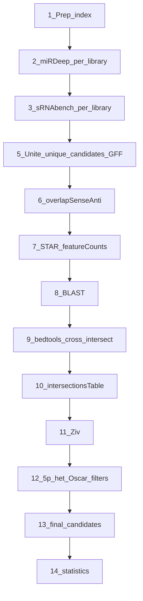

# Novel miRNA discovery pipeline (v4)

Manual cluster runs. Prefer **sbatch** (one nematode command, one Hofstenia command when they differ). Examples of what lives inside those sbatch files are for reference only.


| Document                         | Use when                                     |
| -------------------------------- | -------------------------------------------- |
| **This file** (`pipeline_v4.md`) | Run order + copy-paste commands              |
| `pipeline_v3.md`                 | Previous template (kept for history)         |
| `Pipeline <Species>.md`          | Paper text, validation notes, species quirks |


**Fixed roots (cluster):**

- Scripts (`$REPO`): `/mnt/new_groups/vaksler_group/Isana_Tzah/novel-miRNAs/`
- Data (`$BASE`): `/mnt/new_groups/vaksler_group/Isana_Tzah/Charles_seq/`
- Intersections / BLAST (`$RNACENTRAL`): `/mnt/new_groups/vaksler_group/Isana_Tzah/RNAcentral/`

Invoke Python via absolute `$REPO/...`. Do not copy scripts into species folders.

**Before you start:**

1. Stop after **Phase 11 (Ziv)** until Phase 12 is implemented — do not run 13–14 early.
2. Use `$TRACK` (`{Species}` vs `{Species}_newGenome`) so RNA-mi / Ziv / BLAST paths stay separated.
3. Snapshot existing tracks before re-running in-place phases ([Appendix A](#appendix-a--overwrite-safety)).
4. After each phase: run **Verify**; stop if it prints `VERIFY FAILED`.

Details (workflow diagram, variables, filters, citations, …) live in [appendices](#appendices).

---

## Shell setup (do this first)

**Preferred** — MobaXterm / every new SSH session. Add once to cluster `~/.bashrc`:

```bash
source /mnt/new_groups/vaksler_group/Isana_Tzah/novel-miRNAs/env/moba_aliases.sh
```

Then after connect (exports are **not** persisted across reconnects):

```bash
nm Macrosperma              # or: nm Elegans | nm Sulstoni | nm Hofstenia
# nm Macrosperma new_genome
# nm Hofstenia_newGenome
nm-list                     # show all tracks
```

One-shot without aliases:

```bash
source /mnt/new_groups/vaksler_group/Isana_Tzah/novel-miRNAs/env/load_pipeline_env.sh Macrosperma
# source .../env/load_pipeline_env.sh Macrosperma new_genome
# source .../env/load_pipeline_env.sh Hofstenia_newGenome
```

This sets `$REPO`, `$BASE`, `$SPECIES`, `$TRACK`, `$LIBRARIES`, `$SPECIES_DIR`, `$BASH_DIR`, `$GENOME_DIR`, `$RNA_MI_DIR`, `$BLAST_QUERY_DIR`, `$ZIV_XLSX`, `$STAR_SAMS`, `$HOF_FLAGS`, `$VARIANT`, etc. (see [Appendix D](#appendix-d--template-variables)).

**Verify helpers** (loaded by `nm` / `load_pipeline_env.sh`; paste only if missing):

```bash
FAIL=0
ok()   { echo "OK: $*"; }
fail() { echo "FAIL: $*"; FAIL=1; }
need_file() {
  local f="$1"
  if [[ -s "$f" ]]; then ok "file $f ($(wc -c <"$f") bytes)"
  else fail "missing/empty: $f"; fi
}
need_dir() {
  local d="$1"
  if [[ -d "$d" ]]; then ok "dir $d"
  else fail "missing dir: $d"; fi
}
count_lines() { wc -l <"$1" | tr -d ' '; }
echo "Verify helpers loaded for TRACK=$TRACK SPECIES=$SPECIES VARIANT=${VARIANT:-<empty>}"
```

Manual `export` blocks (fallback if you cannot source the loader): [Appendix D](#appendix-d--template-variables).

---

## Phase 1 — Read preprocessing and genome indexing

**Tools:** cutadapt, bowtie-build, makeSeqObj.jar, `mirbaseToGFF3.py` (Elegans only)  
**Outputs:** trimmed reads (nematodes), bowtie index, sRNAbench seq object, optional Elegans miRBase GFF.

### Nematodes

```bash
cd "$BASH_DIR"
sbatch cutadapt.sbatch          # if not already trimmed

cd "$GENOME_DIR"
bowtie-build -f "$GENOME_FA" "index/${INDEX_BASENAME}GenomeIndexed"
# if miRDeep needs whitespace-stripped genome:
perl -lane 's/\s+.+$//' < "$GENOME_FA" > "$GENOME_FA_NO_WS"

java -jar "$BASE/sRNAtoolboxDB/exec/makeSeqObj.jar" "$GENOME_FA"
SEQOBJ_ZIP="$(dirname "$GENOME_FA")/$(basename "$GENOME_FA" | cut -d. -f1).zip"
mv "$SEQOBJ_ZIP" "$BASE/sRNAtoolboxDB/seqOBJ/${SRNABENCH_INDEX}.zip"
cp -r "$GENOME_DIR/index/." "$BASE/sRNAtoolboxDB/index/"
```

**Elegans only** — miRBase GFF (once; needed before Phase 7/9 miRBase steps):

```bash
cd "$BASE/mirbase_data"
python "$REPO/mirbaseToGFF3.py"
```

### Hofstenia

Reads are pre-trimmed (`$READ_FASTQ_DIR`). Index only:

```bash
cd "$GENOME_DIR"
bowtie-build -f "$GENOME_FA" "index/${INDEX_BASENAME}GenomeIndexed"

java -jar "$BASE/sRNAtoolboxDB/exec/makeSeqObj.jar" "$GENOME_FA"
SEQOBJ_ZIP="$(dirname "$GENOME_FA")/$(basename "$GENOME_FA" | cut -d. -f1).zip"
mv "$SEQOBJ_ZIP" "$BASE/sRNAtoolboxDB/seqOBJ/${SRNABENCH_INDEX}.zip"
cp -r "$GENOME_DIR/index/." "$BASE/sRNAtoolboxDB/index/"
```

> **sbatch (new-genome):** `bowtie_index.sbatch`, `makeseqobj.sbatch`, `star_genome_indexing.sbatch` under `$BASH_DIR`.

Example inside cutadapt.sbatch (nematode, one library)

```bash
cd "$BASH_DIR"
SRR=SRR13072557
cutadapt -a AACTGTAGGCACCATCAAT --core 2 -e 0.25 --discard-untrimmed -m 17 -M 26 \
  "../Fastq/${SRR}.fastq" > "../TrimmedFastq/${SRR}_trimmed.fastq"
```

### Verify — Phase 1

```bash
FAIL=0
need_file "$GENOME_FA"
ls "$GENOME_DIR"/index/*GenomeIndexed*.ebwt "$GENOME_DIR"/index/*GenomeIndexed*.bt2 2>/dev/null | head
need_file "$BASE/sRNAtoolboxDB/seqOBJ/${SRNABENCH_INDEX}.zip"
if [[ "$SPECIES" == "Elegans" && -z "$VARIANT" ]]; then
  need_file "$BASE/mirbase_data/cel_mirbase_seq.gff3"
fi
if [[ "$SPECIES" != "Hofstenia" ]]; then
  need_dir "$SPECIES_DIR/TrimmedFastq"
fi
[[ $FAIL -eq 0 ]] && echo "Phase 1 VERIFY PASSED" || echo "Phase 1 VERIFY FAILED"
```

---

## Phase 2 — miRDeep2 discovery

**Tools:** mapper.pl, miRDeep2.pl, `mirdeepPerLibraryFilter.py`  
**Outputs:** `$SPECIES_DIR/mirdeep_out/{library}/`, `remaining_file_*.csv` per library.

Wait for each step to finish (and check job success) before starting the next.

### Mapper

**Nematodes:**

```bash
cd "$BASH_DIR"
sbatch mapper.sbatch
```

**Hofstenia:**

```bash
cd "$BASH_DIR"
sbatch mapper_test2.sbatch
sbatch mapper_test3.sbatch
```

Example inside mapper sbatch

**Nematode mapper.pl (one library):**

```bash
cd "$BASH_DIR"
LIBRARY=CE57
READ_FASTQ="../TrimmedFastq/SRR13072557.1_trimmed.fastq"
mapper.pl "$READ_FASTQ" -e -i -j -m -h \
  -p "../Genome/Index/${INDEX_BASENAME}GenomeIndexed" \
  -t "../mapper_out/elegans_Seq_vs_genome_${LIBRARY}.arf" \
  -s "../mapper_out/elegans_Seq_collapsed_${LIBRARY}.fasta"
```

**Hofstenia mapper.pl (one library):**

```bash
cd "$BASH_DIR"
LIBRARY=EC1
mapper.pl "$READ_FASTQ_DIR/${LIBRARY}.filtered.fastq" -e -i -j -m -h \
  -p "../Genome/refs/Hmia_ref/index/${INDEX_BASENAME}GenomeIndexed" \
  -t "../mapper_out/hofstenia_Seq_vs_genome_${LIBRARY}.arf" \
  -s "../mapper_out/hofstenia_Seq_collapsed_${LIBRARY}.fasta"
```

### miRDeep (all species — one job per library)

```bash
cd "$SPECIES_DIR/mirdeep_out"
for dir in ${LIBRARIES//,/ }; do
  (cd "$dir" && sbatch mirdeep_test.sbatch)
done
```

### Filter

**Nematodes:**

```bash
sbatch "$SPECIES_DIR/scripts/filter_mirdeep.sbatch"
```

**Hofstenia:**

```bash
sbatch "$SPECIES_DIR/scripts/filter_hof_mirdeep.sbatch"
```

Example inside filter sbatch (per library)

```bash
cd "$SPECIES_DIR/mirdeep_out/$LIBRARY"
python "$REPO/mirdeepPerLibraryFilter.py" -i result_*.csv \
  --filter-s 10 --exclude-c 100 --filter-mc 10
```

### Verify — Phase 2

```bash
FAIL=0
missing=0
for lib in ${LIBRARIES//,/ }; do
  d="$SPECIES_DIR/mirdeep_out/$lib"
  need_dir "$d"
  if ! ls "$d"/remaining_file_*.csv >/dev/null 2>&1; then
    fail "no remaining_file_*.csv in $d"; missing=$((missing+1))
  else
    ok "remaining files for $lib"
  fi
done
echo "Libraries missing remaining CSV: $missing / $(echo ${LIBRARIES//,/ } | wc -w)"
[[ $FAIL -eq 0 ]] && echo "Phase 2 VERIFY PASSED" || echo "Phase 2 VERIFY FAILED"
```

---

## Phase 3 — sRNAbench discovery

**Tools:** sRNAbench.jar, `srnabenchPerLibraryFilter.py`  
**Outputs:** `$BASE/sRNAtoolboxDB/out/...`, `sRNAbench_remaining.csv` per library.  
Do **not** combine FASTQs. Wait for sRNAbench to finish before filtering.

### sRNAbench

**Nematodes:**

```bash
cd "$BASH_DIR"
sbatch srnabench.sbatch
```

**Hofstenia:**

```bash
cd "$BASH_DIR"
for lib in ${LIBRARIES//,/ }; do
  sbatch "sRNAbench_${lib}.sbatch"
done
```

Example inside sRNAbench sbatch

**Nematode (one library):**

```bash
cd "$BASH_DIR"
LIBRARY=CE57
java -jar "$BASE/sRNAtoolboxDB/exec/sRNAbench.jar" \
  input="$SPECIES_DIR/TrimmedFastq/SRR13072557.1_trimmed.fastq" \
  output="$BASE/sRNAtoolboxDB/out/${SPECIES}/${SPECIES}_${LIBRARY}" \
  predict=true species="$SRNABENCH_INDEX" \
  dbPath="$BASE/sRNAtoolboxDB" \
  hairpin=animalsHairpin.fa mature=animalsMature.fa
```

**Hofstenia (one library):**

```bash
cd "$BASH_DIR"
LIBRARY=EC1
java -jar "$BASE/sRNAtoolboxDB/exec/sRNAbench.jar" \
  input="$READ_FASTQ_DIR/${LIBRARY}.filtered.fastq" \
  output="$BASE/sRNAtoolboxDB/out/Hofstenia_${LIBRARY}" \
  predict=true species="$SRNABENCH_INDEX" \
  dbPath="$BASE/sRNAtoolboxDB" \
  hairpin=animalsHairpin.fa mature=animalsMature.fa
```

### Filter

**Nematodes:**

```bash
sbatch "$SPECIES_DIR/scripts/filter_sRNAbench.sbatch"
```

**Hofstenia:**

```bash
sbatch "$SPECIES_DIR/scripts/filter_hof_sRNAbench.sbatch"
```

Example inside filter sbatch (per library)

```bash
python "$REPO/srnabenchPerLibraryFilter.py" -i novel.txt -a novel451.txt --filter-mc 10
```

### Verify — Phase 3

```bash
FAIL=0
missing=0
for lib in ${LIBRARIES//,/ }; do
  if [[ "$SPECIES" == "Hofstenia" && -z "$VARIANT" ]]; then
    d="$BASE/sRNAtoolboxDB/out/Hofstenia_${lib}"
  elif [[ -n "$VARIANT" ]]; then
    d="$BASE/sRNAtoolboxDB/out/${TRACK}/${SPECIES}_${lib}"
  else
    d="$BASE/sRNAtoolboxDB/out/${SPECIES}/${SPECIES}_${lib}"
  fi
  need_dir "$d"
  if ! ls "$d"/sRNAbench_remaining.csv >/dev/null 2>&1; then
    fail "no sRNAbench_remaining.csv in $d"; missing=$((missing+1))
  else
    ok "sRNAbench remaining for $lib"
  fi
done
echo "Libraries missing remaining CSV: $missing"
[[ $FAIL -eq 0 ]] && echo "Phase 3 VERIFY PASSED" || echo "Phase 3 VERIFY FAILED"
```

---

## Phase 4 — Per-library filtering criteria (reference)

Not a separate run step — filters already ran in Phases 2–3. Rules: [Appendix H](#appendix-h--per-library-filtering-criteria).

---

## Phase 5 — Unite libraries, unique_candidates, GFF3/FASTA

**Scripts:** `srnabenchUniteGFF.py`, `mirdeepUniteGFF.py`, `processGoodCandidates.py`, `compare_genome_to_fasta.py`  
Working directory: `$SCRIPTS_DIR/`. Run **per tool** (sRNAbench, then miRDeep). Do not skip or reorder steps.

```
FOR tool IN (sRNAbench, miRDeep):
  A. unite  --debug-only
  B. processGoodCandidates --tool
  C. unite  --uniquecandidates True
```

### Nematodes (Steps A → B → C)

```bash
cd "$SCRIPTS_DIR"

# A — debug CSV only
python "$REPO/srnabenchUniteGFF.py" -o "${SPECIES}_sRNAbench.gff3" \
  -seed "$SEED" --create-fasta "${SPECIES}_sRNAbench.fasta" \
  -s "$SPECIES" $VARIANT --debug-only
python "$REPO/mirdeepUniteGFF.py" -o "${SPECIES}_mirdeep.gff3" \
  --create-fasta "${SPECIES}_mirdeep.fasta" \
  -seed "$SEED" -s "$SPECIES" $VARIANT --debug-only

# B — ±20 bp collapse
python "$REPO/processGoodCandidates.py" --tool sRNAbench -s "$SPECIES" $VARIANT
python "$REPO/processGoodCandidates.py" --tool miRDeep -s "$SPECIES" $VARIANT

# C — final GFF / FASTA / united CSV
python "$REPO/srnabenchUniteGFF.py" -o "${SPECIES}_sRNAbench.gff3" \
  -seed "$SEED" --create-fasta "${SPECIES}_sRNAbench.fasta" \
  -s "$SPECIES" $VARIANT --uniquecandidates True
python "$REPO/mirdeepUniteGFF.py" -o "${SPECIES}_mirdeep.gff3" \
  --create-fasta "${SPECIES}_mirdeep.fasta" \
  -seed "$SEED" -s "$SPECIES" $VARIANT --uniquecandidates True

# coordinate QC (once per tool)
for TOOL_TAG in sRNAbench mirdeep; do
  python "$REPO/compare_genome_to_fasta.py" --mode discovery --species "$SPECIES" $VARIANT \
    --dir "$SCRIPTS_DIR" --genome_fasta "$GENOME_FA_NO_WS" \
    --gff "${SPECIES}_${TOOL_TAG}.gff3" --mature "${SPECIES}_${TOOL_TAG}.fasta" \
    --star "${SPECIES}_${TOOL_TAG}_star.fasta" \
    --hairpin-table "${TOOL_TAG}_all_remaining_filtered.csv" --output "${TOOL_TAG}_coord_check.csv"
done
```

### Hofstenia (Steps A → B → C)

Omit `-seed`; keep `$HOF_FLAGS` (`--base-path $BASE`). No coordinate QC.

```bash
cd "$SCRIPTS_DIR"

# A
python "$REPO/srnabenchUniteGFF.py" -o Hofstenia_sRNAbench.gff3 -s Hofstenia \
  $HOF_FLAGS --create-fasta Hofstenia_sRNAbench.fasta --debug-only
python "$REPO/mirdeepUniteGFF.py" -o Hofstenia_mirdeep.gff3 \
  --create-fasta Hofstenia_mirdeep.fasta -s Hofstenia \
  $HOF_FLAGS --debug-only

# B
python "$REPO/processGoodCandidates.py" --tool sRNAbench -s "$SPECIES" $VARIANT $HOF_FLAGS
python "$REPO/processGoodCandidates.py" --tool miRDeep -s "$SPECIES" $VARIANT $HOF_FLAGS

# C
python "$REPO/srnabenchUniteGFF.py" -o Hofstenia_sRNAbench.gff3 -s Hofstenia \
  $HOF_FLAGS --create-fasta Hofstenia_sRNAbench.fasta --uniquecandidates True
python "$REPO/mirdeepUniteGFF.py" -o Hofstenia_mirdeep.gff3 -s Hofstenia \
  $HOF_FLAGS --create-fasta Hofstenia_mirdeep.fasta --uniquecandidates True
```

### Verify — Phase 5

```bash
FAIL=0
need_file "$SCRIPTS_DIR/debugging_${SPECIES}_sRNAbench.csv"
ls "$SCRIPTS_DIR"/debugging_${SPECIES}_miRDeep*.csv >/dev/null 2>&1 \
  && ok "miRDeep debugging CSV(s)" || fail "missing debugging_${SPECIES}_miRDeep*.csv"

need_file "$SPECIES_DIR/unique_candidates/sRNAbench_uniqueCandidates.csv"
need_file "$SPECIES_DIR/unique_candidates/miRDeep_uniqueCandidates.csv"

for tag in sRNAbench mirdeep; do
  need_file "$SCRIPTS_DIR/${SPECIES}_${tag}.gff3"
  need_file "$SCRIPTS_DIR/${SPECIES}_${tag}_pre_only.gff3"
  need_file "$SCRIPTS_DIR/${SPECIES}_${tag}.fasta"
  need_file "$SCRIPTS_DIR/${tag}_all_remaining_filtered.csv"
done

uc_s=$(count_lines "$SPECIES_DIR/unique_candidates/sRNAbench_uniqueCandidates.csv")
dbg_s=$(count_lines "$SCRIPTS_DIR/debugging_${SPECIES}_sRNAbench.csv")
[[ "$uc_s" -le "$dbg_s" ]] && ok "sRNAbench unique ($uc_s) ≤ debug ($dbg_s)" \
  || fail "sRNAbench unique ($uc_s) > debug ($dbg_s)"

if [[ "$SPECIES" != "Hofstenia" ]]; then
  for tag in sRNAbench mirdeep; do
    [[ -f "$SCRIPTS_DIR/${tag}_coord_check.csv" ]] && need_file "$SCRIPTS_DIR/${tag}_coord_check.csv"
  done
fi
[[ $FAIL -eq 0 ]] && echo "Phase 5 VERIFY PASSED" || echo "Phase 5 VERIFY FAILED"
```

---

## Phase 6 — Sense / antisense / overlap labeling

Same for nematodes and Hofstenia. Edits `*_pre_only.gff3` **in place** — snapshot `$SCRIPTS_DIR` first if you need the unlabeled GFF.

Labels appear only when distinct precursors overlap at `-f 0.4`. Self-hits from the self-intersect are ignored. **No labels is a valid outcome** (documented for Elegans sRNAbench historically).

```bash
cd "$SCRIPTS_DIR"
sed -i 's/\t*$//' "${SPECIES}_mirdeep_pre_only.gff3"
sed -i 's/\t*$//' "${SPECIES}_sRNAbench_pre_only.gff3"

cd "$RNA_MI_DIR"
bedtools intersect -wao -loj -f 0.4 \
  -a "$SCRIPTS_DIR/${SPECIES}_mirdeep_pre_only.gff3" \
  -b "$SCRIPTS_DIR/${SPECIES}_mirdeep_pre_only.gff3" \
  > miRdeep_intersect.bed

bedtools intersect -wao -loj -f 0.4 \
  -a "$SCRIPTS_DIR/${SPECIES}_sRNAbench_pre_only.gff3" \
  -b "$SCRIPTS_DIR/${SPECIES}_sRNAbench_pre_only.gff3" \
  > sRNAbench_intersect.bed

python "$REPO/overlapSenseAnti.py" \
  --intersections-table "$RNA_MI_DIR/miRdeep_intersect.bed" \
  --gff "$SCRIPTS_DIR/${SPECIES}_mirdeep_pre_only.gff3"

python "$REPO/overlapSenseAnti.py" \
  --intersections-table "$RNA_MI_DIR/sRNAbench_intersect.bed" \
  --gff "$SCRIPTS_DIR/${SPECIES}_sRNAbench_pre_only.gff3"
```

### Verify — Phase 6

```bash
FAIL=0
need_file "$RNA_MI_DIR/miRdeep_intersect.bed"
need_file "$RNA_MI_DIR/sRNAbench_intersect.bed"
for tag in mirdeep sRNAbench; do
  gff="$SCRIPTS_DIR/${SPECIES}_${tag}_pre_only.gff3"
  need_file "$gff"
  if [[ "$tag" == mirdeep ]]; then
    bed="$RNA_MI_DIR/miRdeep_intersect.bed"
  else
    bed="$RNA_MI_DIR/sRNAbench_intersect.bed"
  fi
  if grep -qE ';sense|;antisense|;overlap' "$gff"; then
    ok "overlap labels present in $gff"
  else
    # -wao: cols 1-9 = A, 10-18 = B, 19 = overlap bp. Self-hits have $9==$18.
    nonself=$(awk -F'\t' 'NF>=18 && $9 != $18 && $10 != "." {c++} END {print c+0}' "$bed")
    if [[ "$nonself" -eq 0 ]]; then
      ok "no non-self overlaps for $tag (labels not required)"
    else
      fail "no sense/antisense/overlap labels in $gff but $nonself non-self intersect rows (did overlapSenseAnti run?)"
    fi
  fi
done
[[ $FAIL -eq 0 ]] && echo "Phase 6 VERIFY PASSED" || echo "Phase 6 VERIFY FAILED"
```

---

## Phase 7 — STAR alignment and featureCounts

**Tools:** STAR, featureCounts, `add_flank_to_GFF.py`  
STAR = one FASTQ / one output dir **per library**. featureCounts = **one** multi-SAM call per tool (`$STAR_SAMS`).

### STAR index + align

```bash
cd "$BASH_DIR"
STAR --runMode genomeGenerate --runThreadN 16 \
  --genomeDir ../STAR/genome_index/ --genomeSAindexNbases 11 \
  --genomeFastaFiles "$GENOME_FA"

sbatch star_align.sbatch
```

> Do **not** use `star_align_all_libraries.sbatch` on nematode `*_newGenome` tracks.

Example inside star_align.sbatch

**Nematode:**

```bash
LIBRARY=CE57
STAR --genomeDir ../STAR/genome_index/ \
  --readFilesIn "$SPECIES_DIR/TrimmedFastq/SRR13072557.1_trimmed.fastq" \
  --outFileNamePrefix "../STAR/align_to_genome/${LIBRARY}/${SPECIES}_" \
  --outFilterMultimapNmax 20 --runThreadN 16 --outSAMtype SAM
```

**Hofstenia:**

```bash
LIBRARY=EC1
STAR --genomeDir ../STAR/genome_index/ \
  --readFilesIn "$READ_FASTQ_DIR/${LIBRARY}.filtered.fastq" \
  --outFileNamePrefix "../STAR/align_to_genome/${LIBRARY}/${SPECIES}_" \
  --outFilterMultimapNmax 20 --runThreadN 16 --outSAMtype SAM
```

### featureCounts + flanks

Prefer **sbatch** (jobs can take 1–2 h). Each wrapper runs **one** multi-SAM `featureCounts` (all library SAMs → one matrix with per-library columns). Do **not** merge SAMs/BAMs and do **not** run one featureCounts per library. Annotate against `$SCRIPTS_DIR/*.gff3` (not `mirdeep_out/`). Wait for mature jobs before flanks.

**Nematodes — mature** (Elegans `featurecounts_sep_`*; Macrosperma/Sulstoni often `featurecounts_*_sep` — `ls "$BASH_DIR"/feature*counts*.sbatch` if unsure):

```bash
cd "$BASH_DIR"
sbatch featurecounts_mirdeep_sep.sbatch
sbatch featurecounts_sRNAbench_sep.sbatch
# Elegans only:
sbatch featurecounts_mirbase_sep.sbatch
```

**Hofstenia — mature:**

```bash
cd "$BASH_DIR"
sbatch featurescounts_mirdeep_sep.sbatch
sbatch featurescounts_sRNAbench_sep.sbatch
```

**Flanks** (after mature jobs succeed):

```bash
cd "$SCRIPTS_DIR"
python "$REPO/add_flank_to_GFF.py" -s "$SPECIES" $VARIANT

cd "$BASH_DIR"
sbatch featurecounts_mirdeep_flanked.sbatch
sbatch featurecounts_sRNAbench_flanked.sbatch
```

Example inside mature featureCounts sbatch

```bash
# TOOL_TAG=mirdeep or sRNAbench; -a must be $SCRIPTS_DIR GFF
featureCounts -t miRNA -g ID -O -s 1 -M \
  -a "$SCRIPTS_DIR/${SPECIES}_${TOOL_TAG}.gff3" \
  -o "../counts_sep/miRNA_${TOOL_TAG}_counts.txt" \
  $STAR_SAMS

# Elegans miRBase only — same mature flags as Hofstenia/mirdeep, plus -F GFF
# (required for this GFF3; without it featureCounts looks for GTF-style ID "..." and fails)
featureCounts -F GFF -t miRNA -g ID -O -s 1 -M \
  -a "$BASE/mirbase_data/cel_mirbase_seq.gff3" \
  -o ../counts_sep/miRNA_mirbase_counts.txt \
  $STAR_SAMS
```

Example inside flanked featureCounts sbatch

```bash
featureCounts -F GFF -t pre_miRNA -g ID -O -s 1 -M \
  -a "$SCRIPTS_DIR/${SPECIES}_${TOOL_TAG}_flanked_pre.gff3" \
  -o "../counts_sep/miRNA_${TOOL_TAG}_counts_flanked.txt" \
  $STAR_SAMS
```

### Verify — Phase 7

```bash
FAIL=0
need_dir "$SPECIES_DIR/STAR/genome_index"
missing_sam=0
nlib=0
for lib in ${LIBRARIES//,/ }; do
  nlib=$((nlib+1))
  sam="$SPECIES_DIR/STAR/align_to_genome/$lib/${SPECIES}_Aligned.out.sam"
  if [[ -s "$sam" ]]; then ok "SAM $lib"; else fail "missing SAM $sam"; missing_sam=$((missing_sam+1)); fi
done
echo "Missing SAMs: $missing_sam / $nlib"

for tag in mirdeep sRNAbench; do
  need_file "$SPECIES_DIR/counts_sep/miRNA_${tag}_counts.txt"
  need_file "$SPECIES_DIR/counts_sep/miRNA_${tag}_counts_flanked.txt"
  hdr=$(head -n 2 "$SPECIES_DIR/counts_sep/miRNA_${tag}_counts.txt" | tail -n 1)
  cols=$(echo "$hdr" | awk '{print NF}')
  [[ "$cols" -ge $((nlib + 6)) ]] && ok "$tag counts columns≈$cols (libs=$nlib)" \
    || fail "$tag counts look under-columned (NF=$cols, libs=$nlib) — was featureCounts multi-SAM?"
done
if [[ "$SPECIES" == "Elegans" ]]; then
  need_file "$SPECIES_DIR/counts_sep/miRNA_mirbase_counts.txt"
fi
[[ $FAIL -eq 0 ]] && echo "Phase 7 VERIFY PASSED" || echo "Phase 7 VERIFY FAILED"
```

---

## Phase 8 — BLAST homolog search

**Nematodes only** — skip Hofstenia.

```bash
# once — build DB
cd "$RNACENTRAL/BLAST_DB"
python "$REPO/filterSpacesBlastDB.py" > Caenorhabditis_pre_miRNA.fasta
makeblastdb -in Caenorhabditis_pre_miRNA.fasta -title miRNADB -dbtype nucl \
  -out Caenorhabditis_pre_miRNAsDB

# per species / track
mkdir -p "$BLAST_QUERY_DIR"
cd "$RNACENTRAL/bash"
blastn -query "$SCRIPTS_DIR/${SPECIES}_mirdeep.fasta" \
  -db ../BLAST_DB/Caenorhabditis_pre_miRNAsDB \
  -out "$BLAST_QUERY_DIR/miRdeep_blastn_compact" \
  -outfmt 6 -evalue 10 -task blastn-short

blastn -query "$SCRIPTS_DIR/${SPECIES}_sRNAbench.fasta" \
  -db ../BLAST_DB/Caenorhabditis_pre_miRNAsDB \
  -out "$BLAST_QUERY_DIR/sRNAbench_blastn_compact" \
  -outfmt 6 -evalue 10 -task blastn-short
```

Always write under `$BLAST_QUERY_DIR` (`queries/$TRACK/`).

### Verify — Phase 8

```bash
FAIL=0
if [[ "$SPECIES" == "Hofstenia" ]]; then
  echo "Phase 8 skipped for Hofstenia — VERIFY N/A"
else
  need_file "$BLAST_QUERY_DIR/miRdeep_blastn_compact"
  need_file "$BLAST_QUERY_DIR/sRNAbench_blastn_compact"
  [[ $FAIL -eq 0 ]] && echo "Phase 8 VERIFY PASSED" || echo "Phase 8 VERIFY FAILED"
fi
```

---

## Phase 9 — Cross-tool (and known-miRNA) intersections

Strand-aware (`-s`); sRNAbench ↔ miRDeep at `-f 0.6`.

### All species — cross-tool

```bash
cd "$RNA_MI_DIR"
bedtools intersect -s -f 0.6 \
  -a "$SCRIPTS_DIR/${SPECIES}_mirdeep_pre_only.gff3" \
  -b "$SCRIPTS_DIR/${SPECIES}_sRNAbench_pre_only.gff3" \
  > miRdeep_sRNAbench_intersect.bed

bedtools intersect -s -f 0.6 \
  -a "$SCRIPTS_DIR/${SPECIES}_sRNAbench_pre_only.gff3" \
  -b "$SCRIPTS_DIR/${SPECIES}_mirdeep_pre_only.gff3" \
  > sRNAbench_miRdeep_intersect.bed
```

### Elegans only — vs miRBase / miRGeneDB

Prefer the pre-built batch (full matrix also in `$RNA_MI_DIR/Command.txt`):

```bash
cd "$RNA_MI_DIR"
sbatch intersections.sbatch
```

Manual bedtools (Elegans extras)

```bash
cd "$RNA_MI_DIR"
MIRBASE_GFF="$BASE/mirbase_data/cel_mirbase_seq.gff3"
MIRGENEDB_GFF="$BASE/mirgenedb_data_v3/cel_mirgenedb.gff3"

bedtools intersect -s -f 0.6 -a "$SCRIPTS_DIR/${SPECIES}_mirdeep_pre_only.gff3" -b "$MIRBASE_GFF" > miRdeep_miRBase_intersect.bed
bedtools intersect -s -f 0.6 -a "$SCRIPTS_DIR/${SPECIES}_sRNAbench_pre_only.gff3" -b "$MIRBASE_GFF" > sRNAbench_miRBase_intersect.bed
bedtools intersect -s -f 0.6 -a "$MIRBASE_GFF" -b "$SCRIPTS_DIR/${SPECIES}_mirdeep_pre_only.gff3" > miRBase_miRdeep_intersect.bed
bedtools intersect -s -f 0.6 -a "$MIRBASE_GFF" -b "$SCRIPTS_DIR/${SPECIES}_sRNAbench_pre_only.gff3" > miRBase_sRNAbench_intersect.bed
bedtools intersect -s -f 0.6 -a "$SCRIPTS_DIR/${SPECIES}_mirdeep_pre_only.gff3" -b "$MIRGENEDB_GFF" > miRdeep_miRGeneDB_intersect.bed
bedtools intersect -s -f 0.6 -a "$SCRIPTS_DIR/${SPECIES}_sRNAbench_pre_only.gff3" -b "$MIRGENEDB_GFF" > sRNAbench_miRGeneDB_intersect.bed
bedtools intersect -s -f 0.6 -a "$MIRBASE_GFF" -b "$MIRGENEDB_GFF" > miRBase_miRGeneDB_intersect.bed
```

### Verify — Phase 9

```bash
FAIL=0
need_file "$RNA_MI_DIR/miRdeep_sRNAbench_intersect.bed"
need_file "$RNA_MI_DIR/sRNAbench_miRdeep_intersect.bed"
if [[ "$SPECIES" == "Elegans" ]]; then
  for f in miRdeep_miRBase_intersect.bed sRNAbench_miRBase_intersect.bed \
           miRdeep_miRGeneDB_intersect.bed sRNAbench_miRGeneDB_intersect.bed \
           miRBase_miRGeneDB_intersect.bed; do
    need_file "$RNA_MI_DIR/$f"
  done
fi
[[ $FAIL -eq 0 ]] && echo "Phase 9 VERIFY PASSED" || echo "Phase 9 VERIFY FAILED"
```

---

## Phase 10 — Intersections table

**Script:** `intersectionsTable.py` → `$INTERSECTIONS_XLSX`. Expression filter: `--sum-fc-thres 100`.

### Nematodes (with BLAST)

```bash
python "$REPO/intersectionsTable.py" -s "$SPECIES" $VARIANT \
  --mirdeep-inter-table "$RNA_MI_DIR/miRdeep_sRNAbench_intersect.bed" \
  --sRNAbench-inter-table "$RNA_MI_DIR/sRNAbench_miRdeep_intersect.bed" \
  --fc-mirdeep "$SPECIES_DIR/counts_sep/miRNA_mirdeep_counts.txt" \
  --fc-pre-mirdeep "$SPECIES_DIR/counts_sep/miRNA_mirdeep_counts_flanked.txt" \
  --fc-sRNAbench "$SPECIES_DIR/counts_sep/miRNA_sRNAbench_counts.txt" \
  --fc-pre-sRNAbench "$SPECIES_DIR/counts_sep/miRNA_sRNAbench_counts_flanked.txt" \
  -rm "$SCRIPTS_DIR/mirdeep_all_remaining_filtered.csv" \
  -rs "$SCRIPTS_DIR/sRNAbench_all_remaining_filtered.csv" \
  -l "$LIBRARIES" \
  --sum-fc-thres 100 \
  --blast-mirdeep "$BLAST_QUERY_DIR/miRdeep_blastn_compact" \
  --blast-sRNAbench "$BLAST_QUERY_DIR/sRNAbench_blastn_compact"
```

**Elegans only** — also pass miRBase / miRGeneDB intersects + `--fc_mirbase` / `-mgff` (full flag list in [Appendix I](#appendix-i--species-specific-forks) / `Pipeline Elegans.md`).

### Hofstenia (no BLAST)

```bash
python "$REPO/intersectionsTable.py" -s "$SPECIES" $VARIANT \
  --mirdeep-inter-table "$RNA_MI_DIR/miRdeep_sRNAbench_intersect.bed" \
  --sRNAbench-inter-table "$RNA_MI_DIR/sRNAbench_miRdeep_intersect.bed" \
  --fc-mirdeep "$SPECIES_DIR/counts_sep/miRNA_mirdeep_counts.txt" \
  --fc-pre-mirdeep "$SPECIES_DIR/counts_sep/miRNA_mirdeep_counts_flanked.txt" \
  --fc-sRNAbench "$SPECIES_DIR/counts_sep/miRNA_sRNAbench_counts.txt" \
  --fc-pre-sRNAbench "$SPECIES_DIR/counts_sep/miRNA_sRNAbench_counts_flanked.txt" \
  -rm "$SCRIPTS_DIR/mirdeep_all_remaining_filtered.csv" \
  -rs "$SCRIPTS_DIR/sRNAbench_all_remaining_filtered.csv" \
  -l "$LIBRARIES" \
  --sum-fc-thres 100
```

### Verify — Phase 10

```bash
FAIL=0
need_file "$INTERSECTIONS_XLSX"
python - <<'PY'
import os, sys
import openpyxl
path = os.environ["INTERSECTIONS_XLSX"]
wb = openpyxl.load_workbook(path, read_only=True)
need = {"miRdeep", "sRNAbench", "all_candidates"}
missing = need - set(wb.sheetnames)
print("sheets:", wb.sheetnames)
if missing:
    print("FAIL missing sheets:", missing); sys.exit(1)
ws = wb["all_candidates"]
rows = sum(1 for _ in ws.iter_rows(values_only=True)) - 1
print(f"OK all_candidates data rows≈{rows}")
if rows < 1:
    sys.exit(1)
PY
[[ $? -eq 0 ]] && ok "intersections workbook readable" || fail "intersections workbook bad/unreadable"
[[ $FAIL -eq 0 ]] && echo "Phase 10 VERIFY PASSED" || echo "Phase 10 VERIFY FAILED"
```

---

## Phase 11 — Structural filtering (Ziv)

Same command for nematodes and Hofstenia. **Overwrite critical:** on the default (old) assembly, Ziv writes into **cwd** — always `cd "$BASE/Ziv_Features"` first.

```bash
python "$REPO/allCandidatesFasta.py" \
  --all "$INTERSECTIONS_XLSX" \
  -s "$SPECIES" $VARIANT

cd "$BASE/Ziv_Features"
[[ -f "$ZIV_XLSX" ]] && cp -a "$ZIV_XLSX" "${ZIV_XLSX}.bak_$(date +%Y%m%d_%H%M%S)"

python "$REPO/Ziv_feature_SOS.py" \
  --precursors "$RNA_MI_DIR/all_candidates_hairpin.fasta" \
  --mature "$RNA_MI_DIR/all_candidates_mature.fasta" \
  --star "$RNA_MI_DIR/all_candidates_star.fasta" \
  --species "$SPECIES" $VARIANT \
  --all-remaining "$INTERSECTIONS_XLSX"
```

Output: `$ZIV_XLSX`. Sheet → `$ZIV_SHEET` (nematodes: `(D) Structural Features`; Hofstenia: `(A) Unfiltered`). Thresholds: [Appendix J](#appendix-j--ziv-structural-thresholds).

### Verify — Phase 11

```bash
FAIL=0
need_file "$RNA_MI_DIR/all_candidates_hairpin.fasta"
need_file "$RNA_MI_DIR/all_candidates_mature.fasta"
need_file "$RNA_MI_DIR/all_candidates_star.fasta"
need_file "$ZIV_XLSX"
python - <<'PY'
import os, sys
import openpyxl
path = os.environ["ZIV_XLSX"]
sheet = os.environ.get("ZIV_SHEET", "(A) Unfiltered")
wb = openpyxl.load_workbook(path, read_only=True)
print("sheets:", wb.sheetnames)
if sheet not in wb.sheetnames:
    print("FAIL missing sheet", sheet); sys.exit(1)
rows = sum(1 for _ in wb[sheet].iter_rows(values_only=True)) - 1
print(f"OK sheet {sheet!r} data rows≈{rows}")
if rows < 1:
    sys.exit(1)
PY
[[ $? -eq 0 ]] && ok "Ziv workbook + sheet OK" || fail "Ziv workbook missing expected sheet/rows"
echo "STOP after Phase 11 until Phase 12 (Oscar / 5p-het) is implemented — do not run 13–14 yet."
[[ $FAIL -eq 0 ]] && echo "Phase 11 VERIFY PASSED" || echo "Phase 11 VERIFY FAILED"
```

---

## Phase 12 — 5p heterogeneity / Oscar filters *(placeholder)*

Not yet implemented. Do not treat “skipped” as a pass for production finals.

---

## Phase 13 — Final candidates *(only after Phase 12)*

```bash
python "$REPO/allCandidatesFasta.py" \
  --all "$ZIV_XLSX" \
  -s "$SPECIES" $VARIANT \
  --sheetname "$ZIV_SHEET" \
  --output "$MIRGE_FASTA_DIR/"
```

`$MIRGE_FASTA_DIR`: nematodes → `$SPECIES_DIR/miRge/`; Hofstenia → `$SPECIES_DIR/miRge_after_Ziv/`.

### Verify — Phase 13

```bash
FAIL=0
need_dir "$MIRGE_FASTA_DIR"
need_file "$MIRGE_FASTA_DIR/all_candidates_hairpin.fasta"
need_file "$MIRGE_FASTA_DIR/all_candidates_mature.fasta"
need_file "$MIRGE_FASTA_DIR/all_candidates_star.fasta"
[[ $FAIL -eq 0 ]] && echo "Phase 13 VERIFY PASSED" || echo "Phase 13 VERIFY FAILED"
```

---

## Phase 14 — Statistics *(only after Phase 12)*

```bash
cd "$RNA_MI_DIR"
python "$REPO/statistics.py" \
  --all "$ZIV_XLSX" \
  -s "$SPECIES" $VARIANT
```

### Verify — Phase 14

```bash
FAIL=0
need_file "$ZIV_XLSX"
need_dir "$RNA_MI_DIR/figures"
[[ $FAIL -eq 0 ]] && echo "Phase 14 VERIFY PASSED" || echo "Phase 14 VERIFY FAILED"
```

---

# Appendices

## Appendix A — Overwrite safety

### What `$TRACK` already isolates


| Artifact                | Old track                      | New-genome track                         |
| ----------------------- | ------------------------------ | ---------------------------------------- |
| Working root            | `$BASE/{Species}/`             | `$BASE/{Species}_newGenome/`             |
| Unite / GFF / FASTA     | `.../scripts/`                 | same under `_newGenome`                  |
| miRDeep / STAR / counts | under species root             | under `_newGenome`                       |
| Intersections / BEDs    | `RNAcentral/miRNAs/{Species}/` | `RNAcentral/miRNAs/{Species}_newGenome/` |
| Ziv workbook            | `..._ziv_{Species}.xlsx`       | `..._ziv_{Species}_newGenome.xlsx`       |


Nematode **new_genome** tracks are mostly greenfield → lower overwrite risk if you never point `$TRACK` at the old folder.

### What can still overwrite old results

1. **Re-running an old track** (`TRACK=$SPECIES`) — Phases 5–11 write **in place**.
2. `Hofstenia_newGenome` — already run historically; re-runs can replace prior outputs.
3. **BLAST outs** — always use `$BLAST_QUERY_DIR` (`queries/$TRACK/`).
4. **sRNAtoolboxDB index / seqOBJ** — shared under `$BASE/sRNAtoolboxDB/` if basenames collide.
5. **Phase 6** — `overlapSenseAnti.py` edits the GFF **in place**.
6. **Phase 11 (old genome)** — always `cd "$BASE/Ziv_Features"` before Step 11b.

### Snapshot recipe

```bash
export SNAP=$BASE/snapshots/${TRACK}_$(date +%Y%m%d_%H%M%S)
mkdir -p "$SNAP"
[[ -d "$SCRIPTS_DIR" ]] && cp -a "$SCRIPTS_DIR" "$SNAP/scripts"
[[ -d "$SPECIES_DIR/unique_candidates" ]] && cp -a "$SPECIES_DIR/unique_candidates" "$SNAP/unique_candidates"
[[ -d "$SPECIES_DIR/counts_sep" ]] && cp -a "$SPECIES_DIR/counts_sep" "$SNAP/counts_sep"
[[ -d "$RNA_MI_DIR" ]] && cp -a "$RNA_MI_DIR" "$SNAP/miRNAs_${TRACK}"
[[ -f "$ZIV_XLSX" ]] && cp -a "$ZIV_XLSX" "$SNAP/"
[[ -d "$BLAST_QUERY_DIR" ]] && cp -a "$BLAST_QUERY_DIR" "$SNAP/blast_queries"
echo "Snapshot at $SNAP"
```

Optional: `chmod -R a-w` on the snapshot. Helper: `nm_snapshot` (from `moba_aliases.sh`).

### Recommended execution order (post-refactor)

Status: **Hofstenia_newGenome already has prior outputs**; nematode `_newGenome` tracks have **not** been run.

```
0. Snapshot any track you will re-touch (especially old genomes + Hofstenia_newGenome)
1. Smoke: Macrosperma OLD — Phase 5 (±6) with Verify; fix bugs before scaling
2. OLD genomes → through Phase 11 (Ziv) only; Verify each phase; STOP (wait for Phase 12)
     order: Elegans → Macrosperma → Sulstoni → Hofstenia
3. Nematode NEW genomes (fresh) → through Phase 11; Verify; STOP
     order: Elegans_newGenome → Macrosperma_newGenome → Sulstoni_newGenome
4. Hofstenia_newGenome: Verify existing outputs first; only re-run phases that fail Verify
5. Wait for Phase 12 (Oscar + 5p heterogeneity) → then 13 → 14 on all tracks
```

---

## Appendix B — Workflow overview


| Step | Phase                       | Main scripts / tools                                                    |
| ---- | --------------------------- | ----------------------------------------------------------------------- |
| 1    | Prep / index                | cutadapt, bowtie-build, makeSeqObj.jar, `mirbaseToGFF3.py` (Elegans)    |
| 2    | miRDeep per library         | mapper.pl, miRDeep2.pl, `mirdeepPerLibraryFilter.py`                    |
| 3    | sRNAbench per library       | sRNAbench.jar, `srnabenchPerLibraryFilter.py`                           |
| 4    | Filter criteria (reference) | *(ran in 2–3)*                                                          |
| 5    | Unite / unique_candidates   | unite scripts, `processGoodCandidates.py`, `compare_genome_to_fasta.py` |
| 6    | Sense / antisense           | bedtools, `overlapSenseAnti.py`                                         |
| 7    | STAR / featureCounts        | STAR, featureCounts, `add_flank_to_GFF.py`                              |
| 8    | BLAST                       | `filterSpacesBlastDB.py`, blastn *(nematodes)*                          |
| 9    | Cross-tool intersects       | bedtools                                                                |
| 10   | Intersections table         | `intersectionsTable.py`                                                 |
| 11   | Ziv                         | `allCandidatesFasta.py`, `Ziv_feature_SOS.py`                           |
| 12   | 5p-het / Oscar              | *(placeholder)*                                                         |
| 13   | Final candidates            | `allCandidatesFasta.py`                                                 |
| 14   | Statistics                  | `statistics.py`                                                         |





### Filtering layers


| Layer | What                | Script                                                       | Phase |
| ----- | ------------------- | ------------------------------------------------------------ | ----- |
| 1     | Per-library quality | `mirdeepPerLibraryFilter.py`, `srnabenchPerLibraryFilter.py` | 2, 3  |
| 2     | ±20 bp collapse     | `processGoodCandidates.py`                                   | 5B    |
| 3     | Sum FC < 100        | `intersectionsTable.py --sum-fc-thres 100`                   | 10    |
| 4     | Structural          | `Ziv_feature_SOS.py`                                         | 11    |
| 5     | 5p-het / Oscar      | *(TBD)*                                                      | 12    |


---

## Appendix C — What changed (v2 → v3 → v4)

**v2 → v3:** run order of Phases 7–9 changed so STAR/featureCounts and BLAST finish before `intersectionsTable.py`. Old Phase 11 split into 11 Ziv → 12 Oscar/5p-het → 13 finals → 14 statistics. Phase 5 uses `--debug-only` then `--uniquecandidates True`.

**v3 → v4 (this file):**

- Copy-paste area moved to the top (essentials + `nm` setup, then phases).
- Long background material moved to appendices.
- Per-library manual loops removed as primary commands; prefer nematode vs Hofstenia sbatch (with optional “what’s inside” examples).
- Phase 7 featureCounts: copy-paste is `sbatch` (mature → flanks); raw `featureCounts` lines kept as in-sbatch examples.

---

## Appendix D — Template variables

Most are set by `nm` / `load_pipeline_env.sh`. Library lists live in `pipeline_config.py`.


| Variable                               | Meaning                                      | Example                             |
| -------------------------------------- | -------------------------------------------- | ----------------------------------- |
| `$SPECIES`                             | Canonical `-s` (must match `SPECIES_CONFIG`) | `Hofstenia`                         |
| `$VARIANT`                             | Empty, or `--variant new_genome`             | *(empty)*                           |
| `$TRACK`                               | On-disk folder                               | `Hofstenia` / `Hofstenia_newGenome` |
| `$LIBRARIES`                           | Comma-separated library IDs                  | `EC1,EC2,...`                       |
| `$BASE`                                | Charles_seq root                             | `/mnt/.../Charles_seq`              |
| `$SPECIES_DIR`                         | `$BASE/$TRACK`                               |                                     |
| `$SCRIPTS_DIR`                         | United GFF/FASTA dir                         | `$SPECIES_DIR/scripts`              |
| `$BASH_DIR`                            | sbatch wrappers                              | `bash/` or Elegans `Bash/`          |
| `$GENOME_DIR` / `$GENOME_FA`           | Genome paths                                 | species-specific                    |
| `$INDEX_BASENAME` / `$SRNABENCH_INDEX` | Index names                                  | `hofstenia`, `elegansGenomeIndexed` |
| `$STAR_SAMS`                           | All library SAMs (space-separated)           | built by loader                     |
| `$SEED`                                | Seed file (nematodes)                        | `$BASE/mirbase_data/Seeds.txt`      |
| `$HOF_FLAGS`                           | Hofstenia unite flags                        | `--base-path $BASE` or empty        |
| `$RNA_MI_DIR`                          | Intersections / BED / tables                 | `$RNACENTRAL/miRNAs/$TRACK`         |
| `$BLAST_QUERY_DIR`                     | BLAST outs                                   | `$RNACENTRAL/queries/$TRACK`        |
| `$INTERSECTIONS_XLSX`                  | Phase 10 workbook                            |                                     |
| `$ZIV_XLSX` / `$ZIV_SHEET`             | Ziv workbook + sheet                         |                                     |
| `$MIRGE_FASTA_DIR`                     | Phase 13 FASTAs                              | `miRge/` or `miRge_after_Ziv/`      |
| `$REPO`                                | Script root                                  | `/mnt/.../novel-miRNAs`             |


**Rules:**

1. `-s` always canonical `$SPECIES` (`Elegans`, not `elegans`).
2. `$VARIANT` include verbatim (empty string is fine).
3. `$STAR_SAMS` — featureCounts sbatch wrappers run from `$BASH_DIR` and must list all library SAMs (same set as `$STAR_SAMS`).
4. Phase 5: A → B → C in order; never C before B.
5. Phase 11 `allCandidatesFasta` reads intersections; Phase 13 reads `$ZIV_XLSX` with `--sheetname "$ZIV_SHEET"`.

### Manual export fallback — nematodes

```bash
export REPO=/mnt/new_groups/vaksler_group/Isana_Tzah/novel-miRNAs
export BASE=/mnt/new_groups/vaksler_group/Isana_Tzah/Charles_seq
export RNACENTRAL=/mnt/new_groups/vaksler_group/Isana_Tzah/RNAcentral

export SPECIES=Elegans
export VARIANT=""
export TRACK=$SPECIES
export LIBRARIES=CE57,CE58,CE59,CE60,CE61,CE62,CE63,CE69,CE78,CE79,CE80,CE81
export INDEX_BASENAME=elegans
export HOF_FLAGS=""

# Elegans: Bash/ Genome/; Macrosperma/Sulstoni: bash/ genome/
export SPECIES_DIR=$BASE/$TRACK
export SCRIPTS_DIR=$SPECIES_DIR/scripts
export BASH_DIR=$SPECIES_DIR/Bash
export GENOME_DIR=$SPECIES_DIR/Genome
export RNA_MI_DIR=$RNACENTRAL/miRNAs/$TRACK
export BLAST_QUERY_DIR=$RNACENTRAL/queries/$TRACK
export SEED=$BASE/mirbase_data/Seeds.txt
export ZIV_XLSX=$BASE/Ziv_Features/all_remaining_after_ziv_${TRACK}.xlsx
export INTERSECTIONS_XLSX=$RNA_MI_DIR/intersections_table_${SPECIES}.xlsx
export ZIV_SHEET="(D) Structural Features"
export MIRGE_FASTA_DIR=$SPECIES_DIR/miRge/
export GENOME_FA=$GENOME_DIR/caenorhabditis_elegans.PRJNA13758.WBPS16.genomic.fa
export GENOME_FA_NO_WS=$GENOME_DIR/new_caenorhabditis_elegans.PRJNA13758.WBPS16.genomic.fa
export SRNABENCH_INDEX=${INDEX_BASENAME}GenomeIndexed
export STAR_SAMS="$(for lib in ${LIBRARIES//,/ }; do echo ../STAR/align_to_genome/$lib/${SPECIES}_Aligned.out.sam; done)"
```

**Macrosperma:** `SPECIES=Macrosperma`, `LIBRARIES=MR4,MR5,MR6,MR7,MR8`, `INDEX_BASENAME=macrosperma`, `BASH_DIR=$SPECIES_DIR/bash`, `GENOME_DIR=$SPECIES_DIR/genome`.  
**Sulstoni:** `SPECIES=Sulstoni`, `LIBRARIES=SR0,...,SR7`, `INDEX_BASENAME=sulstoni`, lowercase `bash/` / `genome/`.  
**new_genome:** `VARIANT="--variant new_genome"`, `TRACK=${SPECIES}_newGenome`, re-export dirs from `$TRACK`.

### Manual export fallback — Hofstenia

```bash
export REPO=/mnt/new_groups/vaksler_group/Isana_Tzah/novel-miRNAs
export BASE=/mnt/new_groups/vaksler_group/Isana_Tzah/Charles_seq
export RNACENTRAL=/mnt/new_groups/vaksler_group/Isana_Tzah/RNAcentral

export SPECIES=Hofstenia
export VARIANT=""
export TRACK=Hofstenia
export LIBRARIES=EC1,EC2,EC3,GA1,GA2,GA3,DI1,DI2,DI3,PDi1,PDi2,PDi3,PDii1,PDii2,PDii3,PL1,PL2,PL3,PH1,PH2,PH3,HL1,HL2,HL3,IST1,IST2,IST3,AMP1,AMP2,AMP3,SMA1,SMA2,SMA3
export INDEX_BASENAME=hofstenia
export HOF_FLAGS="--base-path $BASE"

export SPECIES_DIR=$BASE/$TRACK
export SCRIPTS_DIR=$SPECIES_DIR/scripts
export BASH_DIR=$SPECIES_DIR/bash
export GENOME_DIR=$SPECIES_DIR/Genome/refs/Hmia_ref
export RNA_MI_DIR=$RNACENTRAL/miRNAs/$TRACK
export BLAST_QUERY_DIR=$RNACENTRAL/queries/$TRACK
export ZIV_XLSX=$BASE/Ziv_Features/all_remaining_after_ziv_${TRACK}.xlsx
export INTERSECTIONS_XLSX=$RNA_MI_DIR/intersections_table_${SPECIES}.xlsx
export ZIV_SHEET="(A) Unfiltered"
export MIRGE_FASTA_DIR=$SPECIES_DIR/miRge_after_Ziv/
export GENOME_FA=$GENOME_DIR/Hmia.030120.fasta
export READ_FASTQ_DIR=$BASE/Hofstenia/Fastq/Hmia_annotation/filtered
export SRNABENCH_INDEX=hofsteniaGenomeIndexed
export STAR_SAMS="$(for lib in ${LIBRARIES//,/ }; do echo ../STAR/align_to_genome/$lib/${SPECIES}_Aligned.out.sam; done)"
```

For `Hofstenia_newGenome`: `TRACK=Hofstenia_newGenome`, `GENOME_FA` → `Hofstenia_newGenome/sRNA_PBonly/hofPB_v6.FINAL.fa`; keep `READ_FASTQ_DIR` on the original Fastq tree.

---

## Appendix E — Species at a glance


| Species         | Role           | Libraries      | Known-miRNA intersects | BLAST  | Seed file                                      |
| --------------- | -------------- | -------------- | ---------------------- | ------ | ---------------------------------------------- |
| **Elegans**     | Validation     | 12 (CE57–CE81) | miRBase + miRGeneDB    | Yes    | `Seeds.txt`                                    |
| **Macrosperma** | Novel nematode | 5 (MR4–MR8)    | Tool–tool only         | Yes    | `Seeds.txt`                                    |
| **Sulstoni**    | Novel nematode | 8 (SR0–SR7)    | Tool–tool only         | Yes    | `Seeds.txt`                                    |
| **Hofstenia**   | Acoel          | 33             | None                   | **No** | (different seed family file; no unite `-seed`) |


**Nematodes:** PRJNA678899; adapter `AACTGTAGGCACCATCAAT`; cutadapt `-a AACTGTAGGCACCATCAAT --core 2 -e 0.25 --discard-untrimmed -m 17 -M 26`.

**unique_candidates:** nematodes = one rep per ±20 bp cluster; Hofstenia = same + ≥2 condition replicates.

---

## Appendix F — Directory layout

```
$BASE/
  {Species}/
    TrimmedFastq/          # nematodes
    genome/ or Genome/
    mapper_out/
    mirdeep_out/{library}/
    scripts/
    unique_candidates/
    STAR/genome_index/
    STAR/align_to_genome/{library}/
    counts_sep/
    bash/ or Bash/
  {Species}_newGenome/
  sRNAtoolboxDB/out/{Species}/{Species}_{library}/
  mirbase_data/
  Ziv_Features/
$RNACENTRAL/
  miRNAs/{Species}/
  queries/{Species}/
  bash/
  BLAST_DB/
```

---

## Appendix G — Script inventory


| Phase | Script                                         | Key flags                                         |
| ----- | ---------------------------------------------- | ------------------------------------------------- |
| 2, 3  | `mirdeepPerLibraryFilter.py`                   | `--filter-s 10 --exclude-c 100 --filter-mc 10`    |
| 2, 3  | `srnabenchPerLibraryFilter.py`                 | `--filter-mc 10`                                  |
| 5     | unite scripts                                  | `--debug-only` (A); `--uniquecandidates True` (C) |
| 5     | `processGoodCandidates.py`                     | `--tool sRNAbench` or `miRDeep`                   |
| 5     | `compare_genome_to_fasta.py`                   | `--mode discovery` (nematodes)                    |
| 6     | `overlapSenseAnti.py`                          | after self-intersect BED                          |
| 1     | `mirbaseToGFF3.py`                             | Elegans only                                      |
| 7     | `add_flank_to_GFF.py`                          | `-s $SPECIES`                                     |
| 8     | `filterSpacesBlastDB.py`                       | nematodes once                                    |
| 10    | `intersectionsTable.py`                        | `--sum-fc-thres 100`                              |
| 11    | `allCandidatesFasta.py` / `Ziv_feature_SOS.py` | → `$ZIV_XLSX`                                     |
| 13    | `allCandidatesFasta.py`                        | `--sheetname "$ZIV_SHEET"`                        |
| 14    | `statistics.py`                                | `--all "$ZIV_XLSX"`                               |


---

## Appendix H — Per-library filtering criteria

**sRNAbench:** drop if `max(5pRC,3pRC) < 10` or `matureBindings < 14`; discard all novel451; drop ncRNA matches; trim hairpin to mature/star bounds.

**miRDeep:** drop rfam-alert / ncRNA; deduplicate lower-scoring mature/star when score ≥ 10; keep if score ≥ 10 or (score < 10 and total ≥ 100 and star > 0); drop if `max(mature RC, star RC) < 10`.

---

## Appendix I — Species-specific forks


| Fork                | Species                | Action                                             |
| ------------------- | ---------------------- | -------------------------------------------------- |
| No BLAST            | Hofstenia              | Skip Phase 8; omit `--blast-*` in Phase 10         |
| miRBase + miRGeneDB | Elegans                | Phase 1 `mirbaseToGFF3.py`; Phase 9/10 full matrix |
| Coordinate QC       | Nematodes              | Phase 5 after step C                               |
| Hofstenia unite     | Hofstenia              | `$HOF_FLAGS`; no `-seed`                           |
| Hofstenia reads     | Hofstenia              | `$READ_FASTQ_DIR/`, not `TrimmedFastq/`            |
| Elegans paths       | Elegans                | `Bash/`, `Genome/`                                 |
| Ziv sheet           | Nematodes vs Hofstenia | `(D) Structural Features` vs `(A) Unfiltered`      |


### Elegans — Phase 10 full command

```bash
python "$REPO/intersectionsTable.py" -s Elegans $VARIANT \
  --mirdeep-inter-table "$RNA_MI_DIR/miRdeep_sRNAbench_intersect.bed" \
  --mirdeep-mibrase-inter "$RNA_MI_DIR/miRdeep_miRBase_intersect.bed" \
  --mirdeep-mirgenedb-inter "$RNA_MI_DIR/miRdeep_miRGeneDB_intersect.bed" \
  --sRNAbench-inter-table "$RNA_MI_DIR/sRNAbench_miRdeep_intersect.bed" \
  --sRNAbench-mibrase-inter "$RNA_MI_DIR/sRNAbench_miRBase_intersect.bed" \
  --sRNAbench-mirgenedb-inter "$RNA_MI_DIR/sRNAbench_miRGeneDB_intersect.bed" \
  --mirbase-mirgenedb-inter "$RNA_MI_DIR/miRBase_miRGeneDB_intersect.bed" \
  --mirbase-mirdeep-inter "$RNA_MI_DIR/miRBase_miRdeep_intersect.bed" \
  --mirbase-sRNAbench-inter "$RNA_MI_DIR/miRBase_sRNAbench_intersect.bed" \
  --fc-mirdeep "$SPECIES_DIR/counts_sep/miRNA_mirdeep_counts.txt" \
  --fc-pre-mirdeep "$SPECIES_DIR/counts_sep/miRNA_mirdeep_counts_flanked.txt" \
  --fc-sRNAbench "$SPECIES_DIR/counts_sep/miRNA_sRNAbench_counts.txt" \
  --fc-pre-sRNAbench "$SPECIES_DIR/counts_sep/miRNA_sRNAbench_counts_flanked.txt" \
  -rm "$SCRIPTS_DIR/mirdeep_all_remaining_filtered.csv" \
  -rs "$SCRIPTS_DIR/sRNAbench_all_remaining_filtered.csv" \
  -l "$LIBRARIES" \
  --sum-fc-thres 100 \
  --blast-mirdeep "$BLAST_QUERY_DIR/miRdeep_blastn_compact" \
  --blast-sRNAbench "$BLAST_QUERY_DIR/sRNAbench_blastn_compact" \
  --fc_mirbase "$SPECIES_DIR/counts_sep/miRNA_mirbase_counts.txt" \
  -mgff "$BASE/mirbase_data/cel_mirbase_seq.gff3"
```

---

## Appendix J — Ziv structural thresholds

Build reference distributions once (before first Ziv run):

```bash
python "$REPO/mirgenedbThresholds.py"
python "$REPO/Ziv_feature_SOS.py" \
  --precursors "$BASE/mirgenedb_data_v3/ALL_mirgenedb_hairpin.fasta" \
  --mature "$BASE/mirgenedb_data_v3/ALL_mirgenedb_mature.fasta" \
  --star "$BASE/mirgenedb_data_v3/ALL_mirgenedb_star.fasta" \
  --species miRGeneDB
python "$REPO/plot_series.py"
```


| Feature                    | Lower | Upper |
| -------------------------- | ----- | ----- |
| Hairpin_seq_trimmed_length | 55.0  | 71.0  |
| Mature_connections         | 11.5  | 23.5  |
| Mature_BP_ratio            | 0.58  | 0.98  |
| Mature_max_bulge           | −0.5  | 3.5   |
| Loop_length                | 10.0  | 26.0  |
| Mature_Length              | 20.5  | 24.5  |
| Star_length                | 20.5  | 24.5  |
| Star_connections           | 15.0  | 23.0  |
| Star_BP_ratio              | 0.62  | 1.02  |
| Star_max_bulge             | −0.5  | 3.5   |
| Max_bulge_symmetry         | −1.5  | 2.5   |
| min_one_mer_hairpin        | 0.104 | 0.271 |
| max_one_mer_hairpin        | 0.216 | 0.422 |


Nematodes also filter `5p_overhang_ziv` and `3p_overhang_ziv` to [0, 4] on sheet (D).

---

## Appendix K — Optional steps

Run after Phase 14 unless noted.

**mirTrace QC** (nematodes; can run after Phase 1):

```bash
java -jar -Xms4G -Xmx4G "$CONDA/mirtrace.jar" qc \
  --species cel --adapter AACTGTAGGCACCATCAAT --config config.txt
```

**Expression dynamics / cross-species seeds / miRge:** see species docs and `run_miRge.sh`. Typical miRge path after Ziv: regenerate FASTAs → `create_combined_mature_star.py` → `generate_miRNA_GFF.py` → `miRge-build` → `mirge.sbatch` → `mirge_processing.py`.

```bash
python "$REPO/expression_dynamics.py" \
  --all "$BASE/Ziv_Features/all_remaining_after_ziv_${SPECIES}.xlsx" \
  --libraries "$LIBRARIES" --time "$TIMEPOINTS" -s "$SPECIES"

cd "$BASE/All_species"
python "$REPO/seed_frequency.py"
```

---

## Appendix L — Alternate genome assemblies (`--variant new_genome`)

Reuse reads from the original track; rebuild indices on new scaffolds. Outputs under `{Species}_newGenome/` (`$TRACK`).


| Species     | Genome FASTA                                             | Prior status                                           |
| ----------- | -------------------------------------------------------- | ------------------------------------------------------ |
| Elegans     | `Elegans_newGenome/genome/CELEG...WBPS19.scaffolds.fna`  | **Not yet run**                                        |
| Macrosperma | `Macrosperma_newGenome/genome/CMACR..._v2.scaffolds.fna` | **Not yet run**                                        |
| Sulstoni    | `Sulstoni_newGenome/genome/CSULS...WBPS19.scaffolds.fna` | **Not yet run**                                        |
| Hofstenia   | `Hofstenia_newGenome/sRNA_PBonly/hofPB_v6.FINAL.fa`      | **Already run** — snapshot + Verify before re-touching |


```bash
nm Macrosperma new_genome
# or: VARIANT="--variant new_genome"; TRACK=${SPECIES}_newGenome; re-export paths
```

---

## Appendix M — Library reference

### *C. elegans* (CE57–CE81)

Genome: `$GENOME_DIR/caenorhabditis_elegans.PRJNA13758.WBPS16.genomic.fa`  
`$BASH_DIR` = `Elegans/Bash/`, `$GENOME_DIR` = `Elegans/Genome/`, `$INDEX_BASENAME` = `elegans`

### *C. macrosperma* (MR4–MR8)

`$INDEX_BASENAME` = `macrosperma`

### *C. sulstoni* (SR0–SR7)

`$INDEX_BASENAME` = `sulstoni`

### *Hofstenia miamia* (33 libraries)

Genome: `Hofstenia/Genome/refs/Hmia_ref/Hmia.030120.fasta`  
Reads: `$READ_FASTQ_DIR/${LIBRARY}.filtered.fastq`  
`$INDEX_BASENAME` = `hofstenia`

Full SRR ↔ library tables: `Pipeline Elegans.md`, `pipeline_config.py`.

---

## Appendix N — Adding a new species

1. Add entry to `SPECIES_CONFIG` in `pipeline_config.py`.
2. Place data under `$BASE/{Species}/`.
3. Extend `load_pipeline_env.sh` / aliases; run phases 1–11 (then 12–14 when ready).
4. Use Elegans as validation template if curated miRNAs exist.

---

## Appendix O — Legacy doc drift

Some commands in `Pipeline <Species>.md` use lowercase `-s` (e.g. `-s elegans`). Current scripts require canonical `-s` (`Elegans`, etc.). Follow this file and `pipeline_config.py`.

---

## Appendix P — Citations

- cutadapt: DOI 10.14806/ej.17.1.200
- miRDeep2: Friedländer et al., NAR 2012 — [https://doi.org/10.1093/nar/gkr688](https://doi.org/10.1093/nar/gkr688)
- sRNAbench: Aparicio-Puerta et al., NAR 2019 — [https://doi.org/10.1093/nar/gkz415](https://doi.org/10.1093/nar/gkz415)
- bedtools: Quinlan & Hall, Bioinformatics 2010 — [https://doi.org/10.1093/bioinformatics/btq033](https://doi.org/10.1093/bioinformatics/btq033)
- Nematode sRNA-seq: Nelson & Ambros, G3 2021 — PRJNA678899

